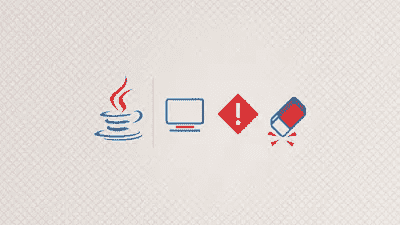
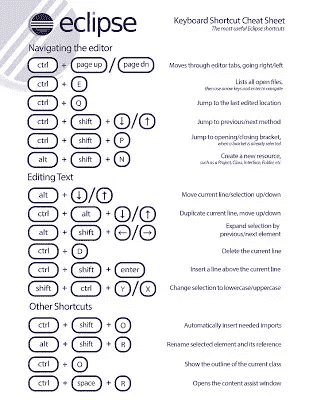
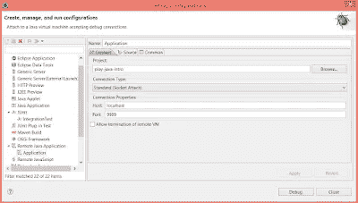
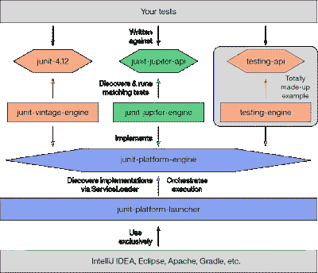
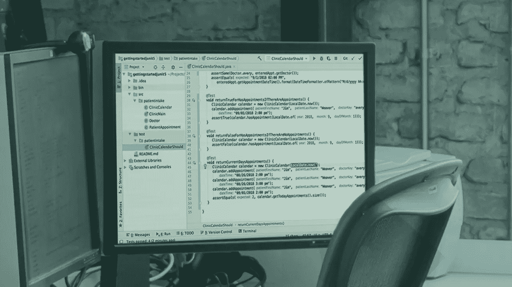

# 2023 年学习 Eclipse、JUnit 和 Mockito 的 10 门最佳免费课程

> 原文：<https://medium.com/javarevisited/top-10-courses-to-learn-eclipse-junit-and-mockito-for-java-developers-4de1e8d62b96?source=collection_archive---------0----------------------->

## 这些是 Java 程序员学习 Java 测试最好的在线免费 Eclipse、JUnit 和 Mockito 教程和课程。

Eclipse 和 JUnit 是 Java 开发人员的两个基本工具。Eclipse 是一个 Java IDE 集成开发环境，允许你从一个窗口编写、运行和调试 Java 程序，而 JUnit 是一个单元测试库，允许你自动测试你的 Java 代码。

您可以编写 [JUnit 测试](http://javarevisited.blogspot.sg/2015/02/simple-junit-example-unit-tests-for-linked-list-java.html#axzz56WXxxAC0)，然后在构建时使用 [Maven](https://javarevisited.blogspot.com/2019/03/top-5-course-to-learn-apache-maven-for.html) 或 Gradle 插件自动运行它们。您可以使用 [Jenkins](https://javarevisited.blogspot.com/2018/09/top-5-jenkins-courses-for-java-and-DevOps-Programmers.html) 来进一步自动化您的构建，这意味着您的单元测试将持续自动运行，在最早的可能机会报告任何中断。大多数 Java 开发人员把整个工作日都花在 Eclipse 上，编写代码，运行代码，调试代码。这就是为什么对你来说很好的理解 [Eclipse](https://www.java67.com/2018/02/5-free-eclipse-and-junit-online-courses-java-developers.html) 和 [JUnit](https://hackernoon.com/5-courses-java-programmers-can-join-to-learn-junit-and-mockito-in-2019-h74t38r4) 是非常重要的。了解你的[工具](http://javarevisited.blogspot.sg/2018/01/10-unit-testing-and-integration-tools-for-java-programmers.html)也有助于擅长你正在做的事情。

过去，我曾分享过 [Eclipse](https://javarevisited.blogspot.com/2016/03/3-books-to-learn-eclipse-ide-for-java-jee-programmers.html#axzz5nsPQnKbO) 和 [JUnit 书籍](https://javarevisited.blogspot.com/2014/08/top-5-books-to-learn-unit-testing-junit-tdd-Java-programmers.html#axzz5E2uHdG3w)来提高你关于这两个基础工具的知识和技能，今天我将分享来自 [Udemy](https://click.linksynergy.com/fs-bin/click?id=JVFxdTr9V80&offerid=323058.9409&type=3&subid=0) 和 [Pluralsight](http://pluralsight.pxf.io/c/1193463/424552/7490?u=https%3A%2F%2Fwww.pluralsight.com%2Flearn) 的免费在线课程，你可以加入这些课程来提高你的 JUnit 和 Eclipse 技能。

我还包括了一些关于 Mockito、测试驱动开发、Cucumber 和 Selenium 的课程，因为它们是测试自动化的重要工具。这些课程特别适合初学者，你将学到在 [Java](/javarevisited/top-5-java-online-courses-for-beginners-best-of-lot-1e1e240a758) 中有效工作所需的一切。通过在职业生涯开始时学习这个工具，您将节省大量编写和运行代码的时间。顺便说一句，中级开发人员也可以从这些课程中受益。

这些课程对于任何想从头开始学习 [Eclipse](http://www.java67.com/2018/01/how-to-remote-debug-java-application-in-Eclipse.html) 和 [JUnit](http://javarevisited.blogspot.sg/2012/08/best-practices-to-write-junit-test.html#axzz56WXxxAC0) 或其中任何一种技术的 Java 开发人员来说都是很好的。这些课程中有一些是完全免费的，所以你没有理由不参加。

# 2023 年 Java 程序员学习的 10 门免费 JUnit 和 Eclipse 课程

学习一门新技术或编程语言并不容易。你需要花相当多的时间去学习和理解，不仅是技术，还有有效工作所需的工具，Java[也不例外。Eclipse 和 JUnit 是 Java 开发人员的两个基本工具，对它们的良好了解对于成为一个高效和强大的 Java 开发人员大有帮助。](https://www.java67.com/2018/07/is-java-best-programming-language-for-beginners.html)

说到学习一项新技术或工具，我的 3 点原则是参加一门课程，读一本书，做一个项目。为了学习 [Eclipse](https://www.java67.com/2018/01/how-to-remote-debug-java-application-in-Eclipse.html) 或者 [JUnit](https://javarevisited.blogspot.com/2019/04/top-5-junit-and-unit-testing-courses-java-programmers.html) ，你也可以采用同样的方法。你可以从这些课程开始，然后你可以遵循这些 Eclipse 和 JUnit 书籍，一旦你对技术和工具有了很好的理解，你就可以开始做项目了。

## 1. [**日食初学者教程**](https://click.linksynergy.com/fs-bin/click?id=JVFxdTr9V80&subid=0&offerid=562016.1&type=10&tmpid=14538&RD_PARM1=https%3A%2F%2Fwww.udemy.com%2Feclipse-java-tutorial-for-beginners%2F) **【免费】**

这是免费学习 Eclipse 基础知识的最棒的课程之一。这个课程是为初学者和第一次学习的人设计的，它不仅教授而且展示了如何在 Eclipse 中做一些事情。在本课程中，您将体验一次有趣的月食之旅。

<https://www.udemy.com/course/eclipse-java-tutorial-for-beginners/?LSNPUBID=JVFxdTr9V80&ranEAID=JVFxdTr9V80&ranMID=39197&ranSiteID=JVFxdTr9V80-bnqMcMqrlUiAnqfZSSD.Fg>  

完成本课程后，您应该掌握了一些 Eclipse 技巧和诀窍。您还将了解 Eclipse 的各种特性——视图、透视图、调试器、保存操作、插件和代码生成。

本课程还将通过 [Eclipse 快捷方式](https://javarevisited.blogspot.com/2018/07/top-30-eclipse-keyboard-shortcuts-java-programming.html#axzz5iy71iYHP)提高您的工作效率，您还将学习从 Git 导入项目以及 Maven 项目的基础知识。总的来说，这是一门用 Eclipse 进行 Java 开发的好课程。

## [**2。面向初学者的 Eclipse IDE:提高您的 Java 生产率**](https://click.linksynergy.com/fs-bin/click?id=JVFxdTr9V80&subid=0&offerid=562016.1&type=10&tmpid=14538&RD_PARM1=https%3A%2F%2Fwww.udemy.com%2Fluv2code-eclipse-ide-for-beginners%2F) **【免费】**

这是另一个面向 Java 开发人员的 Eclipse 初级课程。您可以通过本课程学习如何使用 Eclipse 开发 Java 应用程序。本课程将教你如何安装 Eclipse，以及如何使用有用的插件为你的环境定制 Eclipse。您还将学习如何在 Eclipse 中创建 Java 应用程序，以及如何直接从 Eclipse 中运行和调试它们。本课程还会教你如何利用一些 Eclipse 生产力技术，比如导航源代码、生成源代码和创建单元测试。本课程向您展示了如何从 Eclipse 导入和导出项目。

## [**3。月食小技巧**](https://click.linksynergy.com/fs-bin/click?id=JVFxdTr9V80&subid=0&offerid=562016.1&type=10&tmpid=14538&RD_PARM1=https%3A%2F%2Fwww.udemy.com%2Feclipse-tips-and-tricks%2F) **【免费 Udemy 课程】**

顾名思义，本课程侧重于教授一些有用的 Eclipse 技巧和诀窍。大多数 Java 开发人员满足于仅仅知道如何创建一个 Java 项目并从 Eclipse 运行它。

他们从未真正通过学习键盘快捷键和生产力提示和技巧(如本课程中所示)来利用 Eclipse 的全部潜力。

本课程不仅会告诉你[如何运行和调试你的程序](http://www.java67.com/2016/02/how-to-increase-heap-size-of-java-program-eclipse-command-line.html)，还会告诉你一些关于处理字符编码、Eclipse 内置路径配置、使用 [Maven 和 Eclipse](https://javarevisited.blogspot.com/2016/09/3-maven-eclipse-tips-for-java-developers.html) 以及更快安装你需要的插件以提高生产力的高级技巧。它还教你如何在企业代理背后工作，以及如何从企业网络连接到 maven 资源库和 Eclipse marketplace。总的来说，这是一个免费升级 Eclipse 知识的极好的课程。

## [**4。JUnit 初学者教程—学习 Java 单元测试**](https://click.linksynergy.com/fs-bin/click?id=JVFxdTr9V80&subid=0&offerid=562016.1&type=10&tmpid=14538&RD_PARM1=https%3A%2F%2Fwww.udemy.com%2Fjunit-tutorial-for-beginners-with-java-examples%2F) **【免费】**

JUnit 是许多 Java 开发人员拥有另一项技能，但还不够好。我见过和采访过的大多数 Java 开发人员都知道什么是 JUnit，并且编写过一两个 JUnit 测试，但是他们从来没有真正使用 JUnit 来测试他们的实际项目或者他们每天编写的新代码。大多数人会给你借口，比如总是有交付压力，绝对没有时间写单元测试或 TDD，但是避免单元测试的主要原因通常是信心不足，没有足够的技能和经验来为任何类型的代码编写单元测试。

这个 JUnit 教程将帮助你跨越这个鸿沟，教你单元测试和 [JUnit 测试框架的所有基本概念。](https://javarevisited.blogspot.com/2019/04/top-5-junit-and-unit-testing-courses-java-programmers.html)

简而言之，本课程将教你:
如何为 JUnit 测试创建一个新项目
如何创建、运行&调试 JUnit 测试
如何编写好的单元测试
如何使用 assert 方法
如何使用[基本 JUnit 注释](https://javarevisited.blogspot.com/2012/06/junit4-annotations-test-examples-and.html) — @Test、@Before、@After、@AfterClass、@BeforeClass、@Suite
如何在单元测试中测试性能和异常
如何编写参数化

## 5.使用 JUnit 5 开始单元测试【免费试用】

这是我最喜欢的老师之一 Jim Weaver 为 Java 开发人员开设的另一门很好的单元测试课程。在本课程中，John 解释了 JUnit 的基础知识，并指导您编写第一个单元测试。

一旦涵盖了基础知识，你将被引入到高级概念中，这将帮助你编写干净的测试，并使用像 [DRY 这样的最佳实践来创建可维护的测试代码](https://dev.to/javinpaul/top-10-object-oriented-design-principles-for-writing-clean-code-4pe1)。

之后，您将学习如何将 JUnit 与您现有的 Ant 或 Maven 构建系统集成，以及如何自动创建 JUnit 报告。

最后，他将学习如何使用[存根和模拟](https://javarevisited.blogspot.com/2014/04/difference-between-stub-and-mock-object-java-junit.html)来真正隔离类，从而超越 JUnit 的基本用途，我们还将学习如何使用 JUnit 进行单元测试以外的工作。

总之，快速学习 JUnit 的好课程，开始写你的第一个单元测试。

顺便说一句，这个课程并不是真正的免费课程。你需要一个[**pluar sight 会员**](https://pluralsight.pxf.io/c/1193463/424552/7490?u=https%3A%2F%2Fwww.pluralsight.com%2Fpricing) 才能进入本课程。月费约为 29 美元，年费约为 299 美元，你可以参加 5000 多门编程和开发课程。

<https://pluralsight.pxf.io/c/1193463/424552/7490?u=https%3A%2F%2Fwww.pluralsight.com%2Fpricing>  

虽然我鼓励你加入 Pluralsight 以促进你的学习，但如果你愿意，你也可以通过注册一个 [**10 天免费试用**](http://pluralsight.pxf.io/c/1193463/424552/7490?u=https%3A%2F%2Fwww.pluralsight.com%2Flearn) 来免费参加这门课程，这对完成这门课程来说绰绰有余。

## 6。用 Junit 的 30 个步骤学习单元测试&mock ITO

本课程将用 25 个例子教你 Mockito 和 JUnit——最流行的单元测试和 most 框架。这门课很有帮助。解释清楚、简单且易于理解。我学习了 Junit、Mockito 和 PoweMockito 的基本概念。我将这些知识用于工作中的一个项目。

以下是加入课程的链接— [*用 JUnit 和 Mockito*](https://click.linksynergy.com/deeplink?id=JVFxdTr9V80&mid=39197&murl=https%3A%2F%2Fwww.udemy.com%2Fcourse%2Fmockito-tutorial-with-junit-examples%2F) 学习单元测试

<https://click.linksynergy.com/deeplink?id=JVFxdTr9V80&mid=39197&murl=https%3A%2F%2Fwww.udemy.com%2Fcourse%2Fmockito-tutorial-with-junit-examples%2F>  

## [7。面向初学者的 Java 单元测试:JUnit 5 适合你的第一份 it 工作](https://click.linksynergy.com/deeplink?id=JVFxdTr9V80&mid=39197&murl=https%3A%2F%2Fwww.udemy.com%2Fcourse%2Fjunit5-for-beginners%2F)

在实践中学习用 JUnit 5 编写 Java 单元测试。带有练习和额外 JUnit 备忘单的在线课程。课程简单明了，对于以前从未编写过单元测试的人来说，可能有点太快了。

然而，你可以随时暂停课程，赶上进度，所以这不会是什么大问题。如果你以前已经编写过单元测试(比如用 JUnit 3/4)，那么按照你的指示去做是很容易的。

以下是加入课程的链接— [*面向初学者的 Java 单元测试(JUnit 5)*](https://click.linksynergy.com/deeplink?id=JVFxdTr9V80&mid=39197&murl=https%3A%2F%2Fwww.udemy.com%2Fcourse%2Fjunit5-for-beginners%2F)

<https://click.linksynergy.com/deeplink?id=JVFxdTr9V80&mid=39197&murl=https%3A%2F%2Fwww.udemy.com%2Fcourse%2Fjunit5-for-beginners%2F>  

## 8.[使用 Java、JUnit 和 Mockito 进行即时测试驱动开发](https://click.linksynergy.com/deeplink?id=JVFxdTr9V80&mid=39197&murl=https%3A%2F%2Fwww.udemy.com%2Fcourse%2Finstant-test-driven-development-with-junit%2F)

本课程很好地涵盖了 TDD，并对 JUnit 和 Mockito 进行了合理的深入研究。很好地介绍了良好的例子和坚实的建议。我把它掉了半颗星的唯一原因是因为视频剪辑之间的音量不一致，这有点烦人，但总体内容很棒。

以下是加入课程的链接— [*TDD 与 Java、JUnit 和 Mockito*](https://click.linksynergy.com/deeplink?id=JVFxdTr9V80&mid=39197&murl=https%3A%2F%2Fwww.udemy.com%2Fcourse%2Finstant-test-driven-development-with-junit%2F)

<https://click.linksynergy.com/deeplink?id=JVFxdTr9V80&mid=39197&murl=https%3A%2F%2Fwww.udemy.com%2Fcourse%2Finstant-test-driven-development-with-junit%2F>  

## [9。用 Java 构建自动化框架](https://click.linksynergy.com/deeplink?id=JVFxdTr9V80&mid=39197&murl=https%3A%2F%2Fwww.udemy.com%2Fcourse%2Fcucumber-tutorial%2F)

这是构建端到端 web 自动化测试框架和在 web 应用程序上模拟用户行为的绝佳课程。

本课程的覆盖面令人惊讶，并且每个概念都有一个实践环节，这是本课程最精彩的部分。

<https://click.linksynergy.com/deeplink?id=JVFxdTr9V80&mid=39197&murl=https%3A%2F%2Fwww.udemy.com%2Fcourse%2Fcucumber-tutorial%2F>  

## [10。带 Java 的 Selenium WebDriver 从基础到高级+框架](https://click.linksynergy.com/deeplink?id=JVFxdTr9V80&mid=39197&murl=https%3A%2F%2Fwww.udemy.com%2Fcourse%2Fselenium-real-time-examplesinterview-questions%2F)

如果你想在 Java 应用程序中进行自动化测试，这是一门很好的课程。它既详细又全面，涵盖了广泛的主题和工具，如 Maven、Git、Jenkins、TestNG、ANT、Log4j、Cucumber 等等。

<https://click.linksynergy.com/deeplink?id=JVFxdTr9V80&mid=39197&murl=https%3A%2F%2Fwww.udemy.com%2Fcourse%2Fselenium-real-time-examplesinterview-questions%2F>  

以上是一些**最好的 JUnit 和 Mockito 在线培训课程**，你可以参加这些课程来学习和提高你的 Java 单元测试技能。我还为高级测试和自动化提供了一些学习 Mockito、Cucumber 和 Selenium 的课程。

正如我多次说过的，单元测试技能对于专业软件开发人员来说是必不可少的，没有理由在 [DevOps](https://javarevisited.blogspot.com/2019/01/top-5-free-kubernetes-courses-for-DevOps-Engineer.html) 的年纪不编写自动化单元和集成测试。候选人的单元测试技能也会在面试中被测试，通常具有良好单元测试技能的候选人会被优先考虑。

其他**免费在线课程**你可能喜欢探索
[5 门免费课程学习 Maven 和 Jenkins](http://www.java67.com/2018/02/6-free-maven-and-jenkins-online-courses-for-java-developers.html)
[5 门免费课程学习 Git 和 Github](http://javarevisited.blogspot.sg/2018/01/5-free-git-courses-for-programmers-to-learn-online.html#axzz568Oo1Jao)
[5 门免费课程学习大数据和 Apache Spark](http://javarevisited.blogspot.com/2017/12/top-5-courses-to-learn-big-data-and.html)
[5 门免费 Docker 课程学习 Java 和 DevOps 工程师](http://www.java67.com/2018/02/5-free-docker-courses-for-java-and-DevOps-engineers.html)
[5 门免费课程从头开始学习 Python](http://www.java67.com/2018/02/5-free-python-online-courses-for-beginners.html)
[5 门免费课程学](http://javarevisited.blogspot.sg/2018/01/top-5-free-data-structure-and-algorithm-courses-java--c-programmers.html#axzz55lOcYrUM)
[5 门面向 Java 开发者的免费 Spring 框架课程](http://www.java67.com/2017/11/top-5-free-core-spring-mvc-courses-learn-online.html)
[5 门免费学习 Angular 的在线培训课程](http://www.java67.com/2018/01/top-5-free-angular-js-online-courses-for-web-developers.html)
[5 门面向应用开发者和系统管理员的免费 Linux 课程](http://www.java67.com/2018/02/5-free-linux-unix-courses-for-programmers-learn-online.html)
[Udemy](http://javarevisited.blogspot.sg/2018/01/top-10-udemy-courses-for-java-and-web-developers.html#axzz56TUKbQgM)前 10 名 Java 和 Web 开发课程

感谢您阅读本文。如果你喜欢这些免费的 Eclipse 和 JUnit 课程，请与你的朋友和同事分享。如果您有任何问题或疑问，请留言。

如果你喜欢免费的 Java 课程，这里有一些我已经分享过的:

</javarevisited/10-free-courses-to-learn-java-in-2019-22d1f33a3915> 