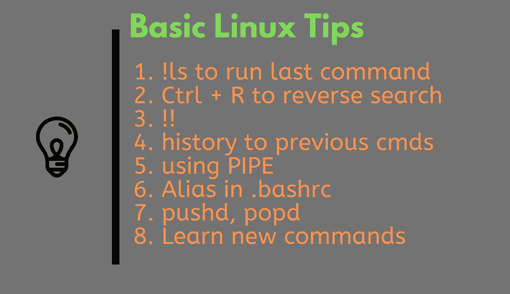
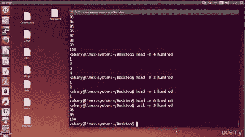
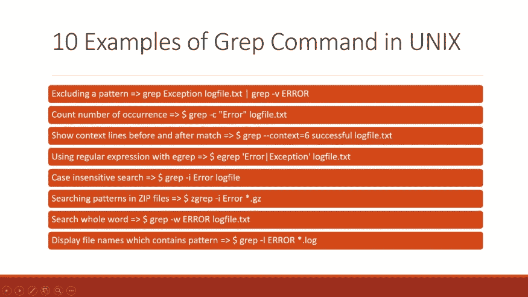

# 提高 Linux 工作效率的 9 个技巧

> 原文：<https://medium.com/javarevisited/top-10-unix-and-linux-productivity-tips-for-programmers-and-developers-c748129cf3e8?source=collection_archive---------1----------------------->

## 简单的 Linux 技巧可以节省 50%的命令行和终端时间

你有没有惊讶地看到有人在 UNIX 终端工作非常快，发命令，做事很快？是的，我已经看过几次了，它总是激励着我向那些超级开发人员学习。

如果你想学习 Linux 或者想提高你的 Linux 技能并寻找实践技巧，那么你来对地方了。早些时候，我已经分享了 [**最好的 Linux 课程**](/javarevisited/7-best-linux-courses-for-developers-cloud-engineers-and-devops-in-2021-7415314087e1) ， [**书籍**](/javarevisited/10-best-linux-unix-and-system-programming-books-for-beginners-2fe750951c9f) ，以及 [**网站**](/javarevisited/6-best-websites-to-learn-linux-4861ac21bfdf) 在这篇文章中，或者教程，或者不管你叫它什么，我已经分享了一些我在 Linux 中快速、快速、高效地工作所遵循的 UNIX 命令实践。

我在金融服务行业工作，我的工作包括在[电子交易](https://savingsfunda.blogspot.com/2022/04/5-best-courses-to-learn-day-trading-and.html)、[衍生品](https://savingsfunda.blogspot.com/2022/04/top-5-courses-to-learn-futures-options.html)、[外汇](https://savingsfunda.blogspot.com/2022/04/5-best-courses-to-learn-forex-trading.html)、商品和其他资产类别中开发和支持在线股票和期货交易应用程序。

我们所有的服务都在 Linux 服务器上运行，所以在 Linux 终端上高效快速地工作对我们来说是至关重要的，这就是我如何在 Linux 中学会这些生产力技巧的。

这篇文章就像我之前的文章一样，关于 UNIX 中的 10 大基本网络命令和[nslookup 命令在 Linux 中如何工作](https://javarevisited.blogspot.com/2017/04/how-hostname-to-ip-address-conversion-or-name-resolution-works-in-Linux.html)。

如果你没有读过这些，你可以看看它们是否有趣和有用。在这篇 UNIX 命令教程中，我将分享我在 UNIX 中如何快速、高效地工作的经验。

*顺便说一句，如果您是 Linux 或命令行的新手，那么我也推荐您参加一个不错的课程，如* [***Linux 掌握:在 11.5 小时内掌握 Linux 命令行***](https://click.linksynergy.com/deeplink?id=JVFxdTr9V80&mid=39197&murl=https%3A%2F%2Fwww.udemy.com%2Fcourse%2Flinux-mastery%2F)**您将从零开始学习 Linux 命令行，并通过世界上最有趣的基于项目的 Linux 课程改善您的职业生涯！**

* [## 精通 Linux:掌握 Linux 命令行

### 感言= = = = = = = = = = = = = = = = = = = = = = = = = = = = = = =“目前为止 Linux o n Udemy 上最好的课程，我绝对推荐”…

udemy.com](https://click.linksynergy.com/deeplink?id=JVFxdTr9V80&mid=39197&murl=https%3A%2F%2Fwww.udemy.com%2Fcourse%2Flinux-mastery%2F) 

# 程序员和开发人员提高 Linux 命令行效率的 10 个技巧

如果你的服务器也驻留在 Linux 机器上，并且你的日常工作包括大量的搜索和使用 UNIX 命令，那么这些提示将会节省你很多时间。

下面的提示是我多年 UNIX 终端经验的结果，我将其总结为在 UNIX 中快速工作的 [**10 个提示。**](http://javarevisited.blogspot.sg/2011/03/unix-command-tutorial-working-fast-in.html)

为什么我要分享这个？

嗯，我喜欢这些提高效率的小技巧，它们很容易学习和记忆，但会给你的日常工作带来巨大的变化。

> 通过分享这篇文章，我期待着从你们那里获得更多的技巧来增强我的武器库，所以请分享你们是如何在 UNIX 中工作的，你们是如何利用 Linux 和其他 UNIX 操作系统如 Fedora、Ubuntu、CentOS 等提供的强大的 Linux 命令和 shell 实用程序的。

请通过发表评论来分享你的经验，以使这篇文章有用并从中受益，并从彼此的专业知识中受益。

无论如何，让我们从这些有用的提示开始:

## 1.用！{command}用于快速执行前一个命令实例

这平均为我节省了 30%的时间。在几秒钟内多次执行同一个 UNIX 命令的情况经常发生，

**在知道这个技巧之前，我曾经使用上下箭头来寻找我的力量，然后执行它们，这花费了我很多时间，**但是，在知道这个技巧之后，我只需要记住命令名，比如`!ls`将执行你的最后一个`"ls -lrt"`，`!vim`将打开你的最终文件，而不需要键入完整的命令。

*使用这个技巧并体验一下吧，它确实节省了大量时间，而且除了*[*bash shell*](/javarevisited/6-free-courses-to-learn-bash-shell-scripting-in-linux-and-unix-a50461ecd4fe)*(像* `*csh*` *或* `*ksh*` *)之外，它在 shell 上也很有用，因为上下箭头一般不会给出先前的命令。*

比如做了 ls -l stocks.txt 之后如果想打开 stocks.txt，可以用 [vim 编辑器](https://click.linksynergy.com/fs-bin/click?id=JVFxdTr9V80&subid=0&offerid=323058.1&type=10&tmpid=14538&RD_PARM1=https%3A%2F%2Fwww.udemy.com%2Fvim-commands-cheat-sheet%2F)作为 vi！$(最后一个参数)。* 

## *2.用！！用于执行最后一个命令*

*这是上一个技巧的扩展，用于执行您已经完成的最后一个命令。因为它只涉及两次击键，而且对同一个键来说也是如此，所以速度惊人。*

**这也适用于上下箭头不像 K 壳和 C 壳那样工作的壳。如果您经常为了调试目的而停止或启动服务器或 Java 应用程序，这将非常有用。**

*Btw，如果你还不熟悉 bash shell，建议你看一下 [**Bash shell 脚本:初学者速成班**](https://click.linksynergy.com/fs-bin/click?id=JVFxdTr9V80&subid=0&offerid=323058.1&type=10&tmpid=14538&RD_PARM1=https%3A%2F%2Fwww.udemy.com%2Fbash-shell-scripting-crash-course-for-beginners%2F) **，**里面会教你 Bash Shell 从命令行到 Shell 脚本。*

**

*对于想成为 Linux 超级用户的人来说，这是一门非常有用的课程。*

## *3.使用“CTRL+R”重复最后一个匹配命令*

*如果您记得不久前执行的最后一个命令，并且只想找到具有相同参数的命令并执行，那么这是最好的选择。*

*这是你需要记住的提示。*

**只需按下* `*"CRTL+R"*` *并键入你在最后一个命令中的单词，UNIX 将为你找到该命令，然后只需按回车键。**

*以上三个小技巧，如果你经常执行命令，都会节省你很多时间，而且重复的百分比相当高。就我来说*

> *通过遵循以上三条建议，我已经节省了将近 50-60%的时间。让我知道你们是如何工作的。*

## *4.使用历史命令查找您的团队最常使用的 UNIX 命令*

*这是我开始在 UNIX 上工作时学到的第一个技巧。这是 UNIX 和 [Shell 脚本](https://click.linksynergy.com/fs-bin/click?id=JVFxdTr9V80&subid=0&offerid=323058.1&type=10&tmpid=14538&RD_PARM1=https%3A%2F%2Fwww.udemy.com%2Fshell-scripting-linux%2F)中最有用的命令。*

**在大多数情况下，有一个特定的命令，比如启动、停止、检查日志文件、构建或发布等等。**

*这些是您经常需要执行的命令，如果您不记得确切的命令，不必担心，只需执行`history | grep`“keyword ”,您将从 Linux 机器上的历史记录中获得该命令。*

**有一些特定环境变量，比如 HISTSIZE，它定义了 UNIX 历史可以存储多少个命令，所以让它变大**

*足以节省你的时间，避免不时参考你的指令手册。*

*顺便说一下，如果你不熟悉基本的 Linux 命令，那么我建议你通过 [**Shell 脚本:了解如何自动化命令行任务**](https://click.linksynergy.com/fs-bin/click?id=JVFxdTr9V80&subid=0&offerid=323058.1&type=10&tmpid=14538&RD_PARM1=https%3A%2F%2Fwww.udemy.com%2Fshell-scripting-linux%2F) 来熟悉这样的命令。*

**

*偶尔避开谷歌，为手头的任务搜索合适的 Linux 命令，会节省你大量的时间。*

## *5.在 grep 和 find 中使用正则表达式*

*grep 和 find T21 是 UNIX 提供给我们的两个最好的工具。几乎每个人都需要在 UNIX 中搜索某些东西，比如文件、目录、文件中的某些词，比如错误或异常，如果您知道如何使用 grep 并通过正则表达式找到它，您将通过键入更少的命令来节省大量时间。*

**例如，通过了解* `*egrep*` *，您可以触发* `*egrep "ERROR|Exception" *.xml*` *，而不是触发两个 grep 命令来分别查找错误和异常。**

*如果你有兴趣学习更多关于 grep 和 find 命令的知识，那么你应该看看我之前的文章[grep 命令的 10 个例子](http://javarevisited.blogspot.sg/2011/06/10-examples-of-grep-command-in-unix-and.html)和[Linux 中 find 命令的 10 个例子](http://javarevisited.blogspot.sg/2011/03/10-find-command-in-unix-examples-basic.html)。*

*我已经在那些文章中分享了许多关于这两个命令的有用选项，这将帮助您从这两个强大的 Linux 命令中获得更多。*

**

## *6.使用管道而不是触发两个命令*

*您可以使用这个技巧来创建自己的 Linux 命令例如，我经常使用管道(|)来排序和过滤出唯一的结果。*

*这里有一个例子*

*`$ cut -d ‘,’ -f1 application.log | sort| uniq | wc -l`*

*这将获得 CSV 文件的第一列，对其进行排序，过滤出 uniq 记录，然后计算行数。这是我自己的 Linux 命令，用来计算 application.log 文件中的 uniq 用户数。*

*如果你不知道，最好从一门不错的 Linux 课程开始，比如 [**Linux 命令行基础**](https://click.linksynergy.com/fs-bin/click?id=JVFxdTr9V80&subid=0&offerid=323058.1&type=10&tmpid=14538&RD_PARM1=https%3A%2F%2Fwww.udemy.com%2Flinux-command-line-volume1%2F) ，因为你可能也不知道其他一些基础知识。*

**

*从我个人的经验来看，参加一个不错的课程，比在零零碎碎中找到必不可少的信息要好。*

*而且，如果你不介意从免费资源中学习，你也可以看看我为开发者列出的 10 门免费 Linux 课程。*

## *7.使用别名并在 Bash 概要文件或 bashrc 文件中定义它们*

*你是否见过一些奇怪的命令在某人的机器上运行，而不是你的，这些命令可能是他在自己的`.bashrc`或`.profile`文件中设置的别名？*

*对于常用的命令，总是要做这样的设置。有许多用法。巴沙尔和。配置文件，但其中最重要的一个是设置别名，如“l .”查找所有隐藏的文件。“ls”包括所有有用的选项，如。`-lrtH`显示所有相关信息。*

*可以进一步查看 [**Linux 命令行界面(CLI)基础**](https://pluralsight.pxf.io/c/1193463/424552/7490?u=https%3A%2F%2Fwww.pluralsight.com%2Fcourses%2Flinux-cli-fundamentals) 了解更多关于登录在 Linux 中的工作原理以及`.login`的作用是什么。Linux 和 bash shell 中的`profile`和`.bashrc`文件。*

**

*顺便说一句，你需要一个 Pluralsight 会员才能参加这个课程，费用大约是每月 29 美元或每年 299 美元([节省 14%](https://pluralsight.pxf.io/c/1193463/424552/7490?u=https%3A%2F%2Fwww.pluralsight.com%2Fpricing))。我有一个，我也建议所有的开发人员都有这个计划，因为 **Pluralsight 就像软件开发人员的网飞**。*

*它有超过 5000 门高质量的课程，涵盖所有最新的主题。因为我们程序员每天都要学习新的东西，所以 299 美元的投资一点也不差。*

*顺便说一句，它还提供了 [**10 天免费试用**](http://pluralsight.pxf.io/c/1193463/424552/7490?u=https%3A%2F%2Fwww.pluralsight.com%2Flearn) 没有任何义务，允许你观看 200 分钟的内容。您可以通过注册试用免费观看本课程。*

* [## 对个人来说

### Pluralsight 的使命一直是公平的技术竞争环境。不管你想学什么，或者…

pluralsight.pxf.io](http://pluralsight.pxf.io/c/1193463/424552/7490?u=https%3A%2F%2Fwww.pluralsight.com%2Flearn)* 

## *8.使用 pushd、popd、cd -、~在目录中移动*

*根据我的经验，在 UNIX shell 中导航要花费将近 50%的时间，如果你打算不时地写一个目录路径，那就忘了快速工作吧。*

*所以，不要输入全名，使用上面所有的提示，充分利用`pushd`、`popd`、`cd —` 和`cd ~`命令。如果您在 UNIX 中的两个目录位置之间切换，最好使用`cd —`。*

## *9.尽量减少击键次数或提高打字速度*

> *你打字越少，工作越快。*

*要使用您最后输入的命令，请使用 bash 中的 tab，以便让 UNIX bash shell 完成您的命令。*

> *如果您键入的最后一个命令很长，而您只想更改几行，请使用 Ctrl+R。*

## *10.不断学习新的 Linux 命令*

*尝试学习更多的命令和它们的选项，这样可以减少思考特定任务的时间，并使用`ctrl+z`和`fg` 和`bg` 来暂停一个进程。*

> *如果你正在查看多个文件或日志文件，这可以节省将近 10%的时间，所以不要时不时地执行 vim 命令，只需用`Ctrl+Z`暂停它，用 fg 1 或 fg 2 把它放在前台。*

*我希望这些 UNIX 命令的例子和技巧能够帮助您在使用 UNIX 时事半功倍，提高您的工作效率和体验。*

*如果你正在寻找一些资源，那么你可以查看 [**在 5 天内学习 Linux 并升级你的职业**](https://click.linksynergy.com/fs-bin/click?id=JVFxdTr9V80&subid=0&offerid=323058.1&type=10&tmpid=14538&RD_PARM1=https%3A%2F%2Fwww.udemy.com%2Flearn-linux-in-5-days%2F)*

* [## 在 5 天内学会 Linux，提升你的职业生涯

### 如果你想学习如何使用 Linux 和……加入其他 20，000 名世卫组织的成功学生的行列

udemy.com](https://click.linksynergy.com/fs-bin/click?id=JVFxdTr9V80&subid=0&offerid=323058.1&type=10&tmpid=14538&RD_PARM1=https%3A%2F%2Fwww.udemy.com%2Flearn-linux-in-5-days%2F) 

这个列表并不完整，所以请分享你在 UNIX 中的工作方式，当然还有**你在 UNIX 中的工作速度有多快？**

**进一步学习**
[5 门面向程序员的免费 Linux 课程](http://www.java67.com/2018/02/5-free-linux-unix-courses-for-programmers-learn-online.html)
[Linux 命令行界面(CLI)基础知识](https://pluralsight.pxf.io/c/1193463/424552/7490?u=https%3A%2F%2Fwww.pluralsight.com%2Fcourses%2Flinux-cli-fundamentals)
[Linux 如何工作:每个超级用户都应该知道的事情](http://www.amazon.com/How-Linux-Works-Superuser-Should/dp/1593275676/?tag=javamysqlanta-20)
[Linux 中 curl 命令的 10 个例子](http://javarevisited.blogspot.sg/2017/03/10-examples-of-curl-command-in-unix-and-Linux.html)
[Linux 中 lsof 命令的 10 个例子](http://javarevisited.blogspot.sg/2016/06/10-example-of-lsof-command-in-unix-linux.html#axzz5CkWP96Nb)
[学习编码的 10 大 Python 课程](/better-programming/top-5-courses-to-learn-python-in-2018-best-of-lot-26644a99e7ec)
[用 5 天学习 Linux](https://click.linksynergy.com/fs-bin/click?id=JVFxdTr9V80&subid=0&offerid=562016.1&type=10&tmpid=14538&RD_PARM1=https%3A%2F%2Fwww.udemy.com%2Flearn-linux-in-5-days%2F)* 

## *结束语*

*感谢您阅读本文。你可能会认为这些都是非常简单的东西，没有必要去学习它们，但是你会惊讶地发现在工作中应用这些技巧可以节省多少时间。*

*很有可能你已经知道了大部分的东西，也有很多有用的免费资源供你使用，我也在这里和那里链接了它们以及最好的资源，它们当然不是免费的，但完全值得花钱。*

*我特别喜欢[**【Udemy】课程**](https://click.linksynergy.com/deeplink?id=JVFxdTr9V80&mid=39197&murl=https%3A%2F%2Fwww.udemy.com%2F) ，因为它们非常实惠，并且以很小的金额提供很多价值，但是你可以自由选择你想要的课程。*

*最终，您应该对基本的 Linux 命令和 bash 技巧有足够的知识和经验。*

*祝您的 Linux 之旅好运！当然**不会很容易**，但是通过遵循这些提示，你会节省很多时间，并且成为你一直想成为的 Linux 超级用户。*

*如果你喜欢这篇文章，那么请考虑在 Twitter 上关注我( [javinpaul](https://twitter.com/javinpaul) )如果你想在每篇新文章发布时得到通知，不要忘记在 Twitter 上关注[**javarestived**](https://twitter.com/javarevisited)！*

> ****P.S.*** *—如果你只是想从一门课程开始学习 Linux，我认为* [**Linux 精通:11.5 小时掌握 Linux 命令行**](https://click.linksynergy.com/deeplink?id=JVFxdTr9V80&mid=39197&murl=https%3A%2F%2Fwww.udemy.com%2Fcourse%2Flinux-mastery%2F) *是最好的入门课程。您将从零开始学习 Linux 命令行，并通过世界上最有趣的基于项目的 Linux 课程改善您的职业生涯！**

* [## 精通 Linux:掌握 Linux 命令行

### 感言= = = = = = = = = = = = = = = = = = = = = = = = = = = = = = =“目前为止 Linux o n Udemy 上最好的课程，我绝对推荐”…

udemy.com](https://click.linksynergy.com/deeplink?id=JVFxdTr9V80&mid=39197&murl=https%3A%2F%2Fwww.udemy.com%2Fcourse%2Flinux-mastery%2F)*