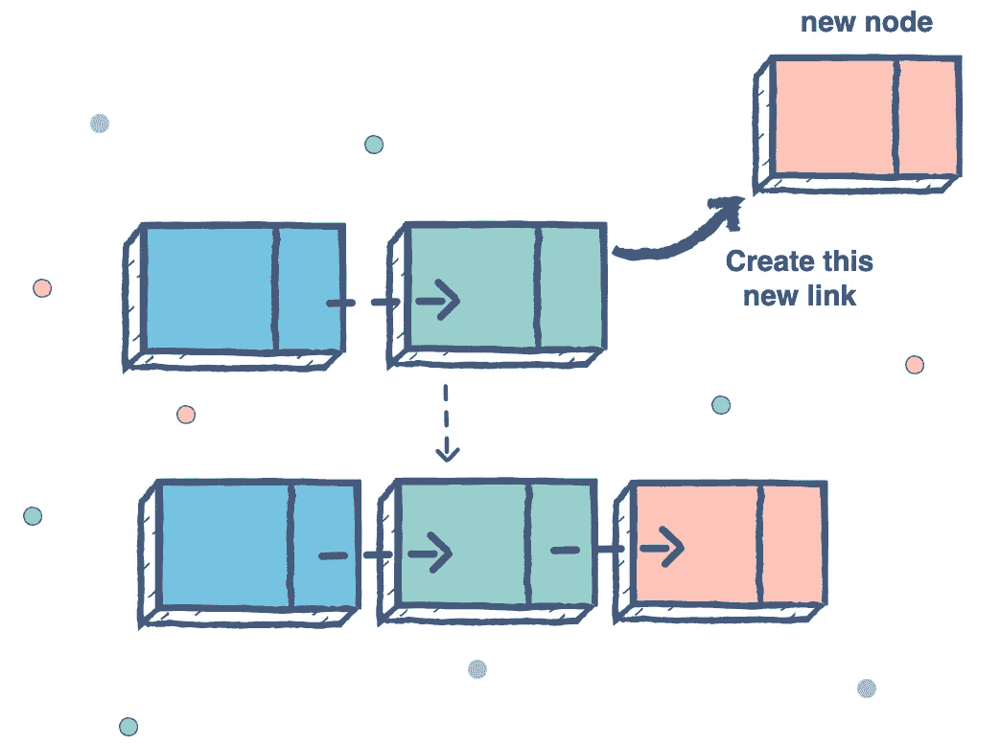
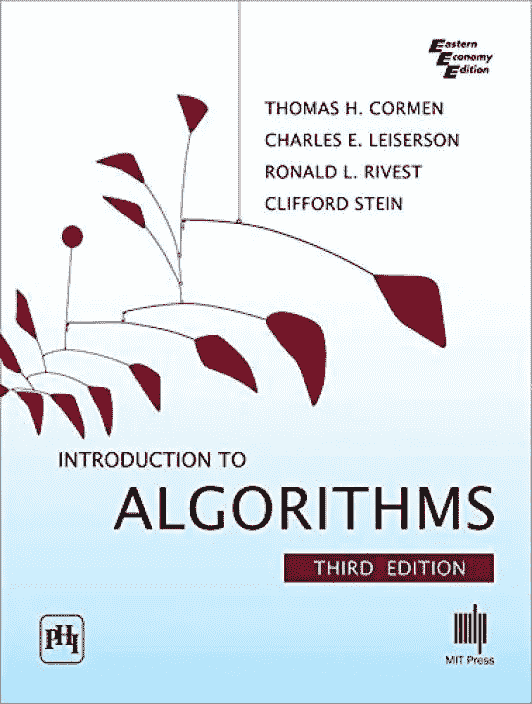

# 技术访谈中的 20 大链表编码问题

> 原文：<https://medium.com/javarevisited/top-20-linked-list-coding-problems-from-technical-interviews-90b64d2df093?source=collection_archive---------0----------------------->

形象信用— [教育性](https://www.educative.io/subscription?affiliate_id=5073518643380224)

大家好，我一直在分享很多给正在积极找工作的程序员的编码面试问题，特别是给初学者和刚毕业没有实际工作经验的计算机工程师。

在过去，我已经分享了一些[数据结构问题](https://hackernoon.com/50-data-structure-and-algorithms-interview-questions-for-programmers-b4b1ac61f5b0)、[字符串算法问题](https://hackernoon.com/20-string-coding-interview-questions-for-programmers-6b6735b6d31c)，以及一些有用的[在线课程](https://hackernoon.com/10-data-structure-algorithms-and-programming-courses-to-crack-any-coding-interview-e1c50b30b927)，为编程工作面试做准备，今天我将分享一份来自编码面试的**常见链表问题列表。**

数据结构是任何编程工作面试中最重要的部分之一，通常是选择或拒绝候选人的原因，这就是为什么练习这些基于数据结构的问题会让你比你的竞争对手更有优势。

它还会让你成为一名更好的程序员，因为你在解决这些问题的同时发展了逻辑和编码意识，这对你的编程生涯大有帮助。

> 如果你不是媒体成员，我强烈推荐你加入媒体，阅读不同领域伟大作家的精彩故事。您可以在 这里**加入介质**</@somasharma_81597/membership>

# **什么是链表数据结构？**

**[链表](http://www.java67.com/2017/06/5-difference-between-array-and-linked.html)是补充数组数据结构的另一种常见数据结构。与数组类似，它也是一种线性数据结构，以线性方式存储元素。**

**然而，与[数组](http://www.java67.com/2014/08/what-is-array-data-structure-in-java.html)不同，它不将它们存储在连续的位置；相反，它们分散在内存中的每个地方，内存使用节点相互连接。**

> **链表只不过是一个节点列表，其中每个节点包含存储的值和下一个节点的地址。**

**由于这种结构，**很容易在链表**中添加和删除元素，因为你只需要改变链接，而不是创建[数组](https://javarevisited.blogspot.com/2015/06/top-20-array-interview-questions-and-answers.html)，但是搜索很困难，通常需要 O(n)时间才能找到单链表中的元素。**

**这篇[文章](http://javarevisited.blogspot.sg/2013/07/difference-between-array-and-linked-list-java.html)提供了更多关于数组和链表数据结构之间区别的信息。**

**它也有多种形式，比如单链表，允许你单向遍历(正向或反向)；一个**双向链表**，允许你双向遍历(向前和向后)；最后是**循环链表**，形成一个循环。**

# **如何解决基于链表的编码问题？**

**为了解决基于链表的问题，很好地了解[递归](https://javarevisited.blogspot.com/2017/03/how-to-reverse-linked-list-in-java-using-iteration-and-recursion.html)是很重要的，因为**链表是一种递归数据结构**。**

**如果从链表中取出一个节点，剩下的数据结构仍然是链表，正因为如此，许多链表问题有比迭代更简单的[递归解](https://javarevisited.blogspot.com/2017/04/recursive-binary-search-algorithm-in-java-example.html#axzz5bkI12WiF)。**

**它们也可以使用`divide-and-conquer`技术来解决，它将问题分解成子问题，直到你可以解决它们。**

> **例如，为了反转一个链表，你打破链表，直到你只有一个节点，在这一点上，你知道如何反转一个节点的链表，它只是同一个节点。**

**这非常类似于递归，实际上，你能解决的最小的`sub-problem`成为递归解的基础情况。**

**顺便说一句，如果你没有数据结构的基础知识或者最近没有更新过，解决这些基于链表的编码问题是没有意义的。那样的话，我建议你先通过一本好的[数据结构和算法课程](https://javarevisited.blogspot.com/2018/11/top-5-data-structures-and-algorithm-online-courses.html#axzz5YFaOvjsh)或者[书](https://javarevisited.blogspot.com/2015/07/5-data-structure-and-algorithm-books-best-must-read.html)来复习概念。**

**如果您需要建议，以下是我的一些久经考验的资源，用于深入学习数据结构和算法:**

1.  **[**数据结构和算法:Java 开发人员深度学习使用 Java**](https://click.linksynergy.com/fs-bin/click?id=JVFxdTr9V80&subid=0&offerid=323058.1&type=10&tmpid=14538&RD_PARM1=https%3A%2F%2Fwww.udemy.com%2Fdata-structures-and-algorithms-deep-dive-using-java%2F)**
2.  **[**Python 中的算法和数据结构**](https://click.linksynergy.com/deeplink?id=JVFxdTr9V80&mid=39197&murl=https%3A%2F%2Fwww.udemy.com%2Falgorithms-and-data-structures-in-python%2F) 给热爱 Python 的人**
3.  **[**JavaScript 算法与数据结构大师班**](https://click.linksynergy.com/fs-bin/click?id=JVFxdTr9V80&subid=0&offerid=508237.1&type=10&tmpid=14538&RD_PARM1=https%3A%2F%2Fwww.udemy.com%2Fjs-algorithms-and-data-structures-masterclass%2F) 由柯尔特·斯蒂尔为 JavaScript 程序员开设**
4.  **[**掌握数据结构&使用 C 和 C++的算法**](https://click.linksynergy.com/deeplink?id=JVFxdTr9V80&mid=39197&murl=https%3A%2F%2Fwww.udemy.com%2Fdatastructurescncpp%2F) 适合擅长 C/C++的人**
5.  **[**Java 中的数据结构:面试复习者**](https://www.educative.io/collection/5642554087309312/5724822843686912?affiliate_id=5073518643380224) 刷新 Java 中重要的数据结构和算法概念。**

**而且，如果你更喜欢书，没有比托马斯·h·科尔曼的 [**算法简介**](http://www.amazon.com/dp/0072970545/?tag=javamysqlanta-20) 更好的了。这是关于数据结构和算法的最全面的书籍之一。**

**

[**算法介绍**](http://www.java67.com/2015/09/top-10-algorithm-books-every-programmer-read-learn.html)** 

# **来自编码访谈的 20 多个常见链表问题**

**在不浪费你更多时间的情况下，这里有一些编码面试中最常见和最流行的链表面试问题。**

**我已经尽可能地链接了解决方案，但我建议你首先尝试自己解决问题，这将使你受益，因为你会思考和学习。**

**一旦你解决了问题或者在尝试后卡住了，你可以看看解决方案并从中学习。**

1.  ****如何一次找到单链表的中间元素？(** [**解**](http://javarevisited.blogspot.sg/2012/12/how-to-find-middle-element-of-linked-list-one-pass.html) **)****
2.  ****如何检查给定的链表是否包含循环？如何找到循环的开始节点？(** [**)解**](http://javarevisited.blogspot.sg/2013/05/find-if-linked-list-contains-loops-cycle-cyclic-circular-check.html) **)****
3.  ****如何在单链表中找到倒数第三个节点？(** [**解**](http://javarevisited.blogspot.sg/2016/07/how-to-find-3rd-element-from-end-in-linked-list-java.html) **)****
4.  ****如何用 Stack 求两个链表的和？(** [**)解**](https://www.geeksforgeeks.org/sum-of-two-linked-lists/) **)****
5.  **如何就地反转一个链表？( [**解**](https://www.java67.com/2016/07/how-to-reverse-singly-linked-list-in-java-example.html) **)****
6.  ****如何在链表中间添加一个元素？(** [**解**](https://www.java67.com/2015/07/how-to-add-element-at-first-and-last-position-of-linked-list-java.html) **)****
7.  ****Java 中如何对链表进行排序？(** [**解**](http://www.java67.com/2016/02/how-to-sort-linkedlist-in-java-example.html) **)****
8.  ****数组和链表有什么区别？(** [**回答**](http://www.java67.com/2017/06/5-difference-between-array-and-linked.html) **)****
9.  ****如何移除链表末尾的第 n 个节点？(** [**)解**](https://leetcode.com/problems/remove-nth-node-from-end-of-list/solution/) **)****
10.  ****如何合并两个已排序的链表？(解决方案)****
11.  ****如何将排序列表转换成二叉查找树？(** [**解**](https://leetcode.com/problems/convert-sorted-list-to-binary-search-tree/solution/) **)****
12.  ****给定一个链表和一个值 *x* ，对其进行划分，使得所有小于 *x* 的节点出现在大于或等于 *x* 的节点之前。(** [**解**](https://leetcode.com/problems/partition-list/solution/) **)****
13.  ****如何从已排序的链表中删除重复项？(** [**解**](https://leetcode.com/problems/remove-duplicates-from-sorted-list/solution/) **)****
14.  ****如何找到两个单链表开始交集的节点。(** [**解**](https://leetcode.com/problems/intersection-of-two-linked-lists/solution/) **)****
15.  ****如何检查给定的链表是否是回文？(** [**解**](https://javarevisited.blogspot.com/2022/03/how-to-check-if-given-linked-list-is.html) **)****
16.  ****如何从整数链表中删除所有与给定值匹配的元素？**(解决方案)**
17.  **如何反转一个链表？( [**解**](http://www.java67.com/2016/07/how-to-reverse-singly-linked-list-in-java-example.html) **)****
18.  **如何在没有递归的情况下反转一个单链表？( [**解**](http://javarevisited.blogspot.sg/2017/03/how-to-reverse-linked-list-in-java-using-iteration-and-recursion.html) **)****
19.  ****未排序链表中的重复节点是如何去除的？(** [**)解**](https://www.geeksforgeeks.org/remove-duplicates-from-an-unsorted-linked-list/) **)****
20.  ****如何求单链表的长度？(**<http://javarevisited.blogspot.sg/2016/05/how-do-you-find-length-of-singly-linked.html>****)******

****这些问题将帮助你发展解决问题的技能，并提高你对链表数据结构的了解。****

****如果你在解决这些链表编码问题上有困难，那么我建议你通过参加 [**数据结构和算法:使用 Java**](https://click.linksynergy.com/fs-bin/click?id=JVFxdTr9V80&subid=0&offerid=323058.1&type=10&tmpid=14538&RD_PARM1=https%3A%2F%2Fwww.udemy.com%2Fdata-structures-and-algorithms-deep-dive-using-java%2F) 课程来更新你的数据结构和算法技能。****

********

****如果这些问题还不够，那么你还可以看看这张[**30 个链表面试问题**](http://javarevisited.blogspot.sg/2017/07/top-10-linked-list-coding-questions-and.html) 的清单，以获得更多的练习题。****

# ****编码采访的有用资源****

****如果你需要一些有用的资源来做好你的编程和编码工作面试，这里有一些你应该看看的在线课程和书籍:****

1.  ****[寻找编码面试:编码问题的模式](https://www.educative.io/collection/5668639101419520/5671464854355968?affiliate_id=5073518643380224)****
2.  ****[破解编码面试书](http://www.amazon.com/Cracking-Coding-Interview-6th-Edition/dp/0984782850/?tag=javamysqlanta-20)****
3.  ****[掌握编码面试:数据结构+算法](https://academy.zerotomastery.io/a/aff_nqb6sg6w/external?affcode=441520_zytgk2dn)****
4.  ****[数据结构和算法:使用 Java 进行深入研究](https://click.linksynergy.com/fs-bin/click?id=JVFxdTr9V80&subid=0&offerid=323058.1&type=10&tmpid=14538&RD_PARM1=https%3A%2F%2Fwww.udemy.com%2Fdata-structures-and-algorithms-deep-dive-using-java%2F)****

# ****现在，您已经为编码面试做好了准备****

****这些是数据结构和算法之外的一些最常见的问题，有助于你在面试中表现出色。****

****我也在我的[博客](http://java67.com/)上分享了很多数据结构和算法问题，所以如果你真的感兴趣，你可以随时去那里搜索。****

****这些常见的[编码](http://www.java67.com/2018/05/top-75-programming-interview-questions-answers.html)、[数据结构](https://hackernoon.com/50-data-structure-and-algorithms-interview-questions-for-programmers-b4b1ac61f5b0)和[算法](https://dev.to/javinpaul/50-data-structure-and-algorithms-problems-from-coding-interviews-4lh2)问题 **s** 是你需要知道的，以成功面试任何公司，无论大小，任何级别的编程工作。****

****如果你正在寻找一份编程或软件开发的工作，那么你可以从这个编码问题列表开始准备。****

****这个列表提供了准备的好话题，也有助于评估你的准备情况，找出你的强项和弱项。****

****良好的数据结构和算法知识对于成功编写面试代码非常重要，这也是你应该集中大部分注意力的地方。****

# ****你可能喜欢的其他文章****

****[10 本算法书每个程序员都应该读的](http://www.java67.com/2015/09/top-10-algorithm-books-every-programmer-read-learn.html)
[面向 Java 开发人员的前 5 本数据结构和算法书](http://javarevisited.blogspot.sg/2016/05/5-free-data-structure-and-algorithm-books-in-java.html#axzz4uXETWjmV)
[20+来自面试的字符串编码问题](https://dev.to/javinpaul/top-20-string-coding-problems-from-programming-job-interviews-493m)
[50+来自面试的数据结构和算法问题](https://dev.to/javinpaul/50-data-structure-and-algorithms-problems-from-coding-interviews-4lh2)
[30+来自编码面试的基于数组的问题](https://javarevisited.blogspot.com/2015/06/top-20-array-interview-questions-and-answers.html)
[从 0 到 1:数据结构&Java 中的算法](https://click.linksynergy.com/fs-bin/click?id=JVFxdTr9V80&subid=0&offerid=323058.1&type=10&tmpid=14538&RD_PARM1=https%3A%2F%2Fwww.udemy.com%2Ffrom-0-to-1-data-structures%2F)
[数据结构和算法分析—工作面试](https://click.linksynergy.com/fs-bin/click?id=JVFxdTr9V80&subid=0&offerid=323058.1&type=10&tmpid=14538&RD_PARM1=https%3A%2F%2Fwww.udemy.com%2Fdata-structure-and-algorithms-analysis%2F)****

# ****结束语****

****谢谢，你坚持到了文章的结尾…祝你编程面试好运！这当然不容易，但是练习完这些问题后，你就离成功和你一直想要的工作更近了一步。****

****如果你喜欢这篇文章，那么请分享给你的朋友和同事，别忘了在 Twitter 上关注 [javinpaul](https://twitter.com/javinpaul) ！****

> ******附言**——如果你需要一些免费的资源，你可以查看 Java 中的[Data Structures for Noobs](http://v)开始准备。****

****<http://bit.ly/2hhloDL>  

## 你可能喜欢的其他算法文章

</free-code-camp/these-are-the-best-free-courses-to-learn-data-structures-and-algorithms-in-depth-4d52f0d6b35a>  </hackernoon/50-data-structure-and-algorithms-interview-questions-for-programmers-b4b1ac61f5b0>  </hackernoon/10-data-structure-algorithms-and-programming-courses-to-crack-any-coding-interview-e1c50b30b927>  

> 如果你不是媒体成员，我强烈推荐你加入媒体，阅读不同领域伟大作家的精彩故事。你可以**在这里加入介质**</@somasharma_81597/membership>****