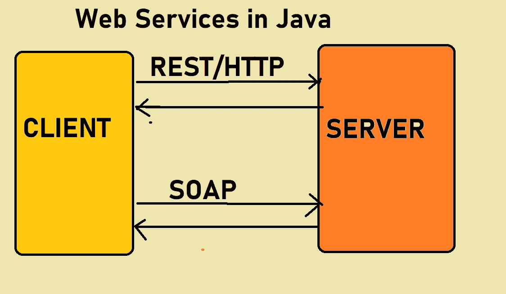
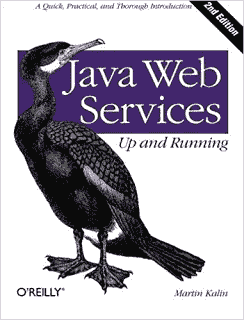
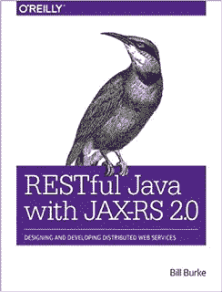
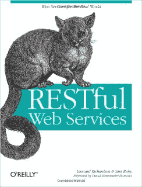
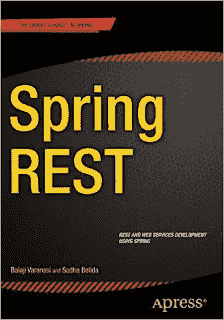

# 2023 年学习 Java 中 SOAP 和 RESTful Web 服务的 5 本最佳书籍

> 原文：<https://medium.com/javarevisited/top-5-books-to-learn-web-services-in-java-soap-rest-22d92adbefc1?source=collection_archive---------0----------------------->

## 这些是学习 Java 中 SOAP 和 RESTful Web 服务的最佳书籍。

如果你是一名 Java 开发人员，想学习如何用 Java 创建 Web 服务，包括 [SOAP](https://www.java67.com/2017/04/3-great-books-to-learn-java-web-services-soap-and-restful.html) 和 [RESTful](https://javarevisited.blogspot.com/2018/02/top-5-restful-web-services-with-spring-courses-for-experienced-java-programmers.html) ，但是不知道从哪里开始，那么你来对地方了。

早些时候，我已经分享了学习 RESTful web 服务的[最佳课程](/javarevisited/top-5-books-and-courses-to-learn-restful-web-services-in-java-using-spring-mvc-and-spring-boot-79ec4b351d12?source=---------17------------------)，在这篇文章中，我将分享一些学习 SOAP 和 RESTful web 服务的最佳书籍。如果您不熟悉 Web 服务，这是向其他开发人员和应用程序公开您的应用程序提供的服务的一种方式。

例如，如果您的系统提供天气信息，那么用户可以通过查看使用 [HTML](https://javarevisited.blogspot.com/2019/05/top-5-html-5-and-css-3-courses-for-web-developers.html) 、 [CSS](https://www.java67.com/2019/01/5-free-bootstrap-course-to-learn-online.html) 和 [JavaScript](https://javarevisited.blogspot.com/2018/06/top-10-courses-to-learn-javascript-in.html) 构建的 Web GUI 来手动检查天气信息。尽管如此，通过使用 Web 服务公开相同的信息，您允许程序员按照他们想要的方式显示。

程序员可以从智能手机应用程序调用您的 web 服务，并在天气应用程序中显示天气相关信息。web 服务确实使您的服务更容易访问，并开辟了一条向不同用户显示信息的新途径。

编程界流行两种 Web 服务， [**SOAP web 服务**](https://click.linksynergy.com/fs-bin/click?id=JVFxdTr9V80&subid=0&offerid=323058.1&type=10&tmpid=14538&RD_PARM1=https%3A%2F%2Fwww.udemy.com%2Fjava-web-services%2F) 和 [**RESTful Web 服务**](https://click.linksynergy.com/deeplink?id=JVFxdTr9V80&mid=39197&murl=https%3A%2F%2Fwww.udemy.com%2Fcourse%2Fspring-web-services-tutorial%2F) 。前者是一种古老但可靠的交换消息的方式，提供了许多特性，如*异步处理*和*有状态事务*，而 REST 是一种相对较新的构建 Web 服务的方式，它利用 HTTP 协议来公开 Web 服务。

Java 为开发 [*SOAP 和 RESTful Web 服务*](/javarevisited/7-difference-between-rest-and-soap-web-services-87510b06b687) 提供支持。它既有标准的又有几个库和框架，这使得你开发 web 服务的任务变得非常容易，就像你可以使用 JAX-WS 来改进基于 SOAP 的 Web 服务，使用 JAX-RS 来创建 RESTful Web 服务。

存在几个开源实现，比如 Apache Axis 是一个开发基于 SOAP 的 web 服务的优秀库，而 [Restlet](http://javarevisited.blogspot.sg/2016/10/restlet-helloworld-example-in-java-and-Eclipse.html) 、 [RESTEasy](https://javarevisited.blogspot.com/2017/02/difference-between-jax-rs-restlet-jersey-apache-cfx-RESTEasy.html) 、 [Jersey](https://javarevisited.blogspot.com/2017/06/jersey-web-service-hello-world-example.html#axzz5YVhV3Tc9) 和 [Spring framework](https://hackernoon.com/why-use-spring-to-develop-java-web-services-ba0dcb2cafbf) 适合开发 RESTful web 服务。

# 2023 年学习 Java Web 服务的 5 本最佳书籍

说到学习，我总是发现书籍、在线课程和个人辅导是学习过去任何新事物的最佳方式。说到自学，我大多是靠好书。

为什么我更喜欢[书](http://javarevisited.blogspot.sg/2017/02/top-5-books-to-learn-rest-and-restful-web-services-in-java.html)而不是文档或博客文章？尽管文档是最新最全面的资源，但它们并不适合初学者。

它们是参考资料，所以它们是最好的参考，我的意思是，一旦你有了一些知识，你就可以参考它们。

类似地，博客帖子有助于学习特定的主题，但它们不够全面，无法教会你在现实世界的项目中使用这些知识所需的大部分东西，因此，当我想了解关于特定主题的更多信息时，我会使用博客帖子，例如，如果你熟悉 PUT 和 post 方法，但对何时使用 PUT 或 POST 感到困惑，你可以在主要关注该主题的文章中搜索和阅读更多信息。

书籍提供两全其美的东西。它们以一种结构化的方式包含了所有有用的信息，因此您可以从基础知识到高级知识按顺序学习它们。

它们也是最完整、最全面的，足以为您提供某种平台，让您可以使用参考文档和博客帖子来了解更多信息。

因此，不再浪费时间，让我们看看一些学习 Java web 服务的最佳书籍。

## [1。马丁·卡琳的《Java Web 服务:启动和运行》](https://www.amazon.com/Java-Web-Services-Practical-Introduction/dp/1449365116?tag=javamysqlanta-20)

这应该是您阅读的第一本书，以了解什么是 soap 和 rest web 服务，您可以用它们做什么，以及如何用 JAX-WS 和 JAX-RS 实现它们。

如果您对这个主题完全陌生，我建议您编写本书给出的一些代码示例，如果您已经有了一些知识，您可以跳过您认为已经足够了解的部分来浏览本书。第二版比第一版提供了更多的 RESTful 上下文，因为 REST 在最近几年已经成为首选的 web 服务技术。

这也是一本准备 Oracle Certified Java expert for Web Services(OCEJWSD)认证(考试代码 1z 0–897)的优秀书籍，但是如果您需要更多资源，您也可以查看 Bharat Tippireaddy 的[**Java Web Services**](https://click.linksynergy.com/deeplink?id=JVFxdTr9V80&mid=39197&murl=https%3A%2F%2Fwww.udemy.com%2Fcourse%2Fjava-web-services%2F)课程，了解 Java 中的 Web 服务。结合这本书是一门极好的课程。

<https://click.linksynergy.com/deeplink?id=JVFxdTr9V80&mid=39197&murl=https%3A%2F%2Fwww.udemy.com%2Fcourse%2Fjava-web-services%2F>  

## [2。RESTful Java 与 JAX-RS 2.0](http://www.amazon.com/RESTful-Java-JAX-RS-Bill-Burke/dp/144936134X?tag=javamysqlanta-20)

如果你对 Java 和 OOP 有所了解，并且想学习如何开发基于 REST 的客户端和服务器，那么这本书非常适合你。它涵盖了来自 Java EE 7 的 JAX-RS 2.0 规范，并且关注于实现而不是理论。

你将学习 REST 和 JAX-RS 如何协同工作以及何时使用它们。它使用 JBoss 的 [RESTEasy](http://javarevisited.blogspot.sg/2017/02/difference-between-jax-rs-restlet-jersey-apache-cfx-RESTEasy.html) 框架来展示 JAX-RS 2.0 的特性，并给出了几个实际例子。

它还教你一些高级概念，比如安全 REST 和在 Web 上执行身份验证的流行机制，包括客户端 SSL 和 [OAuth 2.0](/javarevisited/top-10-courses-to-learn-spring-security-and-oauth2-with-spring-boot-for-java-developers-8f0222d6066d?source=---------5-----------------------) 和 HTTP 内容协商、缓存等。

它实际上是使用 Java 平台开发 REST web 服务的完整指南，尤其是 JAX-RS 2.0，对初学者和有经验者都很有用。

或者，如果您想使用 Jersey，那么您可以使用 Udemy 上的 Jersey 课程来查看 Java 中的 [**RESTFul 服务。使用 Jersey 用 Java 开发 REST 应用程序是一门实践性很强的课程。**](https://pluralsight.pxf.io/c/1193463/424552/7490?u=https%3A%2F%2Fwww.pluralsight.com%2Fcourses%2Frestful-services-java-using-jersey)

<https://pluralsight.pxf.io/c/1193463/424552/7490?u=https%3A%2F%2Fwww.pluralsight.com%2Fcourses%2Frestful-services-java-using-jersey>  

## [3。Leonard Richardson 的 RESTful Web 服务](http://www.amazon.com/RESTful-Web-Services-Leonard-Richardson/dp/0596529260?tag=javamysqlanta-20)

这实际上是关于 RESTful Web 服务的最好的书，由 Leonard Richardson 和 Sam Ruby 共同撰写。不像上一本书，那是一本使用 JAX-RS 2.0 在 Java 中实现 REST web 服务的指南，这是一本关于 RESTful web 服务本身的指南。

甚至 Rails 框架的创建者 David Heinemeier Hansson(他也转发了这本书)也说*“每个从事 Web 工作的开发人员都需要阅读这本书。”我完全同意。你将从 web 的角度了解 web 服务的每一个细节。您将了解什么是 URI，如何将 HTTP 用作应用层协议，而不仅仅是在客户端和服务器之间传输数据的传输协议。*

您还将学习*面向资源的架构*，最重要的是，RESTFul 设计如何比基于 RPC 的 web 服务设计更简单、更通用、更可伸缩。

简而言之，这是一本从 web 开发者的角度学习 REST web 服务的好书，如果你想了解更多，你也可以将这本书与 RESTful Web 服务、Java、Spring Boot、Spring MVC 和 JPA Udemy 课程结合起来快速学习。

<https://click.linksynergy.com/deeplink?id=JVFxdTr9V80&mid=39197&murl=https%3A%2F%2Fwww.udemy.com%2Fcourse%2Frestful-web-service-with-spring-boot-jpa-and-mysql%2F>  

## [4。弹簧座](https://www.amazon.com/Spring-REST-Balaji-Varanasi/dp/1484208242/?tag=javamysqlanta-20)

这本书解释了使用 Spring 框架开发 RESTful web 服务的所有细节。例如，Spring 只为 RESTful web 服务的消费提供了 RestTemplate。

您可以使用这个类连接到 REST 服务，并以 JSON、XML 和文本格式处理响应。Spring framework 充满了这种有用的类和实用程序。

如果你想用 Spring 来创建 RESTful APIs，我也建议你看看欧根·帕拉斯基夫 的 [**REST with Spring，这是 Java 开发者最好的资源之一。**](http://courses.baeldung.com/p/rest-with-spring-the-certification-class?affcode=22136_bkwjs9xa)

这就是学习 Java web 服务的**好书的全部内容**。它包括关于 SOAP 和 RESTful web 服务的论文。SOAP 和 REST web 服务的知识会给你的简历加分不少，因为没有多少开发人员知道 web 服务实际上是如何工作的，或者如何应用最佳实践，不管是 SOAP 还是 REST。因为当前的趋势是 RESTful web 服务和微服务，所以学习更多关于 REST 的知识会更加有益。

其他**有经验的 Java 开发人员可以参考的资源**

*   [学习 learn RESTful Web 服务的 5 门课程](https://javarevisited.blogspot.com/2018/02/top-5-restful-web-services-with-spring-courses-for-experienced-java-programmers.html#axzz61O27yGjY)
*   [面向 Java 开发者的 5 门免费 Spring 框架课程](http://www.java67.com/2017/11/top-5-free-core-spring-mvc-courses-learn-online.html)
*   [学习 Hibernate 和 JPA 的 5 门课程](http://javarevisited.blogspot.sg/2018/01/top-5-hibernate-and-jpa-courses-for-java-programmers-learn-online.html)
*   [面向有经验的 Java 开发人员的 5 大 Java 设计模式课程](http://javarevisited.blogspot.sg/2018/02/top-5-java-design-pattern-courses-for-developers.html)
*   [学习 React 框架的 5 门免费课程](http://www.java67.com/2018/02/5-free-react-courses-for-web-developers.html)
*   [学习大数据和 Apache Spark 的 5 门课程](http://javarevisited.blogspot.com/2017/12/top-5-courses-to-learn-big-data-and.html)
*   [Java 开发人员学习 Node.js 的 5 门课程](http://javarevisited.blogspot.sg/2018/01/top-5-nodejs-and-express-js-online-courses-for-web-developers.html)
*   [前 5 名 Selenium with Java Web 驱动程序课程](http://javarevisited.blogspot.sg/2018/02/top-5-selenium-webdriver-with-java-courses-for-testers.html)
*   [面向 Java 程序员的 5 门免费角课程](http://www.java67.com/2018/01/top-5-free-angular-js-online-courses-for-web-developers.html)
*   [从零开始学习网页开发的 5 门课程](http://javarevisited.blogspot.sg/2018/02/top-5-online-courses-to-learn-web-development.html#axzz57wed1PWd)
*   [深入了解 Spring Boot 的 5 门课程](https://www.java67.com/2018/06/5-best-courses-to-learn-spring-boot-in.html)
*   [学习 Java 微服务的 5 大课程](https://hackernoon.com/top-5-spring-microservice-courses-for-advanced-java-developers-ff601a57d69)

非常感谢您阅读这篇文章。如果你喜欢这些*书籍来学习 Java 中的 SOAP 和 RESTful Web 服务，*那么请与你的朋友和同事分享它们。如果您有任何问题或反馈，请留言。

**p . s .**——如果你想开始用 Java 开发 RESTful web 服务，但又想找一个免费的在线课程，首先，我建议你查看 Udemy 上的[**RESTful Web Services with Spring Framework**](http://bit.ly/2Dh2ma1)课程。这是完全免费的，你需要做的就是创建一个 Udemy 帐户，如果你没有的话，然后加入这个课程。

<http://bit.ly/2Dh2ma1> 