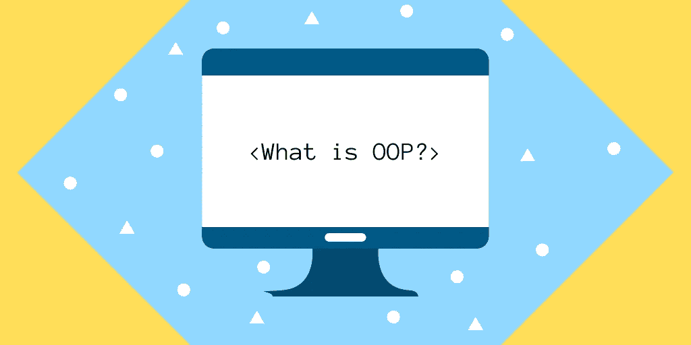

# 面向 Java 开发人员的 50 大 OOP(面向对象编程)面试问题

> 原文：<https://medium.com/javarevisited/top-50-oop-interview-questions-for-java-developers-d3c942bc813d?source=collection_archive---------0----------------------->

## 这些是 Java 开发人员经常被问到的 OOP 面试问题

image_credit —教育性

大家好，如果你正在准备 Java 面试，并且需要一些问题来修改面向对象的概念，那么你来对地方了。在过去，我已经分享了 [**最佳 OOP 书籍和课程**](/javarevisited/6-best-object-oriented-programming-books-and-courses-for-beginners-d46235cbda49) 以及多个 [Java 面试问题](/javarevisited/top-20-java-interview-questions-from-wall-street-banks-36ba58865681)，在这篇文章中，我将为你分享 *50+面向对象编程概念问题*。

OOP 面试问题或面向对象编程面试问题是任何 Java 面试不可或缺的一部分。因为 Java 是一种面向对象的编程语言，所以 Java 开发人员应该擅长面向对象的分析和设计，并且熟悉基本的 OOP 概念，比如抽象、封装和多态。

OOP，Java 中的面试问题主要基于基本的 OOPS 概念，以及这些概念在 Java 中是如何实现的，比如抽象 OOP 概念是使用接口和抽象类实现的，封装是使用私有关键字实现的，等等。

在高级 Java 面试中，OOP 的问题也是 Java 设计模式问题[的一部分。在新生和初学者级别的面试中，OOP 面试问题大多基于基础知识，只有一些棘手的 Java 问题，如](https://www.java67.com/2012/09/top-10-java-design-pattern-interview-question-answer.html) [*为什么 Java 不支持多继承*](https://www.java67.com/2016/03/top-21-java-inheritance-interview-Questions-Answer-Programming.html) 等。

在这篇 Java 文章中，我们会看到一些常见的 OOP 面试问题和答案。

有些问题非常基础，有些面向对象编程问题很难回答，但是这种混合有助于学习更多。如果你想了解更多关于 OOPS 设计原则的知识，请阅读 [10 面向 Java 程序员的 OOP 设计原则](https://javarevisited.blogspot.com/2018/07/10-object-oriented-design-principles.html)。

 [## 你可以深入学习的 10 个 OOP 设计原则

### 想要写出更好、更坚实的代码，能够在生产中经受住时间的考验？这些设计原则会有所帮助。

medium.com](/javarevisited/10-oop-design-principles-you-can-learn-in-2020-f7370cccdd31) 

# 66 Java OOP 概念面试问答

为了不浪费您的时间，下面是我为 Java 程序员列出的面向对象编程的常见问题。这些问题是从许多 Java 访谈中收集来的，既有电话访谈，也有不同层次 Java 程序员的面对面访谈。

1.  什么是面向对象编程中的类？
    (回答)一个类是一个蓝图创建的对象。
2.  **OOP 中的对象是什么？ **【答案】从类中创建，代表类的特定状态。****
3.  ****Java 中的抽象是什么？(** [**回答**](https://javarevisited.blogspot.com/2010/10/abstraction-in-java.html#axzz6oOeSmpNw) **)**
    一种对客户端隐藏复杂性的 OOP 技术。**
4.  ****Java 中的继承是什么？(** [**答**](http://www.java67.com/2012/08/what-is-inheritance-in-java-oops-programming-example.html) **)**
    一种重用代码和功能的面向对象技术。**
5.  ****什么是 Java 中的封装或数据隐藏？(** [**回答**](https://javarevisited.blogspot.com/2012/03/what-is-encapsulation-in-java-and-oops.html) **)**
    一种隐藏数据的 oop 方式，这样你以后就可以更改它而不会影响到其他人。**
6.  ****什么是 Java 或 OOP 中的多态性？(** [**回答**](https://www.java67.com/2012/10/difference-between-polymorphism-overloading-overriding-java.html) **)**
    提供了在运行时选择不同代码运行的灵活性。**
7.  **多态、重载和重写的区别是什么？([回答](http://java67.blogspot.sg/2012/10/difference-between-polymorphism-overloading-overriding-java.html))**
8.  ****为什么 Java 不支持 Java 中的多重继承？(** [**回答**](https://javarevisited.blogspot.com/2011/07/why-multiple-inheritances-are-not.html) **)****
9.  **Java 里什么时候用接口和抽象类？[(答案)](https://www.java67.com/2014/06/why-abstract-class-is-important-in-java.html)**
10.  ****Java 中静态和动态绑定有什么区别？(** [**回答**](http://www.java67.com/2016/08/difference-between-early-vs-late-binding-in-java.html) **)****
11.  **Java 中抽象和多态有什么区别？** ( [回答](http://java67.com/2015/05/difference-between-abstraction-and.html))**
12.  ****IS-A 关系和 HAS-A 有什么区别？(答案)
    IS-A 代表继承，HAS-A 代表构成。****
13.  **为什么 Java 不支持运算符重载？([回答](https://javarevisited.blogspot.com/2011/08/why-java-does-not-support-operator.html))**
14.  ****什么是 Java 中的抽象类？(** [**回答**](https://www.java67.com/2017/08/difference-between-abstract-class-and-interface-in-java8.html) **)****
15.  **Java 中的接口是什么？([答](https://javarevisited.blogspot.com/2012/04/10-points-on-interface-in-java-with.html))**
16.  ****继承和构成有什么区别？(** [**回答**](http://javarevisited.blogspot.sg/2013/06/why-favor-composition-over-inheritance-java-oops-design.html#axzz57Kv4wGXe) **)****
17.  ****耦合和内聚有什么区别？**
    (答案)耦合是代码不同部分之间的依赖，而内聚是代码的同一部分。**
18.  **Java 中的构造函数是什么？([答](https://javarevisited.blogspot.com/2012/12/what-is-constructor-in-java-example-chainning-overloading.html) )
    创建对象的特殊构造。**
19.  ****Java 或 OOP 中的类和对象有什么区别？(** [**回答**](http://www.java67.com/2014/08/what-is-difference-between-class-and-object-java-programming-oops.html) **)****
20.  **Java 中的继承和多态有什么区别？([回答](https://javarevisited.blogspot.com/2020/04/difference-between-inheritance-and-Polymorphism-in-java-oop.html))**
21.  ****什么是立体设计原则？解释其中任意三个(** [**回答**](/javarevisited/10-oop-design-principles-you-can-learn-in-2020-f7370cccdd31) **)****
22.  **工厂设计模式和抽象工厂设计模式有什么区别？([回答](http://javarevisited.blogspot.sg/2013/01/difference-between-factory-and-abstract-factory-design-pattern-java.html))**
23.  ****OOP 中重载、隐藏、隐藏、覆盖有什么区别？(** [**回答**](https://www.java67.com/2019/04/difference-between-overloading-overriding-hiding-shadowing-and-obscuring-in-java-oop.html) **)****
24.  **Java 中实例和对象的区别？([回答](https://draft.blogger.com/blog/post/edit/8712770457197348465/3501002046960146278#))**
25.  **Java 中静态和动态绑定有什么区别？([回答](https://www.java67.com/2014/11/difference-between-instance-and-object-in-java.html))**
26.  **什么是可靠的面向对象原则？** ( [答](https://dev.to/javinpaul/top-10-object-oriented-design-principles-for-writing-clean-code-4pe1))**
27.  ****Java 中抽象类和接口的区别？(** [**回答**](https://javarevisited.blogspot.com/2013/05/difference-between-abstract-class-vs-interface-java-when-prefer-over-design-oops.html) **)****
28.  **Java 中 private、protected 和 public 修饰符的区别？([答](https://javarevisited.blogspot.com/2012/10/difference-between-private-protected-public-package-access-java.html#axzz6j8KhisSX))**
29.  **什么是构造函数链接？([答](https://javarevisited.blogspot.com/2012/12/what-is-constructor-in-java-example-chainning-overloading.html))**
30.  ****按值传递和按引用传递的区别？(** [**回答**](https://javarevisited.blogspot.com/2012/12/does-java-pass-by-value-or-pass-by-reference.html) **)****
31.  **抽象和封装的区别？([回答](https://javarevisited.blogspot.com/2017/04/difference-between-abstraction-and-encapsulation-in-java-oop.html))**
32.  ****关联、合成和聚合的区别？(** [**答案**](https://javarevisited.blogspot.com/2014/02/ifference-between-association-vs-composition-vs-aggregation.html#axzz6uGbTSBhL) **)****
33.  **能解释一下开放封闭的设计原理吗？([回答](http://javarevisited.blogspot.sg/2015/07/strategy-design-pattern-and-open-closed-principle-java-example.html#axzz5CqPlkiLV))**
34.  ****什么是观察者设计模式？你应该什么时候使用它？(** [**回答**](http://javarevisited.blogspot.sg/2011/12/observer-design-pattern-java-example.html) **)****
35.  ****OOP 中隐藏和隐藏的区别？** (** [**回答**](https://www.java67.com/2019/04/difference-between-overloading-overriding-hiding-shadowing-and-obscuring-in-java-oop.html) **)****
36.  **你能用 Java 重写一个静态方法吗？([答](https://www.java67.com/2012/08/can-we-override-static-method-in-java.html))**
37.  ****状态和策略设计模式有什么区别？(** [**回答**](http://javarevisited.blogspot.sg/2014/04/difference-between-state-and-strategy-design-pattern-java.html) **)****
38.  **类和实例的区别是什么？([回答](https://www.java67.com/2014/11/difference-between-instance-and-object-in-java.html))**
39.  ****工厂和抽象工厂设计模式有什么区别？(** [**回答**](http://javarevisited.blogspot.sg/2013/01/difference-between-factory-and-abstract-factory-design-pattern-java.html) **)****
40.  **依赖注入和工厂模式有什么区别？([回答](https://javarevisited.blogspot.com/2015/06/difference-between-dependency-injection.html))**
41.  ****什么是 OOP 或 Java 中的方法重载？(** [**回答**](http://java67.blogspot.sg/2012/08/what-is-method-overloading-in-java-example.html) **)****
42.  **OOP 或 Java 中的方法覆盖是什么？** ( [回答](http://java67.blogspot.sg/2012/08/what-is-method-overriding-in-java-example-tutorial.html))**
43.  ****Java 是纯面向对象语言吗？如果不是为什么？(** [**回答**](http://java67.blogspot.com/2014/03/is-java-pure-object-oriented-programming-language.html) **)****
44.  **Java 中方法重载和重写的规则是什么？** ( [回答](http://java67.blogspot.sg/2012/09/what-is-rules-of-overloading-and-overriding-in-java.html))**
45.  **方法重载和重写的区别？([回答](http://java67.blogspot.sg/2012/09/difference-between-overloading-vs-overriding-in-java.html))**
46.  **我们可以在 Java 中重载一个静态方法吗？([答](http://java67.blogspot.sg/2012/08/can-we-overload-static-method-in-java.html))**
47.  ****我们可以在 Java 中重写静态方法吗？** (** [**回答**](http://java67.blogspot.sg/2012/08/can-we-override-static-method-in-java.html) **)****
48.  **我们能在 Java 中重写私有方法吗？** ( [答](http://java67.blogspot.sg/2013/08/can-we-override-private-method-in-java-inner-class.html))**
49.  ****Java 中的协变方法 overriding 是什么？** (** [**回答**](http://javarevisited.blogspot.com/2014/03/covariant-method-overriding-of-java-5.html) **)****
50.  **我们能改变重写方法的参数列表吗？** ( [回答](http://javarevisited.blogspot.com/2011/08/what-is-polymorphism-in-java-example.html))**
51.  ****我们可以覆盖一个抛出运行时异常而没有抛出子句的方法吗？(** [**回答**](http://javarevisited.blogspot.sg/2011/12/method-overloading-vs-method-overriding.html) **)****
52.  **我们可以在 Java 中覆盖 final 方法吗？([回答](http://javarevisited.blogspot.com/2013/12/when-to-make-method-final-in-java.html))**
53.  **Java 8 的默认方法是什么？** ( [回答](http://javarevisited.blogspot.com/2014/07/default-defender-or-extension-method-of-Java8-example-tutorial.html))**
54.  **什么是 Java 中的抽象类？( [**回答**](http://java67.blogspot.sg/2014/06/why-abstract-class-is-important-in-java.html) )****
55.  **Java 中的接口是什么？一个接口的真正用途是什么？** ( [回答](http://java67.blogspot.sg/2014/02/what-is-actual-use-of-interface-in-java.html))**
56.  ****抽象类和接口有什么区别？** (** [**回答**](http://java67.blogspot.sg/2012/09/what-is-difference-between-interface-abstract-class-java.html) **)****
57.  **没有抽象方法能让类抽象吗？** ( [回答](http://javarevisited.blogspot.com/2013/04/10-abstract-class-and-interface-interview-question-java-answers.html))**
58.  **我们可以同时创建一个最终的和抽象的类吗？** ( [回答](http://javarevisited.blogspot.com/2011/12/final-variable-method-class-java.html))**
59.  ****我们可以重载或者覆盖 Java 中的 main 方法吗？** (** [**回答**](http://java67.blogspot.com/2015/06/can-you-overload-or-override-main-in-java.html) **)****
60.  **Java 中的策略模式解决了什么问题？** ( [回答](http://java67.blogspot.com/2014/12/strategy-pattern-in-java-with-sample.html))**
61.  ****哪个 OOP 概念装饰设计模式是基于？** (** [**回答**](http://java67.blogspot.com/2013/07/decorator-design-pattern-in-java-real-life-example-tutorial.html) **)****
62.  **Java 中什么时候使用 Singleton 设计模式？** ( [回答](http://java67.blogspot.com/2012/08/what-is-singleton-pattern-in-java.html))**
63.  **状态模式和策略模式的区别是什么？** ( [回答](http://javarevisited.blogspot.com/2014/04/difference-between-state-and-strategy-design-pattern-java.html))**
64.  ****在面向对象程序设计中，关联、聚合和组合有什么区别？(** [**答案**](http://javarevisited.blogspot.com/2014/02/ifference-between-association-vs-composition-vs-aggregation.html) **)****
65.  **Java 中的装饰模式、代理模式和适配器模式有什么区别？([回答](http://javarevisited.blogspot.com/2015/01/adapter-vs-decorator-vs-facade-vs-proxy-pattern-java.html))**
66.  ****OOP 中的复合和继承有什么区别？(** [**回答**](http://javarevisited.blogspot.sg/2015/06/difference-between-inheritance-and-Composition-in-Java-OOP.html) **)****

**以上是 Java 程序员常见的一些面向对象面试问题。很可能你已经知道这些基本的面向对象编程、设计和模式相关问题的答案。**

**如果你没有看到链接，并修改这些概念。你可以在面试前使用这个列表来复习所有关键的面向对象编程概念。如果你认为一个流行的 OOP 问题从列表中消失了，请在评论中自由分享，我会把它包括在这个列表中。**

**这些问题中的大部分对 JavaScript 和 Python 开发者也很有用，因为 [JavaScript](/javarevisited/my-favorite-free-tutorials-and-courses-to-learn-javascript-8f4d0a71faf2) 和 [Python](/javarevisited/8-advanced-python-programming-courses-for-intermediate-programmer-cc3bd47a4d19) 也都是面向对象的编程语言。**

**你可能想准备的其他面试问题**

*   **35 Python 初学者面试问题( [python 问题](https://javarevisited.blogspot.com/2021/05/python-interview-questions-answers-for-beginners.html))**
*   **50+ SQL 和数据库电话面试问题( [SQL 问题](https://javarevisited.blogspot.com/2021/05/sql-and-database-phone-interview-questions.html))**
*   **130+ Java 面试问题及答案([列表](https://javarevisited.blogspot.com/2015/10/133-java-interview-questions-answers-from-last-5-years.html))**
*   **17 春季 AOP 面试问题及答案([列表](https://javarevisited.blogspot.com/2021/03/spring-aop-interview-questions-answers.html#axzz6nwXUSoGH))**
*   **40+面向对象的面试问题及答案([问题](https://javarevisited.blogspot.com/2020/05/object-oriented-programming-questions-answers.html))**
*   **15 春季数据 JPA 面试问题([列表](https://www.java67.com/2021/01/spring-data-jpa-interview-questions-answers-java.html))**
*   **面向 Java 开发人员的 20 多个 JUnit 面试问题([问题](https://javarevisited.blogspot.com/2021/04/junit-interview-questions-with-answers.html#axzz6w2HbPhVo))**
*   **编码面试的 10 个动态规划问题([题](https://javarevisited.blogspot.com/2021/03/top-dynamic-programming-problems-for-coding-interviews.html))**
*   **25 春季安全面试问题及答案([问题](https://javarevisited.blogspot.com/2021/02/spring-security-interview-questions-answers-java.html#axzz6lIcZ8tnd))**
*   **学习 Java 编程的 5 门最佳课程([最佳课程](https://javarevisited.blogspot.com/2018/05/top-5-java-courses-for-beginners-to-learn-online.html))**
*   **20 春季 MVC 面试问题及答案([春季问题](https://javarevisited.blogspot.com/2018/11/top-20-spring-mvc-interview-questions-answers-for-java-developers.html))**

**感谢您阅读本文。如果你觉得这些*面向对象编程面试问题*有用，那么请与你的朋友和同事分享。如果您有任何问题或反馈，请留言。**

> *****p . s .****——如果你是面向对象编程的新手，需要一些学习 OOP 的资源，那么你也可以从这些* [*免费的面向对象编程课程*](/swlh/5-free-object-oriented-programming-online-courses-for-programmers-156afd0a3a73) *开始。***

** [## 面向 Java 程序员的五大免费面向对象编程课程[更新]

### Java 编程教程和面试问题，来自 Udemy，Pluralsight，Coursera…

www.java67.com](https://www.java67.com/2018/02/5-free-object-oriented-programming-online-courses.html)**