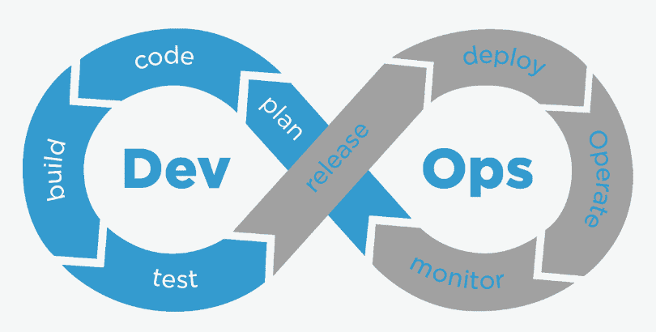

# 目前最受欢迎的 Java 开发技能

> 原文：<https://medium.com/javarevisited/top-java-development-skills-in-demand-right-now-1b3f713f26cc?source=collection_archive---------0----------------------->

*由 Alex Zubel |在* [*Softteco*](https://www.pangea.ai/vendors/softteco/) 的营销主管

Java 仍然是最受欢迎的编程语言之一，并且仍然是最受欢迎的语言之一，尽管它已经存在了将近四分之一世纪。因此，有理由假设 Java 将继续流行，Java 开发人员将会看到未来雇主的更多需求。如果你对这些雇主的招聘趋势感到好奇，一定要看看我们关于 [Java 开发人员招聘趋势](https://www.pangea.ai/vendors/softteco/java-developer-hiring-trends/)的文章。

为了创建高质量的产品，开发人员需要不断地监控最新 Java 工具的发布，并更新他们的技术技能和知识。下面我们展示了 Java 开发人员的五大技能，这些技能将成为 Java 开发人员在 2021 年及以后的绝对必备技能。

# 精通 Java 8

尽管 2019 年 9 月发布了 Java 13，但仍有许多开发人员对 Java 8 及其功能感到不舒服。所以对于有抱负的 Java 开发人员来说，扎实的 Java 8 知识和经验是必须的。

一些最有用的 Java 8 特性包括:

*   使用方法实现创建接口的默认和静态方法
*   只有一个抽象方法的函数接口，帮助开发人员避免添加其他抽象方法
*   帮助实例化函数接口的 Lambda 表达式
*   支持并行和顺序执行的 Java 流 API
*   集合 API 中添加了新方法

所有这些特性使得 Java 8 非常适合函数式编程，这是目前的一个大趋势。函数式编程允许并发性和代码简洁，并有助于用高度优化的代码创建高负载的应用程序。

Java 8 还为机器码优化创造了条件，允许对 Scala、Kotlin 和 Grails 等其他语言的方法进行优化。

# 测试经验

Java 中的单元测试是一个颇有争议的话题。一些开发人员声称编写单元测试是浪费时间，但是我们坚信单元测试技能是任何专业 Java 开发人员必须掌握的。

单元测试允许对单个代码单元进行测试，并确保最终产品不会出现错误。所以，如果一个开发人员想要提升他们的技能和知识，学习如何使用最流行和最有效的测试工具是必须的。

需要熟悉的主要测试框架是每个 Java 开发人员都知道的 JUnit 5 库。其他工具包括:

*   机器人框架
*   莫奇托
*   PowerMock

除了单元测试之外，一个优秀的 Java 开发人员不应该忘记其他测试方法(系统测试、验收测试和集成测试)，以便执行 360 度的软件测试，并确保没有错误、bug 或严重故障。关于测试要记住的关键事情是:小的改变会导致大的结果。如果你毫不犹豫地在单元测试上投入时间和精力，你将会惊讶于你工作质量的提高。

# 采用 DevOps

虽然不是必须的，但是 DevOps 及其原则的探索可能对作为开发人员的你和你工作的公司都有好处。DevOps 流程的灵活性和组织性使公司能够优化产品质量和简化运营，同时提高流程的透明度。

Java 中的 DevOps 基本上就是 DevOps 对 Java 开发的应用。它意味着:

*   持续交付和集成
*   使用微服务而不是整体服务
*   作为代码的基础设施
*   自动化测试

DevOps 是一个广阔的领域，因此需要投入大量的时间和资源来研究它。但是，如果你是一名 Java 开发人员，并且你希望管理环境，学习 DevOps 将是有用的，因为它将使你在未来成为一名 DevOps 工程师。

但是如果你不想成为 DevOps 工程师或者你的公司不想采用它，那也没关系。请记住，DevOps 越来越受欢迎，并逐渐成为 Java 社区的下一个大趋势。

# Java 库和 API 的知识

随着 Java 成为开发者社区的头号编程语言，它拥有大量可用的 API 和库也就不足为奇了。

这些工具极大地促进了开发过程，并允许开发人员快速创建健壮的软件。下面我们列出了一组基本的工具，任何优秀的 Java 开发人员都知道并且可以放心使用。

这些工具有助于快速组装应用程序并高效管理数据及其存储:

1.  应用程序组装工具
2.  Maven(有点过时但仍然流行，也用于组装应用程序)
3.  Java 8 标准包
4.  Spring 框架
5.  JPA ORM (Hibernate，TopLink)
6.  NoSQL 数据库(MongoDB、Cassandra)

至于 API，为了使用主要的 Java API，开发人员需要对 OpenJDK、Android、Oracle 和 IS2T 有扎实的知识。

这些工具的一个很大的优点是它们都附带了详细的信息文档。更重要的是，开发者总是可以得到社区的支持，这也是一个很大的好处。

# 关于春天和 Spring Boot 的扎实知识

Spring Framework 是创建基于 Java 的应用程序最常用的框架，所以开发人员了解它是非常重要的。

Spring 的关键优势之一是依赖注入，它允许创建松散耦合的应用程序，并为开发人员提供了很大的灵活性。Spring 也非常轻量级，支持 XML 和注释配置，还支持声明式编程。所以如果你想掌握你的 Java 开发技能，你也必须掌握 Spring 的部署。

Spring Boot 是一个 Spring 迭代，它是一个用于快速应用程序部署的服务友好的工具。可以肯定地说，Spring Boot 以 Spring 为基础，并在此基础上建立了自己的特色。

Spring 关注的是灵活性，而 Spring Boot 有助于缩短代码并简化开发过程。它为开发人员提供生产就绪的功能，帮助创建独立的应用程序，并且总体上更易于启动和管理。Spring Boot 非常适合需要快速开发的微服务和应用，因为它允许针对不同环境(生产、测试、质量、CI/CD)快速轻松地设置和启动应用。最近发布了 Spring Boot 2 版本，所以 Java 开发人员可能想探索和学习它。

Spring 和 Spring Boot 都利用 React 编程的机会进行了扩展，React 编程是开发社区的另一个热门趋势。例如，Spring 5 现在有一个 WebFlux 来实现对复杂分布式系统的编程和解析的反应式方法。

# 大数据经验

[大数据](https://www.pangea.ai/services/big-data-visualization/)是一个不断发展的趋势，开发人员需要跟随并采纳这一趋势，以满足市场需求。专业 Java 开发人员可以熟悉的主要工具有:

*   阿帕奇火花
*   阿帕奇卡夫卡
*   Hadoop(用于批量数据处理)

Apache Spark 是一个用于大数据处理的分布式框架，为 Java 提供了本地绑定。由于其特性和性能，这个框架很快变得非常流行，现在是 Java 社区中处理大数据的最受欢迎的工具。Apache Spark 可以在独立集群模式下运行，为此，您只需要 Apache Spark 框架和一个 JVM(针对集群中的每台机器)。Spark 也非常快，并且有一个非常用户友好的 Spark API。

Hadoop 是一个数据存储框架，也是 Java 开发人员所熟知的。虽然与 Spark 相比，它的执行速度有所下降，但 Hadoop 仍然是处理大数据最受欢迎的工具之一。这也是因为 Hadoop(以及类似的解决方案)拥有大量插件，可以高效解决大数据处理任务，并整体优化 Hadoop 性能(包括支持流实时处理)。

# 准备好发展您的 Java 技能了吗？

随着越来越受欢迎，Java 似乎有一个稳定的未来。因此，如果开发人员希望适应不断变化的软件开发环境，他们需要跟随最新的发展趋势，不断掌握自己的技能，以满足客户和市场的要求。请务必阅读我们关于成为更好的 Java 开发人员的技巧的文章。

**你可能喜欢的其他 Java 文章**

</javarevisited/the-java-programmer-roadmap-f9db163ef2c2>  <https://javarevisited.blogspot.com/2017/12/10-things-java-programmers-should-learn.html>  <https://dev.to/javinpaul/11-essential-skills-software-developers-should-learn-in-2020-1bio> 