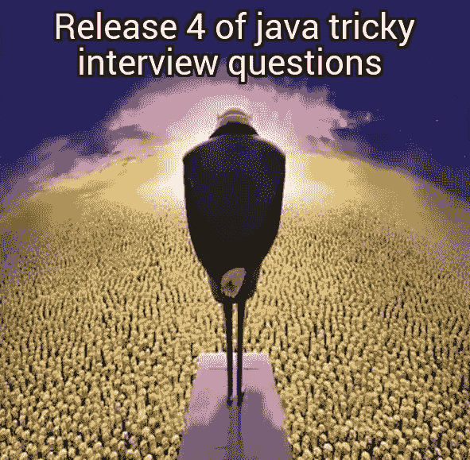

# 棘手的 Java 面试问题系列:第 4 版

> 原文：<https://medium.com/javarevisited/tricky-java-interview-questions-series-release-4-d4bb62951b43?source=collection_archive---------1----------------------->

又是一天，又一个棘手的 java 面试问题发布了。你可以在这里浏览第三版。而整个名单[在这里](/@abhijithjadhav/list/java-tricky-interview-questions-ac7425b8d045)。



## 31.HashMap 键的最佳候选是什么？字符串是 HashMap 键的好候选吗？

不可变对象非常适合 HashMap 键，因为它们一旦创建就不能更改。由于字符串本质上是不可变的，所以它们是[散列表键](https://javarevisited.blogspot.com/2017/08/how-to-remove-key-value-pairs-from-hashmap-java8-example.html)的非常好的候选对象。

## 32.一个变量可以同时是局部的和静态的吗？

不可以。变量不能同时是局部的和静态的，这样做会导致编译错误。本地只允许 final。

## 33.有没有可能在 java 类中定义一个方法，在另一种编程语言如 C++中提供它的实现？

是的，您可以通过使用本机方法堆栈来做到这一点。在本地方法栈开发的情况下，我们将在 Java 类中定义[公共静态方法](https://javarevisited.blogspot.com/2011/12/main-public-static-java-void-method-why.html)而不包含其实现，然后用另一种语言如 [C++](/javarevisited/10-advanced-c-books-and-courses-for-experienced-programmers-a90c3942471a) 提供实现

## 34.我们可以声明一个抽象类 final 吗？

不，我们不能声明抽象类 final。从逻辑上讲，抽象类的主要目的是提供拥有抽象和非抽象方法的可行性，如果我们声明抽象类 fina，那么我们将无法扩展抽象类，整个场景将没有任何意义😊。

```
// The below code will give compilaiton errors
public abstract final class Car{
}
```

## 35.即使定义了显式构造函数，我们还能使用类的默认构造函数吗？

如果我们有一个参数化的构造函数，那么我们就不能自动调用内部的默认构造函数，这会导致编译错误。

## 36.当一个线程正在执行同步方法时，是否有可能由其他线程同时执行其他同步方法？

不可以。当一个线程在[同步方法中时，其他线程不可能执行同步方法。](https://www.java67.com/2013/01/difference-between-synchronized-block-vs-method-java-example.html)

## 37.如果两个线程有相同的优先级，哪个线程将被首先执行？

这将完全取决于线程调度器执行哪个线程。调度程序可以从线程池中挑选任何线程，并运行它，直到它完成，或者它可以通过时间片给所有线程同等的机会。

## 38.sleep()方法可以导致另一个线程休眠吗？

No [sleep()方法](https://javarevisited.blogspot.com/2011/12/difference-between-wait-sleep-yield.html)仅导致当前线程睡眠，而不睡眠任何其他线程。

## 39.在线程的上下文中，什么时候会抛出 IllegalMonitorStateException？

当在非同步上下文中调用 wait()，notify()，notifyall()时，我们将收到一个 IllegalMonitorStateException。

## 40.java 中可以序列化静态变量吗？

我们不能在 java 中序列化静态变量。静态变量的原因是类属于类而不是对象，但是序列化只保存对象状态而不保存类状态。

> 我们这里有[第 5 版](https://abhijithjadhav.medium.com/tricky-java-interview-questions-series-release-5-fe394cbdb4af)😊