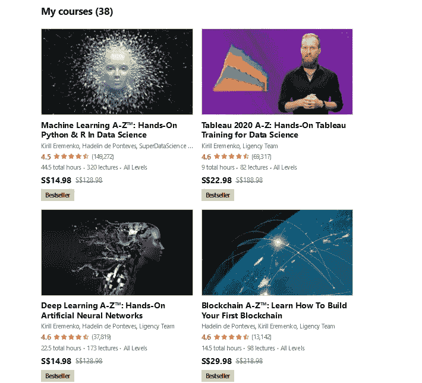

# 回顾 Udemy 上的数据科学课程中的机器学习 A-Z 动手 Python 和 R 值得吗？

> 原文：<https://medium.com/javarevisited/udemy-course-review-machine-learning-a-z-hands-on-python-and-r-in-data-science-by-kirill-eremenko-f2b8aa625895?source=collection_archive---------0----------------------->

## 数据科学课程中的机器学习 A-Z 实践 Python 和 R 由 Kirill 叶列缅科在 Udemy 上提供，这是一个详细的、引人入胜的、信息丰富的学习 Python 和 R 的课程

image_credit — Udemy

大家好，如果你想学习使用 Python 或 R 编程语言的机器学习，并考虑加入由基里尔·叶列缅科和他的 SuperDataScience 团队开设的 Udemy 的 [**机器学习 A-Z——数据科学**](https://click.linksynergy.com/deeplink?id=JVFxdTr9V80&mid=39197&murl=https%3A%2F%2Fwww.udemy.com%2Fcourse%2Fmachinelearning%2F) 中的 Python 和 R 实践在线课程，那么你来对地方了。

在这篇文章中，我回顾了 Udemy 的机器学习 A-Z——Kirill 叶列缅科和 Hadelin De Ponteves 撰写的《数据科学中的 Python 和 R 实践》,这样你就会知道它是否值得你花费时间或金钱。

老实说，这是你可以以实惠的价格获得的 [**最好的机器学习课程**](/javarevisited/top-10-machine-learning-and-data-science-certifications-and-training-courses-for-beginners-and-a6308497b764) 之一，适合初学者和中级程序员以及想要追求机器学习的人。

它全面而又引人入胜；它很详细，但同时非常中肯，充满了现实生活中的例子和动手编码。几乎有 80 万人加入了这门课程，它的平均评分为 4.5，这充分说明了这门课程的质量。

如果你很着急，建议你 [**现在就加入课程**](https://click.linksynergy.com/deeplink?id=JVFxdTr9V80&mid=39197&murl=https%3A%2F%2Fwww.udemy.com%2Fcourse%2Fmachinelearning%2F) (目前九折)。你不会后悔，但是如果你有一些时间，留下来看机器学习 aZ-A 动手 Python 和 R 的*全复习* *在数据科学课程*做一个知情的决定。

这个被称为机器学习的行业已经发展成为 IT 行业中需求最大的领域之一。一些无穷无尽的选项和行业可以受益于机器学习，例如聊天机器人、自动驾驶汽车、假新闻检测等等。

机器学习是让计算机利用数据而不是被编程来学习的概念。Glassdoor 估计，机器学习工程师的年薪约为 114，121 美元。好的一面是，你实际上不需要大学学位就可以在这个行业开始职业生涯，因为许多在线课程可以教你这些概念。

当我在互联网上浏览一些在线课程，在像 [**Coursera**](https://coursera.pxf.io/c/3294490/1164545/14726?u=https%3A%2F%2Fwww.coursera.org%2F) 、 [**Educative**](https://www.educative.io/subscription?affiliate_id=5073518643380224) 和 [**Pluralsight**](https://pluralsight.pxf.io/c/1193463/424552/7490?u=https%3A%2F%2Fwww.pluralsight.com%2Flearn) 这样的平台上学习机器学习时，我登陆了一个 Udemy 课程，该课程承诺教你在这个行业开始职业生涯所需的所有东西，你现在正在阅读该课程的评论。

 [## 机器学习

### 构建智能应用程序。在四门实践课程中掌握机器学习基础知识。这种专业化来自…

coursera.pxf.io](https://coursera.pxf.io/c/3294490/1164545/14726?u=https%3A%2F%2Fwww.coursera.org%2Fspecializations%2Fmachine-learning) 

# 数据科学中的机器学习 A-Z——动手 Python 和 R 值不值？回顾

不浪费你更多的时间，下面是我对 [**Udemy 的机器学习 A-Z——数据科学中的动手 Python 和 R**](https://click.linksynergy.com/deeplink?id=JVFxdTr9V80&mid=39197&murl=https%3A%2F%2Fwww.udemy.com%2Fcourse%2Fmachinelearning%2F)**的回顾。**考虑到讲师的声誉、内容结构、本课程涵盖的内容以及整体课程材料和交付，我将评论分为多个部分。

## 1.讲师声誉

在开始探索内容之前，我们先来介绍一下这门机器学习课程的两位主要讲师:

[**基里尔·叶列缅科**](https://click.linksynergy.com/deeplink?id=JVFxdTr9V80&mid=39197&murl=https%3A%2F%2Fwww.udemy.com%2Fuser%2Fkirilleremenko%2F) :是一位拥有多年行业经验的数据科学顾问，也是一位 Udemy 讲师，在机器学习、tableau、深度学习、数据科学、python 语言等不同领域开设了超过 114 门课程，注册学生超过 160 万。

[**Hadelin de pont eves**](https://www.udemy.com/user/hadelin-de-ponteves/):也是 Udemy 讲师，拥有超过 80 门不同领域的在线课程，如区块链、深度学习、计算机视觉、人工智能以及更多领域。他也是一名企业家，也是 BlueLife AI 的创始人。

Kirill 是学习[数据科学](/javarevisited/my-favorite-data-science-and-machine-learning-courses-from-coursera-udemy-and-pluralsight-eafc73acc73f)、[机器学习](/javarevisited/top-10-machine-learning-and-data-science-certifications-and-training-courses-for-beginners-and-a6308497b764)、[人工智能](/javarevisited/7-best-courses-to-learn-artificial-intelligence-in-2020-26d59d62f6fe)的最好的 Udemy 导师之一，他创作了许多畅销课程，包括这本。您可以进一步查看他的个人资料，了解有关他的其他数据科学课程的更多信息。

## 2.课程结构和内容

好的方面是，在深入到课程的实践部分之前，讲师从机器学习的介绍和其他一些关键的机器学习概念开始。

**2.1。数据预处理**
在将机器学习算法应用到你的数据之前，第一步是将数据预处理成正确的格式，这一节就是全部。您将看到如何使用两种语言[python](https://javarevisited.blogspot.com/2019/09/5-websites-to-learn-python-for-free.html)n 和 [R](/javarevisited/10-best-r-programming-courses-for-data-science-and-statistics-8f84ebec4974) 来预处理数据。

**2.2。回归**
对数据进行预处理后的下一步是对数据应用一些机器学习算法。本节向您展示六种不同的[机器学习算法](/javarevisited/5-machine-learning-algorithms-every-data-scientists-should-learn-de467fd2e444)，如简单线性回归、支持向量机、随机森林等等，并评估这些算法的性能。

**2.3。分类**
机器学习回归算法是用来预测连续数据的，但是预测类别呢？嗯，这就是你在这一节将学到的一些算法，如逻辑回归，核 SVM，以及更多，每种算法的优点和缺点的细节。

**2.4。聚类**

**2.5。关联规则学习**
这一节将教你一种用来寻找各种项目之间关系的技术，称为关联规则学习。它通常更多地用于推荐系统中。

**2.6。强化学习**
简而言之，强化学习是机器学习的一个子集，其中计算机可以做出一系列决策。这一节还将向您展示如何使用 [Python](/javarevisited/10-best-python-certification-courses-from-coursera-4576890eb6b3) 和 [R](/javarevisited/top-5-free-courses-to-learn-r-programming-for-data-science-and-statistics-in-2020-305bf1c6f24e) 来执行这一操作。

**2.7。自然语言处理是机器学习的一个子集，计算机可以处理文本，如翻译、语音识别等。本节将向您介绍 [NLP 库](/javarevisited/10-best-nlp-natural-language-processing-with-python-courses-for-beginners-bfe526c6b0b2)以及如何在 [python](/swlh/5-free-python-courses-for-beginners-to-learn-online-e1ca90687caf) 和 r。**

**2.8。深度学习**深度学习的力量来了，你可以创建神经网络来处理和处理这些大量的数据。

**2.9。降维**
这项技术用于将你的数据从高维空间降维或转换到低维空间，因为变量越少，越容易绘制和比较。

**2.10。模型选择&助推**
在你学会了所有的[机器学习](/javarevisited/10-free-machine-learning-courses-for-beginners-181f83b4c816)和[深度学习](/javarevisited/10-free-deep-learning-courses-for-beginners-37b5de61f8dc)技术和算法之后，你可能会对我的问题或项目需要使用哪一个感到困惑。这一节将教你应该为你的模型或数据使用什么算法和技术。

## 3.人物评论

课程拿到了 70 多万的学生报名，很疯狂，各行业 Udemy 平台很少有课程拿到这个报名数，证明了这个节目的成功和质量。

**这里是加入本课程的链接**—[—**机器学习 A-Z —数据科学中的动手 Python 和 R**—](https://click.linksynergy.com/deeplink?id=JVFxdTr9V80&mid=39197&murl=https%3A%2F%2Fwww.udemy.com%2Fcourse%2Fmachinelearning%2F)

image_credit — Udemy

这就是基里尔·叶列缅科和他的 SuperDataScience 团队在 Udemy 上对机器学习 A-Z:数据科学课程中的 Python 和 R 的实践的**综述。**

这是最好的机器学习在线课程之一。它很全面(44 小时的内容)但很吸引人，很实用但很详细，最重要的是，它信息量很大。基里尔·叶列缅科的教学风格使这成为一门使用 Python 和 r 学习机器学习的完整课程

你将学到真正令人惊讶的东西，这将使你在这个行业中变得专业，我甚至无法提到你将在这个课程中探索的所有东西，所以这是你成为机器学习工程师的机会。

如果你是认真的 [*学习 Python*](/javarevisited/10-best-python-certification-courses-from-coursera-4576890eb6b3) *和* [*机器学习*](/javarevisited/10-free-machine-learning-courses-for-beginners-181f83b4c816) *深入学习*，这里有一些更多的免费和付费资源供进一步学习

*   [面向数据科学和机器学习的 8 大 Python 库](https://javarevisited.blogspot.com/2018/10/top-8-python-libraries-for-data-science-machine-learning.html)
*   [2023 年学习 Python 的 10 个理由](https://javarevisited.blogspot.com/2018/05/10-reasons-to-learn-python-programming.html)
*   [面向初学者的 15 门免费 Python 编程课程](/swlh/5-free-python-courses-for-beginners-to-learn-online-e1ca90687caf)
*   [程序员的 10 门 Python 课程和认证](https://javarevisited.blogspot.com/2020/02/10-best-coursera-courses--for-python.html)
*   [学习数据科学的 5 大 Python 书籍](https://javarevisited.blogspot.com/2019/08/top-5-python-books-for-data-science-and-machine-learning.html)
*   [面向程序员的 10 本免费 Python 编程书籍](http://www.java67.com/2017/05/top-7-free-python-programming-books-pdf-online-download.html)
*   [2023 年网络开发者路线图](https://hackernoon.com/the-2019-web-developer-roadmap-ab89ac3c380e)
*   [Python 开发者的五大 Web 开发框架](https://javarevisited.blogspot.com/2019/04/top-5-python-web-development-frameworks.html)
*   [5 Python 中的数据科学与机器学习课程](https://javarevisited.blogspot.com/2018/03/top-5-data-science-and-machine-learning-online-courses-to-learn-online.html)
*   [Python 和 JavaScript——从哪个开始比较好？](https://javarevisited.blogspot.com/2019/05/python-vs-javascript-which-programming-language-beginners-should-learn.html)
*   [深入学习 Python 的 10 门免费在线课程](https://javarevisited.blogspot.com/2018/12/10-free-python-courses-for-programmers.html)
*   [8 个 Python 项目，适合初学者学习 Python](/javarevisited/8-projects-you-can-buil-to-learn-python-in-2020-251dd5350d56)
*   [为什么 Python 是数据科学的最佳编程语言](https://javarevisited.blogspot.com/2020/05/why-python-is-best-programming-language.html)
*   [免费学习 Python 编码的五大网站](https://javarevisited.blogspot.com/2019/09/5-websites-to-learn-python-for-free.html)

感谢您阅读本文。如果你喜欢这篇*机器学习 A-Z——数据科学课程复习*中的动手 Python 和 R，请把这篇文章分享给你的朋友和同事。

如果你有任何问题或反馈，请留言，如果你有我应该加入或阅读的机器学习课程或书籍，请随时与我们分享。

**P. S. —** 如果你是 Coursera 课程的粉丝，想知道加入哪门 Coursera 课程来从零开始学习机器学习，那么我强烈推荐你加入华盛顿大学提供的 [**机器学习专业化**](https://coursera.pxf.io/c/3294490/1164545/14726?u=https%3A%2F%2Fwww.coursera.org%2Fspecializations%2Fmachine-learning) 。

 [## 机器学习

### 构建智能应用程序。在四门实践课程中掌握机器学习基础知识。这种专业化来自…

coursera.pxf.io](https://coursera.pxf.io/c/3294490/1164545/14726?u=https%3A%2F%2Fwww.coursera.org%2Fspecializations%2Fmachine-learning) 

这是一个很好的掌握机器学习基础知识的课程集。超过 410 万人加入了这个计划，详细学习机器学习概念。