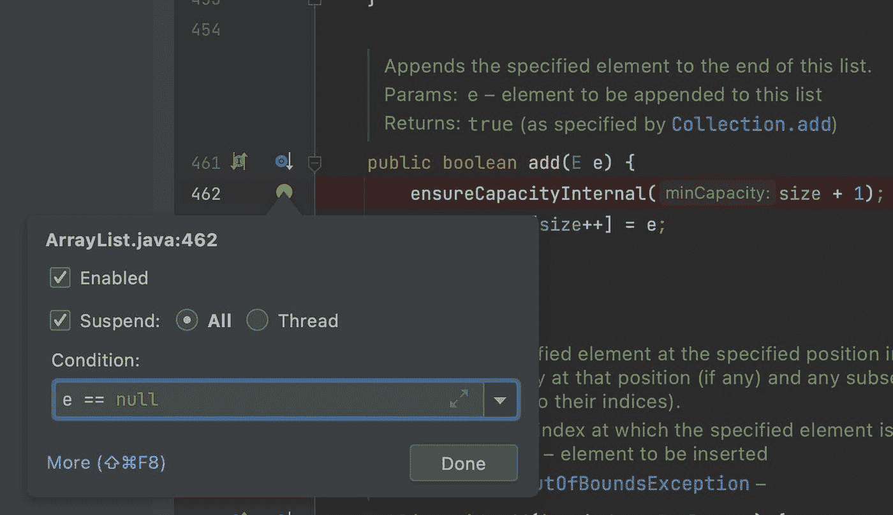
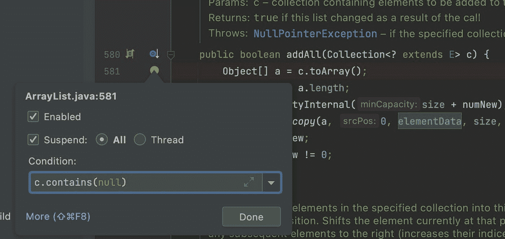
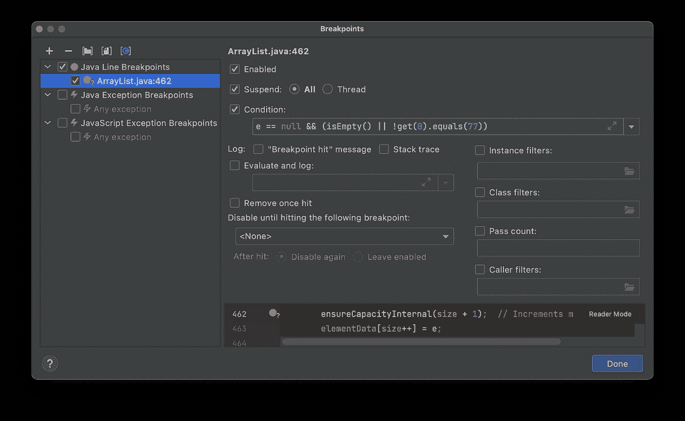

# 了解堆栈跟踪并进一步调试它们

> 原文：<https://medium.com/javarevisited/understanding-stack-traces-and-debugging-them-further-d866a1ce0493?source=collection_archive---------3----------------------->


最近，一个初级开发人员发给我一个模糊的堆栈跟踪，当我立即知道问题所在并给他指出必要的修改时，他非常惊讶。公平地说，我的优势在于我是第一个把错误放在那里的人…但是从堆栈跟踪中收集信息的能力，即使是一个模糊的跟踪，也是一项重要的技能。

正在讨论的堆栈跟踪是一个`ClassNotFoundException`，它通常非常简单，已经告诉了您需要知道的一切。班级不在那里。为什么不是，这其实是我们做错了什么的问题。在这种情况下，由于项目被混淆，错误是这个类没有被排除在混淆之外。

尽管这些年来人们对它充满了憎恨，但`[NullPointerException](https://javarevisited.blogspot.com/2013/05/ava-tips-and-best-practices-to-avoid-nullpointerexception-program-application.html)` [](https://javarevisited.blogspot.com/2013/05/ava-tips-and-best-practices-to-avoid-nullpointerexception-program-application.html)是我最喜欢的例外之一。您可以立即知道发生了什么，在大多数情况下，堆栈几乎直接指向问题。有一些边缘情况，例如:

```
myList.get(offset).invokeMethod();
```

那么是哪一个触发了`NullPointerException`？

如果你用的是最新版本的 Java，它会告诉你，这很酷。但是如果我们仍然在 Java 11(或 8)上，就有不止一个选择。如果我们作弊的话，至少 3 次或者 4 次:

1.  `myList`是显而易见的，但它很少为空，如果是这样，您会立即看到它
2.  偏移量可以为空。它可以是一个整数对象，在这种情况下，由于自动装箱，它可以是`null`。也不太可能
3.  在这种特定情况下，最有可能的原因是来自`get()`方法的返回值，这意味着列表元素之一是`null`
4.  最后`invokeMethod`本身可以扔一个`[NullPointerException](https://www.java67.com/2021/05/how-to-solve-nullpointerexception-in-java.html)`。但这有点作弊，因为筹码会更深一点

因此，在不了解任何代码的情况下，我们只需知道异常类型，就可以大致猜出一行中发生了什么。但这并不能在所有情况下直接引导我们找到错误。

# 有一个空值

这个`NullPointerException`可能是由于列表中的一个空值而发生的。假设您已经验证了您可能仍然不知道这个空值最初是如何进入列表的…

这并不难发现，让我们假设列表是`ArrayList`类型的，在这种情况下，只需打开`ArrayList`类(在 IntelliJ 中可以用 Control-O 实现)并在`add()`方法上放置一个条件断点。您可以测试值是否为 null，如果有人试图将 null 添加到列表中，它将在断点处停止。



现在这个不会抓到所有`null`偷偷进列表的情况。它可以通过流 API，通过`addAll()`和其他一些方法来实现。好的一面是我们可以抓住这些方法中的任何一个:



由于`addAll()`接受了一个`Collection`，我们可以使用标准的`contains()`方法来检查在`Collection`中是否有一个`null`元素，如果有，就停止。

# 如果“有时”可以呢？

所以我们运行这段代码，宾果它在一个断点处停止…但不幸的是，这不是正确的情况。该断点与另一个列表相关，我们现在没有调试该列表。显然，在那个列表中，一个`null`值是可以的，并且是所期望的。

所以我们按下继续键，断点一次又一次地出现。每次都是因为错误的列表……这通常是开发者开始大声咒骂和诅咒调试器使用旧日志的时候。

所以围绕这个问题有几种方法。最理想的是避开那个特定的列表。如果您有办法识别该列表，例如全局实例或第一个元素可能是特定值，您可以简单地增加原始条件断点，例如，在这种情况下，我们假设`null`OK 列表中的第一个元素是 77，在这种情况下，此条件将解决问题:



这并不理想，但假设它足够本地化，它可以解决这个问题。

# 嵌套堆栈跟踪

所以这是现代框架的“阵痛”之一。框架捕捉异常并传播它，将它包装在自己的异常中。重复冲洗。你最终会得到一个堆积痕迹的套娃。

筛选所有这些堆栈并找到重要的那一个通常是痛苦的一大部分。尤其是在像 Spring 这样的框架中，代理代码使得堆栈特别长，难以阅读。

例如:

```
javax.ws.rs.ProcessingException: RESTEASY004655: Unable to invoke request: org.apache.http.conn.HttpHostConnectException: Connect to localhost:8443 [localhost/127.0.0.1, localhost/0:0:0:0:0:0:0:1] failed: Connection refused (Connection refused)
    at org.jboss.resteasy.client.jaxrs.engines.ApacheHttpClient4Engine.invoke(ApacheHttpClient4Engine.java:328)
    at org.jboss.resteasy.client.jaxrs.internal.ClientInvocation.invoke(ClientInvocation.java:443)
    at org.jboss.resteasy.client.jaxrs.internal.proxy.ClientInvoker.invokeSync(ClientInvoker.java:149)
    at org.jboss.resteasy.client.jaxrs.internal.proxy.ClientInvoker.invoke(ClientInvoker.java:112)
    at org.jboss.resteasy.client.jaxrs.internal.proxy.ClientProxy.invoke(ClientProxy.java:76)
    at com.sun.proxy.$Proxy307.grantToken(Unknown Source)
    at org.keycloak.admin.client.token.TokenManager.grantToken(TokenManager.java:90)
    at org.keycloak.admin.client.token.TokenManager.getAccessToken(TokenManager.java:70)
    at org.keycloak.admin.client.token.TokenManager.getAccessTokenString(TokenManager.java:65)
    at org.keycloak.admin.client.resource.BearerAuthFilter.filter(BearerAuthFilter.java:52)
    at org.jboss.resteasy.client.jaxrs.internal.ClientInvocation.filterRequest(ClientInvocation.java:579)
    at org.jboss.resteasy.client.jaxrs.internal.ClientInvocation.invoke(ClientInvocation.java:440)
    at org.jboss.resteasy.client.jaxrs.internal.proxy.ClientInvoker.invokeSync(ClientInvoker.java:149)
    at org.jboss.resteasy.client.jaxrs.internal.proxy.ClientInvoker.invoke(ClientInvoker.java:112)
    at org.jboss.resteasy.client.jaxrs.internal.proxy.ClientProxy.invoke(ClientProxy.java:76)
    at com.sun.proxy.$Proxy315.toRepresentation(Unknown Source)
    at io.athena_tech.server.security.keycloak.KeycloakRealmService.lambda$doesLightrunRealmExist$0(KeycloakRealmService.java:124)
    at io.athena_tech.server.security.keycloak.KeycloakApi.getWithAdmin(KeycloakApi.java:35)
    at io.athena_tech.server.security.keycloak.KeycloakRealmService.doesLightrunRealmExist(KeycloakRealmService.java:122)
    at io.athena_tech.server.security.keycloak.KeycloakRealmService$$FastClassBySpringCGLIB$$9e16800d.invoke(<generated>)
    at org.springframework.cglib.proxy.MethodProxy.invoke(MethodProxy.java:218)
    at org.springframework.aop.framework.CglibAopProxy$CglibMethodInvocation.invokeJoinpoint(CglibAopProxy.java:771)
    at org.springframework.aop.framework.ReflectiveMethodInvocation.proceed(ReflectiveMethodInvocation.java:163)
    at org.springframework.aop.framework.CglibAopProxy$CglibMethodInvocation.proceed(CglibAopProxy.java:749)
    at org.springframework.transaction.interceptor.TransactionAspectSupport.invokeWithinTransaction(TransactionAspectSupport.java:366)
    at org.springframework.transaction.interceptor.TransactionInterceptor.invoke(TransactionInterceptor.java:118)
    at org.springframework.aop.framework.ReflectiveMethodInvocation.proceed(ReflectiveMethodInvocation.java:186)
    at org.springframework.aop.framework.CglibAopProxy$CglibMethodInvocation.proceed(CglibAopProxy.java:749)
    at org.springframework.aop.framework.CglibAopProxy$DynamicAdvisedInterceptor.intercept(CglibAopProxy.java:691)
    at io.athena_tech.server.security.keycloak.KeycloakRealmService$$EnhancerBySpringCGLIB$$7eca0d51.doesLightrunRealmExist(<generated>)
    at io.athena_tech.server.service.client.InitKeycloakService.initDefaultCompanies(InitKeycloakService.java:146)
    at io.athena_tech.server.service.client.InitKeycloakService$$FastClassBySpringCGLIB$$35f06991.invoke(<generated>)
    at org.springframework.cglib.proxy.MethodProxy.invoke(MethodProxy.java:218)
    at org.springframework.aop.framework.CglibAopProxy$CglibMethodInvocation.invokeJoinpoint(CglibAopProxy.java:771)
    at org.springframework.aop.framework.ReflectiveMethodInvocation.proceed(ReflectiveMethodInvocation.java:163)
    at org.springframework.aop.framework.CglibAopProxy$CglibMethodInvocation.proceed(CglibAopProxy.java:749)
    at org.springframework.aop.aspectj.AspectJAfterThrowingAdvice.invoke(AspectJAfterThrowingAdvice.java:62)
    at org.springframework.aop.framework.ReflectiveMethodInvocation.proceed(ReflectiveMethodInvocation.java:186)
    at org.springframework.aop.framework.CglibAopProxy$CglibMethodInvocation.proceed(CglibAopProxy.java:749)
    at org.springframework.aop.interceptor.ExposeInvocationInterceptor.invoke(ExposeInvocationInterceptor.java:95)
    at org.springframework.aop.framework.ReflectiveMethodInvocation.proceed(ReflectiveMethodInvocation.java:186)
    at org.springframework.aop.framework.CglibAopProxy$CglibMethodInvocation.proceed(CglibAopProxy.java:749)
    at org.springframework.aop.framework.CglibAopProxy$DynamicAdvisedInterceptor.intercept(CglibAopProxy.java:691)
    at io.athena_tech.server.service.client.InitKeycloakService$$EnhancerBySpringCGLIB$$5ae1a459.initDefaultCompanies(<generated>)
    at java.base/jdk.internal.reflect.NativeMethodAccessorImpl.invoke0(Native Method)
    at java.base/jdk.internal.reflect.NativeMethodAccessorImpl.invoke(NativeMethodAccessorImpl.java:62)
    at java.base/jdk.internal.reflect.DelegatingMethodAccessorImpl.invoke(DelegatingMethodAccessorImpl.java:43)
    at java.base/java.lang.reflect.Method.invoke(Method.java:566)
    at org.springframework.context.event.ApplicationListenerMethodAdapter.doInvoke(ApplicationListenerMethodAdapter.java:305)
    at org.springframework.context.event.ApplicationListenerMethodAdapter.processEvent(ApplicationListenerMethodAdapter.java:190)
    at org.springframework.context.event.ApplicationListenerMethodAdapter.onApplicationEvent(ApplicationListenerMethodAdapter.java:153)
    at org.springframework.context.event.SimpleApplicationEventMulticaster.doInvokeListener(SimpleApplicationEventMulticaster.java:172)
    at org.springframework.context.event.SimpleApplicationEventMulticaster.invokeListener(SimpleApplicationEventMulticaster.java:165)
    at org.springframework.context.event.SimpleApplicationEventMulticaster.multicastEvent(SimpleApplicationEventMulticaster.java:139)
    at org.springframework.context.support.AbstractApplicationContext.publishEvent(AbstractApplicationContext.java:403)
    at org.springframework.context.support.AbstractApplicationContext.publishEvent(AbstractApplicationContext.java:360)
    at org.springframework.boot.context.event.EventPublishingRunListener.running(EventPublishingRunListener.java:103)
    at org.springframework.boot.SpringApplicationRunListeners.running(SpringApplicationRunListeners.java:77)
    at org.springframework.boot.SpringApplication.run(SpringApplication.java:330)
    at io.athena_tech.server.AthenaServerApp.main(AthenaServerApp.java:64)
    at java.base/jdk.internal.reflect.NativeMethodAccessorImpl.invoke0(Native Method)
    at java.base/jdk.internal.reflect.NativeMethodAccessorImpl.invoke(NativeMethodAccessorImpl.java:62)
    at java.base/jdk.internal.reflect.DelegatingMethodAccessorImpl.invoke(DelegatingMethodAccessorImpl.java:43)
    at java.base/java.lang.reflect.Method.invoke(Method.java:566)
    at org.springframework.boot.devtools.restart.RestartLauncher.run(RestartLauncher.java:49)
Caused by: org.apache.http.conn.HttpHostConnectException: Connect to localhost:8443 [localhost/127.0.0.1, localhost/0:0:0:0:0:0:0:1] failed: Connection refused (Connection refused)
    at org.apache.http.impl.conn.DefaultHttpClientConnectionOperator.connect(DefaultHttpClientConnectionOperator.java:156)
    at org.apache.http.impl.conn.PoolingHttpClientConnectionManager.connect(PoolingHttpClientConnectionManager.java:376)
    at org.apache.http.impl.execchain.MainClientExec.establishRoute(MainClientExec.java:393)
    at org.apache.http.impl.execchain.MainClientExec.execute(MainClientExec.java:236)
    at org.apache.http.impl.execchain.ProtocolExec.execute(ProtocolExec.java:186)
    at org.apache.http.impl.execchain.RetryExec.execute(RetryExec.java:89)
    at org.apache.http.impl.execchain.RedirectExec.execute(RedirectExec.java:110)
    at org.apache.http.impl.client.InternalHttpClient.doExecute(InternalHttpClient.java:185)
    at org.apache.http.impl.client.CloseableHttpClient.execute(CloseableHttpClient.java:83)
    at org.apache.http.impl.client.CloseableHttpClient.execute(CloseableHttpClient.java:56)
    at org.jboss.resteasy.client.jaxrs.engines.ApacheHttpClient4Engine.invoke(ApacheHttpClient4Engine.java:323)
    ... 64 common frames omitted
Caused by: java.net.ConnectException: Connection refused (Connection refused)
    at java.base/java.net.PlainSocketImpl.socketConnect(Native Method)
    at java.base/java.net.AbstractPlainSocketImpl.doConnect(AbstractPlainSocketImpl.java:399)
    at java.base/java.net.AbstractPlainSocketImpl.connectToAddress(AbstractPlainSocketImpl.java:242)
    at java.base/java.net.AbstractPlainSocketImpl.connect(AbstractPlainSocketImpl.java:224)
    at java.base/java.net.SocksSocketImpl.connect(SocksSocketImpl.java:403)
    at java.base/java.net.Socket.connect(Socket.java:609)
    at org.apache.http.conn.ssl.SSLConnectionSocketFactory.connectSocket(SSLConnectionSocketFactory.java:368)
    at org.apache.http.impl.conn.DefaultHttpClientConnectionOperator.connect(DefaultHttpClientConnectionOperator.java:142)
    ... 74 common frames omitted
```

有人能告诉我在本地运行我们的服务器时我做错了什么吗…

让我们试着从通常是根本原因的最低异常开始分解:

```
Caused by: java.net.ConnectException: Connection refused (Connection refused)
    at java.base/java.net.PlainSocketImpl.socketConnect(Native Method)
    at java.base/java.net.AbstractPlainSocketImpl.doConnect(AbstractPlainSocketImpl.java:399)
    at java.base/java.net.AbstractPlainSocketImpl.connectToAddress(AbstractPlainSocketImpl.java:242)
    at java.base/java.net.AbstractPlainSocketImpl.connect(AbstractPlainSocketImpl.java:224)
    at java.base/java.net.SocksSocketImpl.connect(SocksSocketImpl.java:403)
    at java.base/java.net.Socket.connect(Socket.java:609)
    at org.apache.http.conn.ssl.SSLConnectionSocketFactory.connectSocket(SSLConnectionSocketFactory.java:368)
    at org.apache.http.impl.conn.DefaultHttpClientConnectionOperator.connect(DefaultHttpClientConnectionOperator.java:142)
```

连接有问题。一个连接被拒绝，这意味着我们的服务器试图连接到其他一些服务器，但它失败了。

所以这给了我们一些基本的信息，但没有别的。

让我们向上进行一个异常，看看第二个块。因为它很大，所以我只关注异常的边缘:

```
Caused by: org.apache.http.conn.HttpHostConnectException: Connect to localhost:8443 [localhost/127.0.0.1, localhost/0:0:0:0:0:0:0:1] failed: Connection refused (Connection refused)
    at org.apache.http.impl.conn.DefaultHttpClientConnectionOperator.connect(DefaultHttpClientConnectionOperator.java:156)
    at org.apache.http.impl.conn.PoolingHttpClientConnectionManager.connect(PoolingHttpClientConnectionManager.java:376)
```

这里还是什么都没有。这是 Apache 连接代码。但不知道是谁触发的也不知道为什么。

所以我们回到了不太典型的顶部，在这里我们可以找到答案:

```
javax.ws.rs.ProcessingException: RESTEASY004655: Unable to invoke request: org.apache.http.conn.HttpHostConnectException: Connect to localhost:8443 [localhost/127.0.0.1, localhost/0:0:0:0:0:0:0:1] failed: Connection refused (Connection refused)
    at org.jboss.resteasy.client.jaxrs.engines.ApacheHttpClient4Engine.invoke(ApacheHttpClient4Engine.java:328)
    at org.jboss.resteasy.client.jaxrs.internal.ClientInvocation.invoke(ClientInvocation.java:443)
    at org.jboss.resteasy.client.jaxrs.internal.proxy.ClientInvoker.invokeSync(ClientInvoker.java:149)
    at org.jboss.resteasy.client.jaxrs.internal.proxy.ClientInvoker.invoke(ClientInvoker.java:112)
    at org.jboss.resteasy.client.jaxrs.internal.proxy.ClientProxy.invoke(ClientProxy.java:76)
    at com.sun.proxy.$Proxy307.grantToken(Unknown Source)
    at org.keycloak.admin.client.token.TokenManager.grantToken(TokenManager.java:90)
    at org.keycloak.admin.client.token.TokenManager.getAccessToken(TokenManager.java:70)
    at org.keycloak.admin.client.token.TokenManager.getAccessTokenString(TokenManager.java:65)
    at org.keycloak.admin.client.resource.BearerAuthFilter.filter(BearerAuthFilter.java:52)
```

如果你看下面一点，你会看到`org.keycloak`包。这实质上意味着我忘记了在启动服务器之前启动 keycloak。这被很好地隐藏在堆栈中，需要大量的领域知识(我们使用 keycloak)才能弄清楚。

这糟透了。如果我是团队的新成员，试图发布一些东西(这正是这种异常发生的时候)，我会被这种异常弄得不知所措。至少我要花点时间才能弄明白。不幸的是，我没有解决这个问题的灵丹妙药。

继续看栈就行了，答案一般都在边缘(底部或者顶部)。如果有些事情不是很清楚，不要放弃。

# TL；速度三角形定位法(dead reckoning)

在许多情况下，我们可以通过查看堆栈跟踪和深入挖掘来收集我们在日志中看到的或从用户那里得到的异常的原因。显然，要记住嵌套异常和其他类似的问题。

当试图找出异常堆栈的根本原因时，调试器仍然是一个很好的助手。我们可以利用像条件断点这样的特性来缩小范围。令人惊讶的是，我们在这篇文章中没有提到异常断点。我认为它们有其价值，但当我们有一个堆栈时，我们已经知道(大致)发生了什么和在哪里。

我们需要超越这一点的东西，我试图在这篇文章中涵盖这一点。