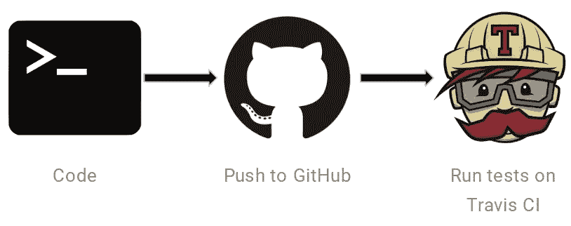
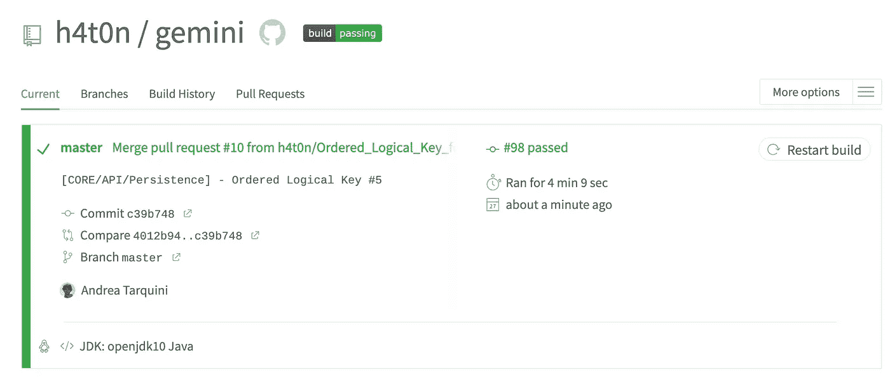

# 针对具有持续集成的真实数据库的单元和集成测试

> 原文：<https://medium.com/javarevisited/unit-and-integration-tests-against-a-real-database-with-continuous-integration-a62d1be664f3?source=collection_archive---------5----------------------->

使用 Github、Travis CI、Java/Spring 和 PostgreSQL 的真实项目示例。

我将解释一个非常简单的免费解决方案，我在我雄心勃勃的项目 **Gemini** 中使用了这个方案，它从一个简单的 DSL 模型开始，从头开始自动生成后端 [REST API](https://javarevisited.blogspot.com/2018/02/top-5-restful-web-services-with-spring-courses-for-experienced-java-programmers.html) 。

在 Gemini 中，我做了许多自以为是的操作，将我定义的抽象类型转换成真正的 SQL 语句和查询，有时使用一些特定于数据库的特性(如 PostgreSQL 中的域)。

 [## h4t0n/双子星

### Gemini 使得 REST API 开发速度更快。您可以创建微服务、完整的后端 web/移动应用程序和 MVPs

github.com](https://github.com/h4t0n/gemini) 

我开发了许多使用真实 PostgreSQL 数据库的集成测试，每次需要测试一个宏特性时，我都会从一个新的数据库开始完全删除集成测试数据库。我知道这个过程可能需要一些时间来完成，但这并不重要。我很少在编程时运行所有的代码库测试。我只运行可能受影响的部分，如果有任何问题，特拉维斯和 [Github](https://www.java67.com/2019/04/top-5-courses-to-learn-git-and-github.html) 会注意到我。

因此，让我们深入探讨一下，但我不想在这里解释我是如何启动 Spring context 或删除数据库的。如果您需要关于[Spring](https://javarevisited.blogspot.com/2018/06/top-6-spring-framework-online-courses-Java-programmers.html)/Gradle/[Java](/javarevisited/10-free-courses-to-learn-java-in-2019-22d1f33a3915)的帮助，您可以联系我或浏览 Gemini 的[代码。](https://github.com/h4t0n/gemini)

相反，我想解释如何设置和使用 Github 和 Travis 的组合来开始集成测试。这样，如果你不使用 [Java](https://javarevisited.blogspot.com/2018/05/top-5-java-courses-for-beginners-to-learn-online.html) 或 [Spring](https://javarevisited.blogspot.com/2016/12/top-5-spring-and-hibernate-training-courses-java-jee-programmers.html) 你可以设置持续集成过程，用你自己的语言/命令替换它们。

首先，您需要在 Github 存储库设置中启用 Travis Webhook(因此您需要一个 Travis 帐户)。

然后只需在项目的根目录中提供一个合适的 **.travis.yml** 。以下是我给双子座的。

这真的很简单:

1.  定义你正在使用的语言。在我的例子中，java 和 openjdk 10
2.  然后在 *before_install* 部分安装测试所需的工具和数据库。我需要**格拉德**和 **postgreslq11**
3.  *before_script* 是初始化服务。我创建了我在集成测试中使用的数据库来连接
4.  *脚本*是开始测试流程的部分。例如，我清理了所有的 gradle 上下文，并运行了一个 gradle 任务 *jacocoRootReport* 来编译所有内容，并开始测试我的 Spring 项目的每个子模块

仅此而已。Github 和 Travis 会完成剩下的工作。例如，看看拉取请求合并的结果…

其他**编程文章**你可能喜欢的
[2019 年 Web 开发者路线图](https://hackernoon.com/the-2019-web-developer-roadmap-ab89ac3c380e)
[2019 年学习 Python 的 10 个理由](https://javarevisited.blogspot.com/2018/05/10-reasons-to-learn-python-programming.html)
[2019 年你可以学习的 10 种编程语言](http://www.java67.com/2017/12/10-programming-languages-to-learn-in.html)
[每个 Java 开发者都应该知道的 10 个工具](http://www.java67.com/2018/04/10-tools-java-developers-should-learn.html)
[学习 Java 编程语言的 10 个理由](http://javarevisited.blogspot.sg/2013/04/10-reasons-to-learn-java-programming.html)
[Java 和 Web 开发者应该学习的 10 个框架 2019](http://javarevisited.blogspot.sg/2018/01/10-frameworks-java-and-web-developers-should-learn.html)
[2019 年要学习的 5 大 Java 框架](http://javarevisited.blogspot.sg/2018/04/top-5-java-frameworks-to-learn-in-2018_27.html)
[每个 Java 开发者都应该知道的 10 个测试库](https://medium.freecodecamp.org/these-are-the-top-testing-tools-libraries-and-frameworks-for-java-developers-8c0e3f9bc11d)