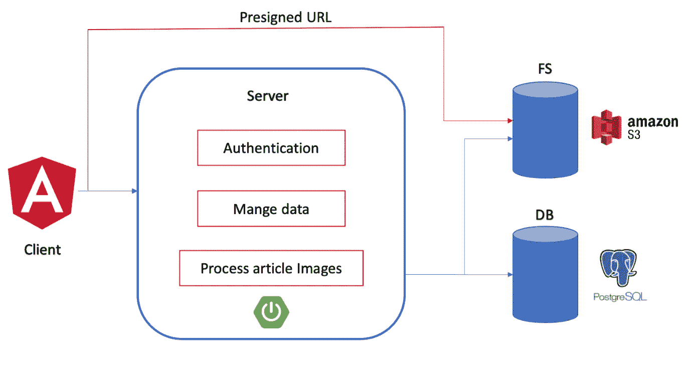

# 使用 Java 中预先签名的 URL 模式从 AWS S3 上传和检索文件

> 原文：<https://medium.com/javarevisited/upload-and-retrieve-files-form-aws-s3-using-the-presigned-url-pattern-in-java-ecde26e9441f?source=collection_archive---------2----------------------->

在我学习 AWS 的过程中，我偶然发现了 S3 的预先设计的 URL 模式。在处理从云中上传和下载对象时，这种模式对于节省服务器带宽非常重要。

本质上，它的工作方式是完全绕过服务器，将服务器从处理和等待上传/下载时间的负担中解放出来，并节省重要的资源(见图 1)。

[](https://javarevisited.blogspot.com/2021/02/spring-security-interview-questions-answers-java.html)

图 1:博客架构

出于本教程的目的，我将使用这个简单的博客项目来说明这在 [Java](/javarevisited/review-of-courseras-java-programming-software-engineering-fundamentals-specialization-4dcfa0ed2de4) 中是如何工作的。该项目是一个博客网站的模拟，有一个 Angular 8 客户端和 [Spring Boot 后端](/javarevisited/top-10-courses-to-learn-spring-boot-in-2020-best-of-lot-6ffce88a1b6e?source=---------39------------------)和 [Postgres 数据库](/javarevisited/7-best-free-postgresql-courses-for-beginners-to-learn-in-2021-3bf369d73794)，当然，S3 作为一个文件系统，用于保存“大”文件，关于该项目的更多细节和完整代码可以在我的 [gitHub](https://github.com/elmodeer/simple-blog-project) 上找到。

我们将考虑的用例是当用户试图上传/更新他们的个人资料图片或文章缩略图时。采取以下步骤:
1-客户端请求上传/更新特定文件。
2-服务器从 S3 为该特定资源请求一个预先指定的 URL。
3-服务器将 URL 发送回客户端。
4-客户端使用资源本身直接向 S3 发出上传/获取请求。

让我们看看这是如何工作的，

# 1-设置 S3 桶

您需要设置一个[S3 bucket](/javarevisited/7-best-aws-s3-and-dynamodb-courses-for-beginners-in-2021-a8a44b6066da)t 并允许公众访问它，这可以通过在创建一个新 bucket 并编辑 CORS 配置后导航到 permission 选项卡来实现。将下面的代码片段粘贴到编辑器中，然后点击 save。

```
<?xml version=”1.0" encoding=”UTF-8"?>
<CORSConfiguration xmlns=”[http://s3.amazonaws.com/doc/2006-03-01/](http://s3.amazonaws.com/doc/2006-03-01/)">
<CORSRule>
 <AllowedOrigin>*</AllowedOrigin>
 <AllowedMethod>POST</AllowedMethod>
 <AllowedMethod>GET</AllowedMethod>
 <AllowedMethod>PUT</AllowedMethod>
 <AllowedMethod>DELETE</AllowedMethod>
 <AllowedMethod>HEAD</AllowedMethod>
 <AllowedHeader>*</AllowedHeader>
</CORSRule>
</CORSConfiguration>
```

请记住，这绝不违反您的存储桶的安全性，因为除了您的服务器之外，没有人能够访问这个存储桶。通过它，你可以完全控制如何与它交互，以及谁有权访问其中的哪些文件。

# 2-客户端请求生成预先指定的 URL

客户端可以请求两种预先指定的 URL，一种是“放置”一个新资源，另一种是“获取”一个已经持久化的资源。

两者都是对 spring 控制器的简单调用，负责生成带有文件名的 URL。

```
// for "PUT"
generatePresignedPutUrl(file: File): Observable<any> {return this.http.get('http://localhost:8080/api/articles/putImage/'
                     + file.name, { responseType: 'text' });}// for "GET"
generatePresignedGetUrl(articleId: number): Observable<any>{return this.http.get('http://localhost:8080/api/articles/getImage/'
                     + articleId, { responseType: 'text' });}
```

# 3- URL 生成

作为第一步，我们需要将 AWS sdk 导入到项目中，以便能够与任何 AWS 产品通信。导入可以通过 maven 依赖或 Gradle 来实现。之后，我们将有一个生成[、【上传】、【获取】URL 的方法。](https://javarevisited.blogspot.com/2016/10/difference-between-put-and-post-in-restful-web-service.html#axzz6poJhuerN)

```
public static String generatePresignedUrl
                           (String fileName, HttpMethod mehtod) {
    try {
        // Set the pre-signed URL to expire after 10 mins.
        java.util.Date expiration = new java.util.Date();
        long expTimeMillis = expiration.getTime();
        expTimeMillis += 1000 * 60 * 10;
        expiration.setTime(expTimeMillis);

        // Generate the pre-signed URL
        GeneratePresignedUrlRequest generatePresignedUrlRequest =
        new GeneratePresignedUrlRequest(*bucketName*, fileName)
                .withMethod(mehtod)
                .withExpiration(expiration);
        URL url = *s3Client*.generatePresignedUrl(
                                       generatePresignedUrlRequest);
        *logger*.info("pre-signed URL for " + mehtod.toString() 
        + " operation has been generated.");
        return url.toString();
      } catch (Exception e) {
        e.printStackTrace();
      }
     *logger*.error("URL could not be generated");
     return null;
```

在生成 URL 之后，它们被发送回客户机，在客户机上附加所需的文件后，它们可以被执行。

# 4.1 -执行 PUT 请求

在获得 PUT url 之后，文件可以直接附加到它上面并直接执行。我为此创建了这个助手函数。

```
uploadfileToAWSS3(fileuploadurl: string, file: File):  
                                                 Observable<any>{ const req = new HttpRequest(
    'PUT',
    fileuploadurl,
    file, 
    {
        reportProgress: true, // to track upload process
    });
    return this.http.request(req);
}
```

当然，您可以在代码中的任何地方调用它并订阅它，还可以检查响应代码以确保它是一个成功的请求。

# 4.2 —执行 GET 请求

get 请求更容易处理，我所做的只是将返回的预先签名的 url 绑定到 HTML 文件中`img`标记的“src”属性。

```
// HTML
// Typescript
  imageUrl: string;
       .....
  getImage(): void {
     this.userService.generatePresignedGetUrl(this.user.id)
         .subscribe(imageUrl => { 
                    this.imageUrl = imageUrl; 
         }),
         (err: any) => {
             console.log(err.error);
         };
  }
```

仅此而已。现在，预先设计的 URL 已经完全正常工作了。一个非常重要的问题是观察你从应用程序内部发出的请求，以及它们是否包含除了来自 [AWS](/javarevisited/5-best-aws-courses-for-beginners-and-experienced-developers-to-learn-in-2021-563212409fbd?source=rss-bb36d8439904------2&utm_source=dlvr.it&utm_medium=linkedin) 的`X-Amz-Algorithm`之外的任何其他认证机制。

如果您使用附加到请求的 JWT 身份验证头，就会发生这种情况。在这种情况下，您需要过滤来自该头的任何 S3 请求。

我希望这将有助于任何人绊倒在这些事情上。如果您有任何改进、更正或任何与代码相关的内容，欢迎发表评论。

**相关资源**

1- [GitHub 代码](https://github.com/elmodeer/simple-blog-project)
2- [AWS 预签名 URL](https://docs.aws.amazon.com/AmazonS3/latest/dev/PresignedUrlUploadObjectJavaSDK.html)