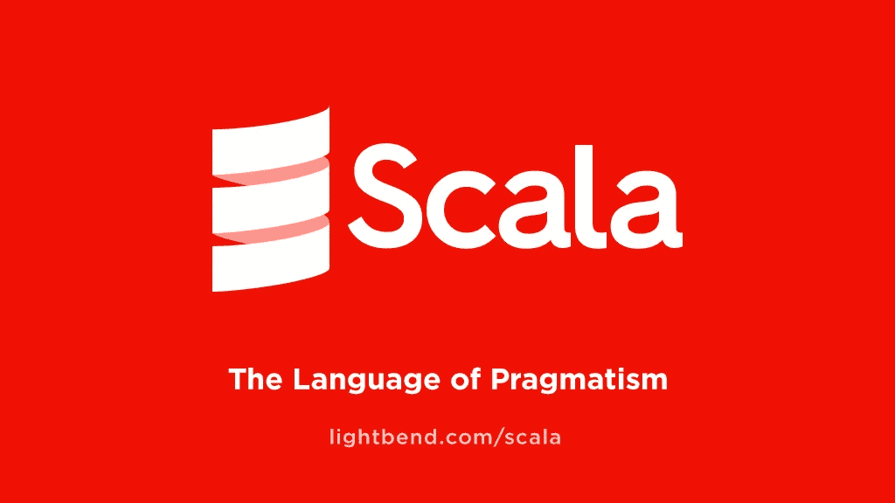

# Java 和 Scala 差异完全指南

> 原文：<https://medium.com/javarevisited/variance-in-java-and-scala-63af925d21dc?source=collection_archive---------0----------------------->



本文旨在解释 Java 和 Scala 中类型参数的差异。在各种博客和文章中已经有很多关于这个主题的材料，但对我来说，他们总是觉得要么太复杂，直接进入高级功能，对于这个主题的新手来说很难理解，要么太简单，只触及表面。

所以，这是我填补这个空白的尝试。

## 首先，简单介绍一下背景

我假设你们大多数人(或所有人)都非常熟悉面向对象编程中的多态性概念。例如，能够测试一个数组是否等于另一个数组，但不需要为每种类型的[数组](https://javarevisited.blogspot.com/2012/01/sort-array-in-java-ascending-and.html#axzz5XfRjTLwH)实现 equality 方法，这很酷。

我们只想使用 [equals()方法](https://javarevisited.blogspot.com/2011/02/how-to-write-equals-method-in-java.html)(假设它是为每个对象定义的，这对 [Java](/javarevisited/10-best-places-to-learn-java-online-for-free-ce5e713ab5b2) 和 [Scala](/javarevisited/10-best-scala-and-functional-programming-online-courses-for-beginners-b6461b27bf) 都是正确的)，我们不想关心数组中实际包含哪种确切类型的对象。

在 Java 中，Integer[]是 Number[]的子类，它们都是 Object[]的子类。这叫做**协方差**。给定 A < : B(意思是 A 是 B 的子类)，如果 T【A】<:T【B】那么 T 在其类型中是协变的。给定同样的关系 A < : B，如果 T【B】<:T【A】那么 T 在其类型中是**逆变**。

如果这是你第一次听说 contravariance，它可能现在对你来说没有多大意义，但是等到这篇文章的结尾。最后，如果 T[A]和 T[B]没有关系，尽管事实上一个<: b="" then="" we="" say="" t="" is="" class="is hj">不变量在其类型中。

所以，Java 中的数组是协变的。我们可以有一个方法 isEqual()或 sort()或 shuffle()，它接受一个对象数组，我们可以传入我们想要的任何数组。耶！我们也可以定义一个方法，接受一个几何形状的数组，然后传入几何形状的数组，或者三角形，或者等边三角形，等等。最佳的多态性。

嗯，这是有代价的。假设我们有一个整数数组。这是一个对象数组的子类，对吗？因此，如果我有一个名为“objectArray”的变量，它是一个对象数组，将我们的整数数组赋给 objectArray 是完全有效的。

现在我们有了一个变量 objectArray，它被编译器视为一个对象数组，但是在它的下面，我们真正拥有的是一个整数数组。好的，这还不是一个大问题……但是，在编译器看来，我们的整数数组现在是一个对象数组！我们被允许存储字符串、三角形和香蕉——编译器将只是站在那里，让它发生。当然，在运行时，当我们从保存整数数组的原始变量(或者，更准确地说，变量*认为*它仍然保存整数数组，而实际上它保存所有类型的东西)中获取内容时，我们的代码会崩溃和烧毁。

我们遇到了一个问题。但是怎么办呢？现在已经没有回头路了(我们说的是 2004 年)，因为全世界已经有成千上万的商业项目在使用 Java。数组必须保持“可攻击性”。但是，Java 5 中出现了一个叫做*泛型*的很酷的新事物。你可能已经知道，它们是用 Java 写在< >里面的，而 [Scala](/javarevisited/7-free-scala-and-functional-programming-courses-for-beginners-370f3cd41a4e) 用的是[]符号。泛型允许任何类拥有一个类型标签，就像数组一样，但是与数组不同，这些类型标签**不是协变的**。

所以，在 Java 中，MyClass <string>不是 MyClass 的子类。太好了，仿制药不能速成！但是，是的，这意味着我们没有数组的那种简洁的多态性特征。无法向采用 MyClass 的方法传递 MyClass <string>的实例。我们也不能在需要对象列表的地方传递字符串列表。真遗憾。我们总是可以强制进行一些难看的造型，但是这在运行时可能是危险的(让我们回到我们讨厌数组的地方),并且被认为是一个大禁忌。</string></string>

## 前往救援

在这种情况下，有一种方法可以实现多态性(即协方差和逆变)——通过使用**有界通配符。**通配符有两种界限——上限和下限。上限允许“从上面”限制类型，也就是说，指定层次结构中允许的最高级别，而下限通过指定允许的最低类型来“从下面”限制类型。下面是一个上限通配符的示例:

```
public void process(List**<? extends Car>** list) { ... }
```

这意味着 process()接受由 Car 或 Car 的任何子类参数化的列表。耶，协方差！而如果我们用 super 来切换 extends，它就变成了一个下界:

```
public void process(List**<? super Car>** list) { ... }
```

现在 process()只接受 Car 或者 Car 的*任何超类*参数化的列表，这样就实现了逆变。

很好。我们得到了我们想要的多态性。我们有一个方法 process()，它的参数在类型上可以是协变的，也可以是逆变的，这取决于我们使用的是上限还是下限通配符。注意，Java 中的边界不仅可用于通配符，也可用于类型参数，因此我们可以声明一个类，如 MyClass，T extends Car，T12。类型参数(如 T)不同于通配符(用？)在某种意义上，它可以在代码的其余部分重用。与有界通配符相比，有界类型参数有两个主要区别:

*   使用类型参数，您可以指定多个绑定的**。但是因为在 Java 中你只能扩展一个超类，其他的边界指定了必须实现的接口。例如，MyClass < T 扩展 Bird&CanSwim&CanRun>意味着 MyClass 实例的类型参数必须扩展 Bird 并实现 can swim 和 can run。**
*   **只有上限**可以用于类型参数。这意味着 MyClass < T 扩展 Bird >可以，但是 MyClass < T 超级 Bird >不会编译。原因超出了本文的范围(已经够长了)，但是我们不会在类型参数上使用界限，所以我想这没问题。让我补充一下，在 Scala 中，类型参数可以有上限和下限，分别写为[T < : Bird]和[T > : Bird]。

让我们回到通配符的界限，因为它们确实为我们提供了协方差和逆变。我们实现了多态性，并且能够为 process()方法提供 List <car>的子类型或超类型，这取决于我们是将 List 参数声明为协变的(使用上限)还是逆变的(使用下限)。现在，在使用有界通配符时，有一些重要的限制必须考虑:我们只能从协变列表中获取内容，并且只能将内容放入逆变列表中。实际的规则更加通用，因为参数化的类可以是任何东西，而不仅仅是类似列表的容器。事情是这样的:我们只能用**协变类型参数作为返回类型**，只能用**逆变类型参数作为输入类型**。让我们在 List get-put 示例中解释这一点。</car>

在协变列表 extends Car>(也称为上界列表)的情况下，我们知道里面有 Car 的实例。有些是跑车，有些是豪华轿车，也许我们还有进一步的子类(例如阿斯顿马丁)，但它们都是汽车。我们可以从这个列表中得到对象，并且知道我们得到的是一辆汽车。然而，由于我们不知道实际的底层类型是什么(汽车或跑车或阿斯顿马丁)，如果这样的列表允许将东西放入其中，那么我们会遇到与数组相同的问题。我们可以创建一个跑车列表，安全地将它赋给一个 List <car>变量，然后“安全地”(就编译器而言)将豪华轿车放入其中。在运行时，我们会再次崩溃和燃烧。我们唯一允许放入的是 null，因为它扩展了所有东西，所以不管实际的底层类型是什么，null 都会扩展它。</car>

另一方面，在逆变列表 super Car>(也称为下界列表)的情况下，我们知道把汽车放在里面是安全的(这包括子类型如 AstonMartin 它们也是汽车)。无论实际的底层类型可能是什么(例如，Vehicle 或 AnyRef)，每辆车都扩展它，所以如果我们在实际的底层类型是 Vehicle 时放置一个 AstonMartin，我们没有做错什么，不是吗？阿斯顿马丁是一种交通工具。但是现在的情况与上限相反——虽然我们可以放置汽车，但是我们不能从这个列表中获得任何东西(实际上，我们可以，但是它是 Object 类型的，这不是很有用)。我们不能得到一辆车，因为如果基础类型是，比如说，一辆车，那么我们就有麻烦了。我们不知道实际的潜在类型是什么——就我们所知，列表中也可能充满了摩托车、拖拉机和水陆两用沙滩车。从该列表中获取 Car 类型的对象可能会导致运行时异常。

以下是所有代码:

```
List<? extends Integer> a = new ArrayList<Integer>();
List<? super Integer> b = new ArrayList<Integer>();a.add(3);    // fails; let’s try with null
a.add(null); // works
b.add(3);    // no problem hereInteger ai = a.get(0); // no problem here either
Integer bi = b.get(0); // fails; let’s try with Object
Object o = b.get(0);   // works
```

你也可以这样想:在这两种情况下，你只能放入最低(最具体)的允许类型，你只能得到最高(最一般)的允许类型。对于协变(上限)列表，允许的最低类型是 null，最高类型是 Car，而对于逆变(下限)列表，允许的最低类型是 Car，最高类型是 Object

```
 upper bound            lower bound
       null ------------------- Car ------------------- Object
```

好，所以我们只能从协变列表中得到东西，也只能把东西放到逆变列表中。这被称为*获取-放置原则*。现在让我们回到更一般的规则:

*   对于**返回**泛型类型的方法，使用**协方差**
*   对于**将**作为泛型的方法，使用**逆变**
*   对于**和**都接受并返回泛型类型的方法，使用**不变性**

快速回顾:Java 中的数组是[协变的](https://javarevisited.blogspot.com/2014/03/covariant-method-overriding-of-java-5.html)，这允许脏东西使我们的代码崩溃和烧毁。泛型(我们也可以称之为参数化的)类是不变的，这使得它们不受崩溃和烧毁的影响，但是我们失去了多态性。我们可以通过使用通配符界限来实现每个方法的协方差和逆变(并带回多态性)，但是在为一个方法定义方差时，我们必须记住 get-put 原则。

## Scala 呢？

首先，在 Scala 中，数组是**不变的**，这就排除了崩溃和烧毁的可能性。至于列表，它们现在默认是**协变的**。由于它们的不变性，它们协变是安全的；不会有人将一个整数列表赋给一个对象列表(因为不可变性不允许重新赋值；相反，对列表的每个“添加”操作都返回一个新列表)。不变性将我们从失去多态性和崩溃烧毁场景之间的尴尬困境中解救出来。

但是，让我们诚实地说，这并不是一个重大的改进。数组只是追求较小的邪恶(它们现在没有多态性，而不是易于崩溃和烧毁)，列表变得协变只是因为它们在默认情况下是不可变的。你也可以在 Java 中使用[不可变列表(比如在 Guava 库中的 ImmutableList)或者实现他们自己的列表，并使用上限来寻找协方差。](https://javarevisited.blogspot.com/2018/02/java-9-example-factory-methods-for-collections-immutable-list-set-map.html)

真正的进步在语言本身。Java 只支持 **use-site variance，**表示使用类型参数*时定义方差。*在实践中，这意味着使用有界通配符为每个方法分别定义。

另一方面，Scala 既支持 use-site variance(语法类似于 Java，只是用[_ <: t="" and="" class="is hj">声明-site variance 替换了 extends T>。 Declaration-site，顾名思义就是在类型参数*声明*时定义方差。您可以简单地通过在类型参数前面加上“+”来声明协方差，而“-”表示逆变(没有符号意味着不变性)。

所以，在 Java 里你会说:

```
public class Foo<T> { ... }
...
Foo<? extends Integer> covariantFoo = new Foo<Integer>();
Foo<? super Integer> contravariantFoo = new Foo<Integer>();
```

请注意，在一种情况下，Foo 看起来是协变的(协变 Foo)，而在另一种情况下是逆变的(逆变 Foo)。它没有预先声明为协变或逆变；相反，它的差异是在它被使用的地方(使用地点)定义的。

在 Scala 中，你可以做同样的事情，只是语法有些不同(分别使用[_ <: integer="" and=""> : Integer])，但是你也可以在前面声明 variance(declaration-site):

```
class CovariantFoo[+T] { ... }
class ContravariantFoo[-T] { ... }
...
val covariantFoo = new CovariantFoo[Int]()
val contravariantFoo = new ContravariantFoo[Int]()
```

这次我们有两个类，每个类都将其类型参数声明为协变或逆变。这里有一个简短的总结:

```
**Covariance**                           
if A is a *subtype* of B then:
Java:  L<A> is a subtype of L<? extends B> (use-site)
Scala: L[A] is a subtype of L[_ <: B]      (use-site)
       L[A] is a subtype of L[+B]          (declaration-site)**Contravariance**
if A is a *supertype* of B then:
Java:  L<A> is a subtype of L<? super B> (use-site)
Scala: L[A] is a subtype of L[_ >: B]    (use-site)
       L[A] is a subtype of L[-B]        (declaration-site)
```

使用站点和声明站点哪种方法更好？一般来说，两者都不好。它们是实现目标的不同方式。我个人更喜欢声明站点差异，因为它与整个“不可变的，因此很容易推理”的函数范型(Scala 也允许您以命令式、非函数式的方式编写，但这是非常不鼓励的)。一旦你声明了你的类型参数的方差，就不能在剩下的代码中改变它们。

此外，由于您是设计者，最好将声明差异的负担放在您自己身上；如果你把这个负担放在你的客户身上，他们可能会滥用它。引用 Scala 中的编程[1]:

> [使用站点差异]需要放入通配符的将是类的客户端，如果他们弄错了，一些重要的实例方法将不再适用。变化是一件棘手的事情，用户通常会弄错，他们会认为通配符和泛型过于复杂。通过定义位置差异，您向编译器表达了您的意图，编译器将仔细检查您希望可用的方法是否确实可用。

Scala 编译器到底双重检查什么？它检查你是否通过在逆变位置使用协变类型违反了方法定义中的协变和逆变的**规则，反之亦然。请注意，这与获取-输出原则直接相关；这只是它的一个更一般化的版本。我们可以称之为*协变位置——逆变位置*原理。它说协变类型可以作为方法返回类型，但不能作为方法参数类型，而对于逆变类型则相反。**

让我们看一个例子。我们可以从一开始就重温我们的老例子；它声称，如果没有 get-put 原则，“我们可以创建一个跑车列表，安全地将其赋给一个`List<Car>`变量，然后将豪华轿车放入其中”。现在，由于 [Scala](https://javarevisited.blogspot.com/2018/01/10-reasons-to-learn-scala-programming.html#axzz5qk6KSalU) 支持不可变的值，这不会太糟糕。我们的旧跑车列表将仍然是跑车列表，而新列表将是所有类型的汽车列表。将豪华轿车加入跑车清单没有任何危险。让我用一个更好的例子来说明协变和逆变的规则。

如果 Foo[T]在其类型 T 中是协变的，这意味着我们可以把一些 Foo[SportsCar]当作 Foo[Car]，对吗？好的，但是如果 Foo[SportsCar]是 Foo[Car]的子类，那么它必须支持来自 Foo[Car]的所有方法(并且可能添加一些自己的、更具体的方法)。现在，如果 Foo 有一些方法使用 T 类型的值作为它的参数(也就是在逆变位置)呢？这个特殊的方法在 Foo[Car]中接受豪华轿车没有问题，但是现在在 Foo[SportsCar]中突然只接受跑车了！我们将有一个在超类中工作的调用(传递一个 limo 给那个方法)，但是不能在子类中工作。这将违反整个子类-超类的概念。返回值类型为 T 的方法是可以的，因为返回一辆跑车遵守超类返回一辆车的义务。

对于类型逆变的类来说，情况正好相反。将 T 传递给方法是可以的——因为 Foo 的类型是逆变的，这意味着 Foo 的子类是所有那些由 Car 的超类型参数化的子类，比如 Foo[Vehicle]或 Foo[Any]。在这种情况下，使用汽车的方法就变成了使用汽车或任何其他工具的方法。这是可以的。必须遵守的是，在原始类中获取汽车的方法必须能够在子类中获取汽车，而不是像我们在 SportsCar 示例中看到的那样缩小范围。这确实实现了。如果我们用 Foo[Car]替换它的一个子类，比如 Foo[Vehicle]，那么任何使用 Foo[Car]的方法为它提供 cars 的代码都可以工作。把汽车喂给一个吃 Foo[Vehicle]的方法就可以了。

但是现在在 Foo 是逆变的情况下，当我们想让一个方法返回一个 Car 类型的值时，我们遇到了问题。在协方差的情况下，它将返回豪华轿车，跑车，阿斯顿马丁等。事实上，它们都是汽车。然而，作为一个 Foo[Car]并让你的子类返回一个 Foo[Vehicle](不要忘记 Foo 是逆变的，所以它的子类必须由 Car 的超类型参数化)是不太正确的，因为拥有子类的全部意义在于你可以在任何需要它的父类的地方插入它，而这在这种情况下是不可能的。使用 Foo[Vehicle]这样的子类会将我们的方法调用的结果限制为 vehicles，这意味着我们的旧代码将不再工作(也许它会对结果调用“摔门”,但它真正得到的结果是一辆摩托车；法只答应给我们一辆车，记得吗？).如果这有点难以消化，不要担心。这真的不是一件小事。在下一节中，我将提供一个更丰富的关于对比的例子，当你读完这篇文章的时候，事情应该会变得有条不紊。

回到我们的规则。因此，声明位置方差允许编译器检查协变和逆变规则是否得到遵守。然而，如果你使用使用位置变化，你的编译器不能帮助你使用这些规则，因为它不知道你的类在它的类型中是协变的还是逆变的。差异声明被推迟到使用该类的时候。这意味着你作为类的设计者，对这些东西没有控制权。您将定义您的类方法，并且您将祈祷您的类的未来用户将仅当他们将您的类实例化为协变时调用 get-like 方法，并且仅当他们将它实例化为逆变时调用 put-like 方法。协变/逆变的争论现在在他们的手上。我不知道你怎么想，但我更愿意自己承担这种丑陋的工作，让他们的生活更轻松。

在下一节(也是最后一节),我将通过子类型化一个函数来提供一个 Scala 差异的例子。Scala 中的函数是一等公民；它们不仅可以作为参数传递、从方法返回、保存在集合中等等。，但它们也可以是子类型和超类型。因此，除了子类和超类，你还可以有子函数和超函数！

## 函数子类型的变化

Scala 中的每个单参数函数实际上都是 Function1 trait 的一个实现(实际上要复杂一些，但为了简洁起见，这里省略了细节):

```
trait Function1[-S, +T] { def apply(x: S): T }
```

注意 Function1 在 S 中是逆变的，在 t 中是协变的，Function1 trait 的某些实现(姑且称之为 MySubFunction[S1，T1])是另一个(姑且称之为 MySuperFunction[S2，T2])的子类，前提是它遵守 Function1 中提供的方差规则(也就是说，如果 S2 <: s1="" and="" t1="" t2=""/>

This rule of function being covariant in its input type and contravariant in its return type comes from the *利斯科夫替代原理* (LSP)。它说 T 是 U 的子类型，如果它支持与 U 相同的操作，并且它的所有操作**比 U 中的相应操作需要更少的**(或相同)和**提供更多的**(或相同)(子类型是自反的，所以 S < : S)。

好，让我们看看这是什么意思。想一个函数:

```
def getCarInfo: Car => AnyRef
```

这些都是 getCarInfo 的有效子类型:

*   Car => AnyRef
*   车辆=> AnyRef
*   汽车= >字符串
*   车辆= >字符串

它们都像 Car => AnyRef 一样要求更少(或相同)，提供更多(或相同)。“少”就是“比较笼统”，“多”就是“比较具体”。这非常符合逻辑:vehicle 是“小于”Car，因为我们对该对象了解较少(我们只知道它是 vehicle，但不知道它是哪种类型的 Vehicle)，而它是“大于”AnyRef，因为它提供给我们的不仅仅是 AnyRef 对象(我们在 Vehicle 中定义了所有的字段和方法)。

让我们仔细看看这四种亚型。第一个和 getCarInfo 完全一样，这没问题，因为子类型是自反的(这也是我在 LSP 的定义中 less/more 后面加“or same”的原因)；第二个要求更少，因为它不仅仅局限于汽车——它允许任何车辆，这比汽车要求更低；第三个提供了更多，因为它不是只提供 AnyRef，而是提供了更丰富的类型字符串；第四种比 getCarInfo 要求更少，提供更多。

停下来想一想。这是协变和逆变的全盛时期！如果我希望函数 B 是函数 A 的一个**子类**，那么 B 的输入参数必须是 A 的输入参数(协方差)的一个**超类**，B 的返回值必须是 A 的返回值(协方差)的一个**子类**。

现在让我们构建一个完整的示例。代码如下:

```
1   /**
2    * Remember! In Scala, every function that takes one argument 
3    * is an instance of Function1 with signature:
4    *
5    * trait Function1[-T, +S] extends AnyRef
6    */
7   
8   class Vehicle(val owner: String)
9   class Car(owner: String) extends Vehicle(owner)
10  
11  object Printer {
12
13    val cars = List(new Car("john"), new Car("paul"))
14
15    def printCarInfo(getCarInfo: Car => AnyRef) {
16      for (car <- cars) println(getCarInfo(car))
17    }
18  }
19  
20  object Customer extends App {
21
22   val getOwnerInfo: (Vehicle => String) = _.owner
23   
24   Printer.printCarInfo(getOwnerInfo)
25  }
```

查看 printCarInfo 方法(第 15 行),该方法将函数 Car => AnyRef 作为参数:

```
def printCarInfo(getCarInfo: Car => AnyRef)
```

如果我们要从自定义代码中调用这个方法(第 24 行)，我们必须要么传递一个具有相同签名的函数(Car => AnyRef)，要么传递一个 Car => AnyRef 的子类型的函数，也就是说，它需要更少或相同的内容，并提供更多或相同的内容。在示例中，我们选择了第二个选项，并传入了一个函数(在第 22 行中定义),该函数要求比 Car(一辆车)少，但提供的比 AnyRef(一个字符串)多:

```
val getOwnerInfo: (Vehicle => String) = _.owner
```

很好，LSP 得到满足，所以我们的函数 Vehicle => String 是 Car => AnyRef 的有效子类型。

printCarInfo 方法在第 16 行使用 getCarInfo 函数从汽车中获取信息并打印出来。即使 printCarInfo 代码对我们不可用，我们看不到方法内部，我们仍然知道它必须将 cars(不要忘记这也包括子类型，例如 AstonMartin)提供给 getCarInfo。它的特征告诉我们。因此，如果我们说 getCarInfo 的替代函数使用了 Vehicle，我们没有破坏任何东西，因为所有的汽车及其子类型都是 Vehicle。我们所做的只是提供了一个*需要更少*的函数，所以 printCarInfo 不会注意到任何不同。printCarInfo 说的是——“酷，不管怎样，只要你给我提供一个能接受我的车的功能，我就很好”。而一个接受车辆的功能当然也接受汽车。

另一方面，我们的 Vehicle => String 返回一个字符串，这意味着它*提供了更多的*。printCarInfo 说的是它想要一个返回 AnyRef 的函数。String 是 AnyRef 吗？是的，它是。再说一次，我们没有打破任何东西。

太好了！我们已经表明 Vehicle => String 是 Car => AnyRef 的完全有效的替代。PrintCarInfo 将继续正常的工作流程，而不会注意到提供给它的不是 Car => AnyRef，而是 Vehicle => String。我们已经在真实的例子中，而不是在一些深奥的理论解释中，看到了方差家族中怪异的小成员——逆变。

所以你有它。我对方差的解释到此为止。如果你想给我一些反馈，请随时联系我在 sinisalouc@gmail.com。

## 参考

[1]: Martin Odersky，Lex Spoon，Bill Venners，《Scala 中的[编程》，第二版](http://www.amazon.com/dp/0981531644/?tag=javamysqlanta-20)

## **进一步学习**

[学习 Scala 和函数式编程的 5 本书](http://javarevisited.blogspot.sg/2017/04/5-books-to-learn-scala-and-functional-programming.html)
[学习 Scala 的 10 个理由](https://hackernoon.com/10-reasons-to-learn-scala-and-functional-programming-2fce385e6ec7)on[hacker noon](https://medium.com/u/4a8a924edf41?source=post_page-----63af925d21dc--------------------------------)
[一个 10 分钟的 Scala 介绍](https://hackernoon.com/a-10-minute-introduction-to-scala-d1fed19eb74c)by[Teiva Harsanyi](https://medium.com/u/1c96b0f1c413?source=post_page-----63af925d21dc--------------------------------)
[学习 Scala 的 5 门免费课程](https://javarevisited.blogspot.com/2019/01/5-free-scala-programming-courses-for-java-programmers-learn-online.html)
[前 30 名 Scala 编程面试问题](https://javarevisited.blogspot.com/2017/03/top-30-scala-and-functional-programming.html)
[一个案例介绍 Java 世界中的 Scala](/@sderosiaux/a-guide-to-introduce-scala-in-a-java-world-327b932699b4)

</javarevisited/7-free-scala-and-functional-programming-courses-for-beginners-370f3cd41a4e>  </javarevisited/10-best-scala-and-functional-programming-online-courses-for-beginners-b6461b27bf> 