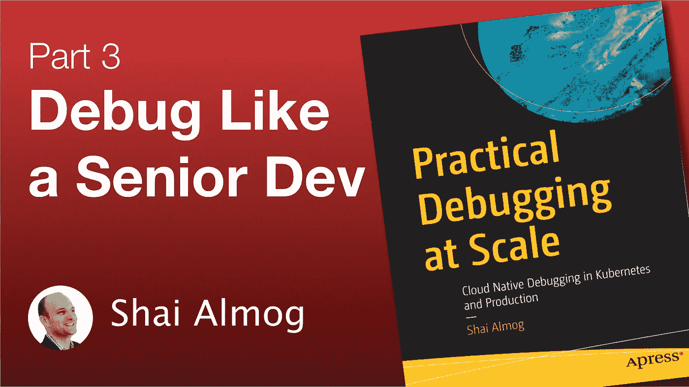

# 观看和评估

> 原文：<https://medium.com/javarevisited/watch-and-evaluate-92c7a660b146?source=collection_archive---------2----------------------->

这是异常紧张的一周。新的 [YouTube 频道](https://www.youtube.com/@debugagent)承载着课程，订阅量激增，刚刚进入第三周……[课程网站](https://course.debugagent.com/)现已上线，你可以在那里看到整个课程，尽管我一直在添加视频，并做了大约 1/3 的工作。现在它有 3 小时 17 分钟的内容。我还有一个小时的内容准备添加，我正在做几个。我很确定课程结束时会超过 6 个小时。

我还在制作一些其他有趣的视频，比如关于[保护自己免受连载攻击的视频](https://www.youtube.com/watch?v=xLXFhRLkxLc)。在接下来的几周里，我会写一篇完整的博文来讨论这个问题。

如果你有任何问题，想法或想法，我很乐意听到你。下面是本周的视频和文字记录。

# 副本

欢迎回到大规模调试的第三部分，在这里我们学习像专家一样寻找 bug！

在这一节中，我们将讨论作为[调试](https://javarevisited.blogspot.com/2022/09/java-debugging-interview-questions.html)基础的观察表达式。这非常重要，我稍后将再次讨论这个主题。

监视区域是屏幕底部的区域

在 IntelliJ 中，我们还可以在代码旁边嵌入观察表达式。监视是调试器最重要的功能之一。这就是我们可以看到调试器中发生了什么的方式。但我会比这更深入。尤其是对象标记，这是有史以来最酷的调试器功能之一。

# 返回值

你有没有从一个方法返回后，只是想，那个方法返回了什么？

这很常见，尤其是当返回值没有存储在变量中的时候。幸运的是，IDE 可以为我们保存这个值，这样我们就可以马上检查它了！

通过启用这个选项，我们可以看到所有未来方法的返回值。如果我们进入 isPrime 方法，然后退出，您将能够看到

底部的方法的返回值。

# 评价

表达式求值是调试器的一个很酷的特性，我们没有充分使用它。

我们可以从右键菜单中启动“计算表达式”对话框，并输入任何有效的 Java 表达式。这是一个强大的工具，可以调用任何方法，做算术，甚至改变变量的值。如果你需要模拟一些在当前代码中很难测试的东西，这里是你可以使用平台和测试“疯狂理论”的地方。

这很像我们在新版 [Java](/javarevisited/10-best-places-to-learn-java-online-for-free-ce5e713ab5b2) 中的 REPL，但在很多方面都更好，因为我们可以在应用程序的上下文中执行代码。如果我有一个返回错误值的方法，我通常会将调用复制到评估对话框中，并尝试调用的各种组合，以查看“什么有效”。只需尝试所有选项而无需重启，就能为我们节省大量时间！

您可以使用`Alt-F8`组合键启动该对话框。

# 看

IntelliJ 中的守望能力绝对壮观。

IntelliJ 允许我们通过从上下文菜单中选择“添加内联监视”来将监视直接嵌入到 IDE 编辑器中。据我所知，这是 JetBrains 独有的惊人特性

一旦选中，监视就会出现在我们添加内嵌监视的那一行的右边，这样就可以很容易地用代码进行评估。这在反复返回同一行时非常方便。

我们也可以使用标准手表，它会添加其他变量的元素。这对于我们想要在大部分代码中跟踪的对象非常有用。随着我们继续前进，我有很多关于观察区的话要说，但现在，让我们先把它放一放。

# 改变状态

设定值是我在[调试](https://www.java67.com/2018/01/how-to-remote-debug-java-application-in-Eclipse.html)时经常忘记使用的一个功能。

这太可惜了，因为它太强大了。我们可以通过右键单击任何字段并选择 set value 来设置它的值。

我们也可以使用`F2`来加速这个过程

我可以将该值更改为任意值。这也适用于对象，在这些对象中，我可以分配一个现有的值或调用一个创建方法、一个新语句或任何我想要的表达式。这是一个非常强大的特性，我们可以动态地改变对象来重现我们想要测试的状态。

我们可以将这种能力与我们之前讨论的跳转到行结合起来，并通过许多不同的排列来测试一个方法。甚至是那些不能正常复制的。一个很好的例子就是我拥有的只能在 Windows 上运行的代码。但是我有苹果电脑。我只是更改了表示当前操作系统的静态变量的值，并测试了代码。

# 物体标记

对象标记是我们将在本课程中讨论的最酷的功能之一，它几乎是未知的。

这有点微妙，首先我们将为`[Thread.currentThread()](https://javarevisited.blogspot.com/2013/04/how-to-get-current-stack-trace-in-java-thread.html)`添加一个观察器，它返回代表当前线程的对象实例。如你所见，我可以看到手表中的当前线程。

现在我可以一次又一次地运行这个方法，并且看到当前的线程，这个方法总是从同一个线程执行吗？

我可以查看线程 ID。是一样的。所以它可能是线程安全的。但是我如何验证这一点呢？

我通常在一张纸上写下对象 ID 或变量的指针，并检查它是否是相同的值。这是一种痛苦，而且无法扩展。我多长时间可以反复按一次“继续”?

在右键菜单中，我选择标记对象并输入任意名称。在这种情况下，一旦完成，我可以按 OK

这会立即用新标签替换当前线程的值。因此，我们可能会错误地认为这只是一个观察表达式的名称。它不是。我们声明了一个新变量，并将其命名为`MyThread`。我们将观察表达式的当前值复制到该变量中。我们现在可以像对待 IDE 中的大多数变量一样对待该变量。

我们可以在这里评估价值，得到我们想要的一切。注意由 [IntelliJ](/javarevisited/7-best-courses-to-learn-intellij-idea-for-beginners-and-experienced-java-programmers-2e9aa9bb0c05) 添加的`_DebugLabel`后缀，以避免命名冲突，但除此之外，我们可以调用这个对象上的任何操作，比如获取名称，甚至访问私有字段名称。但是这个会变得更好…

让我们给这个方法添加一个断点，一个完全标准的断点，就像我们之前做的那样。这将是一个标准的条件断点，我们很快会深入讨论，但现在你需要知道的是，我可以定义一个条件，它将决定断点是否会停止。让我们放大

让我们输入条件，我可以将`MyThread`与线程的当前值进行比较。请注意，由于`MyThread`的值独立于`Thread.currentThread()`的原始监视语句，因此这种情况会相应地发生。因此，如果当前线程确实不同，断点将在此处停止。

这在处理许多对象时非常有用。在这种情况下，我可以直接检查这个方法是否会被同一个线程命中。我可以用它来比较任何对象，而不是把它们的指针写在一张纸上！是的。我真的会拿着一张纸坐下来，抄下指针地址，以确保我再次看到它时没有弄错。这在很多方面都更好！

我经常在 JPA 这样的 API 中使用它，有时我们可能有两个相同身份的对象实例。这个真的很难察觉。只需标记一个对象，您就可以立即看到它是一个不同的实例。

由于这种情况显然是单线程的，断点将不会再被命中。但是这对于非常复杂的情况非常有效，是一个非常有用的工具！

# 最后

接下来，我们将深入研究断点和它们能做的惊人的事情。这是一个你不想错过的深度视频。如果您有任何问题，请使用评论部分。谢谢大家！