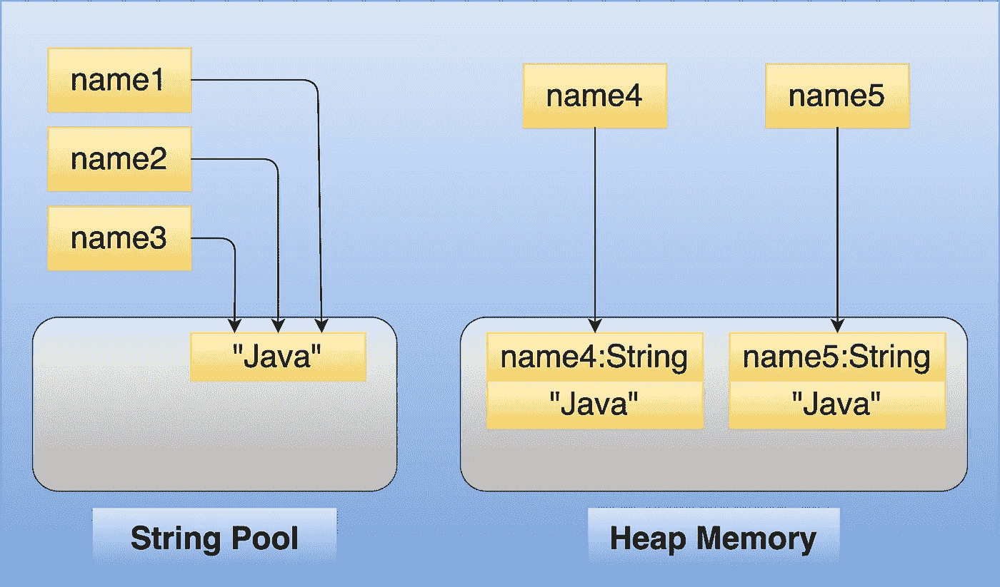

# 字符串池在 Java 中是什么意思？

> 原文：<https://medium.com/javarevisited/what-does-string-pool-mean-in-java-996f0554e1dc?source=collection_archive---------1----------------------->

## 字符串-面试-问题

## 了解 Java 中的字符串池，以及如何在字符串池中存储和检索对象。


使用 intern()方法的字符串池示例

# Java 中的字符串池是什么？

*它是一个* ***池中的字符串*** *存放在* ***堆中的内存*** *。如果池中不存在创建的所有字符串，则它们都存储在该池中。*

> String 类是不可变的类，因此所有使用文字或 new 运算符创建的 string 对象都不能被更改/修改。

# 创建字符串对象有两种方式:

## 1.使用双引号(" ")[当使用字符串时]

```
String name1 = “Java”;
```

上面的语句创建了一个 string 对象，如果它还没有出现在字符串池中，就把它放在字符串池中，并给 name1 分配了一个引用。

在这种情况下，**只创建一个对象。**

## 2.使用“新”关键字:

```
String name2 = new String(“newJava”);
```

上面的语句在堆内存中创建一个字符串对象，并检查它是否存在于字符串池中。如果" **newjava"** 不在字符串池中，那么它将把这个字符串放在字符串池中，否则它将跳过它。

在这种情况下，创建了两个对象，一个在堆内存中，另一个在字符串池中。

让我们再举一个例子，用编程和图解的方式来理解它。

**Java 字符串池示例**

## 输出:

```
true
true
true
false
false
false
```

## 用图解法将上述代码翻译成:

[](https://javarevisited.blogspot.com/2022/03/3-examples-to-parse-json-in-java-using.html)

字符串池和堆对象创建内存示例

## 注意:

> 字符串文字存储在字符串常量池中。具有相同内容的字符串共享这个公共内存区域以减少内存使用。用`**new**` 操作符创建的字符串对象存储在堆内存区，不同字符串对象的相同内容不共享存储。

# 在上面的程序中创建了多少个对象？

> *这个问题的答案会是* ***3*** *。*

如你所见，当我们对 **name1** 使用字符串文字时，在字符串常量池中创建了一个对象，因为那时字符串常量池中没有这个`“Java”`字符串。

对于下一个字符串 **name2** ，相同的字符串已经存在，因此没有创建新的字符串对象，而是为该字符串返回相同的引用。

类似地，对于**名称 3** ，将分配与**名称 1** 相同的参考。

*对于每个新操作符，堆内存中都有两个对象，并且不会在字符串常量池中创建任何对象，因为"* ***Java"*** *字符串已经存在于字符串常量池中。*

***因此你会看到总共 3 个物体。***

# 我们如何检查字符串内容是否相同，以及两个字符串是否指向同一个对象？

字符串函数`**equals(Object obj)**`可用于比较两个字符串的内容，运算符`***==***`可用于比较两个字符串引用是否相同。

## 示例:

```
String string1 = new String(“Hey Java”);
String string2 = “Hey Java”;
System.out.println(string1.equals(string2));//prints true
System.out.println(string1 == string2);//prints false
```

string1.equals(string2)检查了两个 string 对象的内容，因此返回 true，因为它们具有相同的值“嘿 Java ”,而 string1 `==` string2 返回 false，因为 string1 引用的是[堆](https://javarevisited.blogspot.com/2013/04/what-is-maximum-heap-size-for-32-bit-64-JVM-Java-memory.html)中的对象，string2 引用的是字符串常量池中的对象。

> 在使用 equals()函数进行对象的内容比较时，请确保调用 equals()方法的引用不为空，否则将得到 **NullPointerException** 。

# Intern()方法是做什么的？

`[**intern()**](https://javarevisited.blogspot.com/2015/12/when-to-use-intern-method-of-string-in-java.html)`返回字符串对象的规范表示。
当调用 intern 方法时，如果字符串池已经包含一个等于这个字符串对象的字符串(`this`基本上是指调用`**intern()**`方法的对象)，如 equals(Object)方法所确定的，则返回池中的字符串。否则，该字符串对象将被添加到池中，并返回对该字符串对象的引用。

## 示例:

intern()示例

**输出:**

```
true
```

在上面的例子中，行号为 **6** **" *Java* "** 的对象没有出现在字符串池中，因此在字符串池中创建了字符串对象，并将该对象的引用返回给 **string1** 变量。在第 7 行，当调用 **string1.intern()** 时，它查看字符串池，并且已经存在一个字符串，因此该字符串对象的引用被返回到 **string2** 。因此，程序的输出为**真**。

[](https://javarevisited.blogspot.com/2013/07/java-string-tutorial-and-examples-beginners-programming.html)

使用 intern()方法的字符串池示例

*本文到此为止。我希望你已经理解了* ***字符串池*** *以及如何使用字符串和新操作符创建对象。*

# 类似内容可以关注[维克拉姆古普塔](https://medium.com/u/2c3b611409dc?source=post_page-----996f0554e1dc--------------------------------)。

***你可能喜欢看下面的面试问题:***

[](/@basecs101/do-you-know-immutable-class-in-java-why-string-is-immutable-dc18b0cec4b9) [## 你知道 Java 中的不可变类吗？为什么字符串是不可变的？

### 关于不变性的一切——什么、如何以及何时。

medium.com](/@basecs101/do-you-know-immutable-class-in-java-why-string-is-immutable-dc18b0cec4b9) [](/@basecs101/what-does-string-pool-mean-in-java-996f0554e1dc) [## 字符串池在 Java 中是什么意思？

### 了解 Java 中的字符串池，以及如何在字符串池中存储和检索对象。

medium.com](/@basecs101/what-does-string-pool-mean-in-java-996f0554e1dc) [](https://levelup.gitconnected.com/string-stringbuilder-and-stringbuffer-a-complete-guide-5ddd083a2ad5) [## String、StringBuilder 和 StringBuffer:完整指南

### 了解 java 中的文本/字符串操作类，如何以及何时使用它们。

levelup.gitconnected.com](https://levelup.gitconnected.com/string-stringbuilder-and-stringbuffer-a-complete-guide-5ddd083a2ad5)