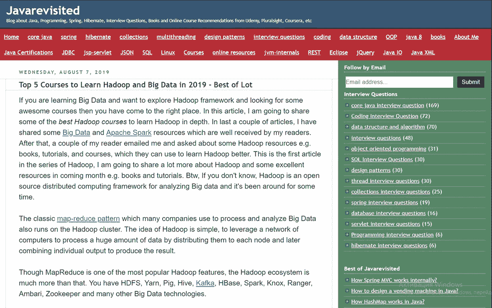
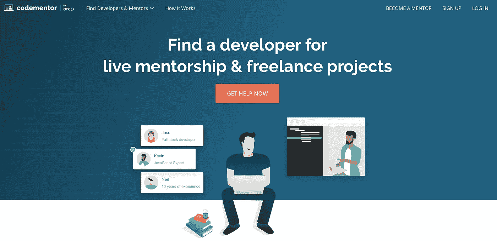
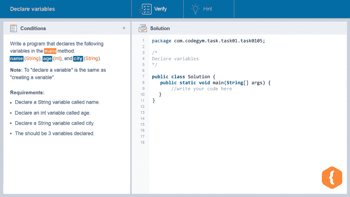

# 获得 Java 程序员的第一份工作应该知道什么

> 原文：<https://medium.com/javarevisited/what-you-should-know-to-get-your-first-job-as-a-java-programmer-5716f31cf333?source=collection_archive---------0----------------------->

我教过这么多小组，还没见过一个学生只是为了好玩才来学 Java 的。他们中的每一个人都想成为一名专业的开发人员，并以此谋生。这不正是我们学习新技能的目的吗——找份工作？

就业是学习一门编程语言的自然进程，但我逐渐意识到毕业后找工作是一件理所当然的事情。大多数公司希望开发人员有一些工作经验，如果你没有任何工作经验，你很可能会得到一个没有报酬的实习机会，这肯定不会帮你解决账单。

# 为什么要成为 Java 开发人员

如果你想成为一名 Java 程序员，你会怎么做呢？毕竟，即使对初级开发人员来说，这也是一份高薪的工作，根据 Indeed 的数据，平均年薪接近[7 万美元。](https://www.indeed.com/salaries/junior-java-developer-Salaries)

# 这是最受欢迎的语言之一

根据 [Stackoverflow 2019 调查](https://insights.stackoverflow.com/survey/2019#technology-_-programming-scripting-and-markup-languages)，Java 在专业上处于使用最多的语言前五名，让位于 [JavaScript](/javarevisited/my-favorite-free-tutorials-and-courses-to-learn-javascript-8f4d0a71faf2) 、 [HTML/CSS](https://javarevisited.blogspot.com/2019/05/top-5-html-5-and-css-3-courses-for-web-developers.html) 、 [SQL](https://javarevisited.blogspot.com/2018/05/top-5-sql-and-database-courses-to-learn-online.html) 和 [Python](/better-programming/top-5-courses-to-learn-python-in-2018-best-of-lot-26644a99e7ec) 。这意味着公司正在积极地将它用于他们的项目，并且在这个领域有足够的工作机会。

根据美国劳工统计局的报告，到 2028 年，软件开发就业市场预计将增长 21%。你打赌它会投射到世界其他地方。如果您需要更多学习 Java 的理由，请查看这篇文章:

<https://javarevisited.blogspot.com/2018/07/10-reasons-to-learn-java-programming.html>  

# 你将与现实世界中的应用程序进行项目合作

Java 不是创建游戏的首选语言，如 [C++](https://javarevisited.blogspot.com/2020/01/top-10-free-interactive-online-courses.html) ，也不是机器学习算法，如 [Python](https://javarevisited.blogspot.com/2019/07/top-5-books-to-learn-python-in-2019.html) ，但它被广泛用于编码服务和现实世界应用的平台。它在亚马逊和脸书被使用，你可以发现自己正在将 [Java 技能](https://dev.to/javinpaul/10-skills-java-programmer-can-learn-to-accelerate-their-career-3nlh)应用到医疗保健系统和金融平台，这将惠及普通人。

# 你在面试中会遇到什么问题

在大多数情况下，你必须通过一家公司的两轮或更多轮面试才能找到工作。即使是初创公司也会雇佣招聘人员来帮助他们寻找专家，这样你与一家公司的第一次接触就会通过他们中的一家。

招聘人员最感兴趣的是你的动机、抱负，以及你是否适合其他团队成员。所以，期待一些标准的问题，比如*为什么我们应该雇用你*以及你对自己五年后的展望。有时他们会给出一个技术任务，稍后由另一个开发人员来评估。

给你一个建议:如果你没有通过第一轮，那家公司不适合你。

如果你真的通过了，你将获得一次技术面试，在那里你可以展示你的 Java 能力。对于经验有限的开发人员来说，他们很可能会关注您的基本 Java 知识和解决问题的技能。让我们回顾一下您可能会有疑问的几个主题。

<https://javarevisited.blogspot.com/2017/01/how-to-prepare-for-java-interviews.html>  

# 编写和运行 Java 应用程序所需的技术

***用 Java 开始编码需要在电脑上安装什么？*** —开发套件和虚拟机。您可能会被要求告诉您需要先安装什么，或者一步一步地告诉您如何安装。你也可能会遇到一些棘手的问题，比如:

可以在任何平台上使用 JVM 吗？ — Java 是跨平台的，你需要一个 [JVM](https://javarevisited.blogspot.com/2019/04/top-5-courses-to-learn-jvm-internals.html) 来运行一个应用程序，当然，它是跨平台的。

您可能也在使用代码编辑器，所以不要忘记提到这一点。我个人喜欢用 [IntelliJ IDEA](https://itnext.io/top-5-intellijidea-and-android-studio-courses-for-java-and-android-programmers-afcc27309b60) 。它很方便，并且具有编码所需的所有特性，比如智能完成、代码分析和重复检测。

# 进入一个项目

你很少会从一开始就加入这个项目，公司希望看到 ***你将如何处理一个已经存在的项目？***

通常，你会对项目的一部分或者某些功能进行编码，但是你需要理解整个项目，它的想法，目标，以及它应该如何运作。公司在这里寻找的是你阅读他人代码的能力，适应他们的风格，你能多快提高速度，以及你是否打算向其他团队成员寻求帮助。你当然应该这么做。

另一个与你可能的项目工作相关的常见问题是 ***当你落后于计划时，你会采取什么行动？重要的不是你能在多大程度上为你的团队领导或客户打破僵局，而是你能在多大程度上分清轻重缓急。例如，您可以识别符合最低可行产品标准的特性，并首先关注这些特性。***

***你如何组织你的代码？*** —这是你能调出作品集时的问题。公司寻找能够编写可读代码(其他团队成员可以理解)并且知道组织和评论代码的最佳实践的专家。

这就是为什么我鼓吹你应该多做练习而不是阅读。这是建立个人投资组合的可靠方法——当你没有工作经验时，投资组合会证明你的技能。

# Java 特有的问题

***声明类的时候，会用什么方法？*** —像考试一样准备答题。你需要表明你理解基本概念并能使用它们。

OOP ，对象，集合，如何声明一个方法，甚至一个 Java 程序的基本结构，对一个初学者来说都是一个面试的问题，所以你可能想在你的会议之前复习一些理论或者玩一个编码游戏。这就引出了下一个问题:

# 找工作需要懂多少 Java？

尽管新手之间的竞争非常激烈，你仍然会发现一些公司在寻找没有工作经验但有巨大潜力的初露头角的开发人员。问题是，有些人需要经验很少的专家，这样他们才能把你塑造成他们需要的专业人士。还没有难以打破的独特风格或行为的人。尽管如此，你还是需要足够的知识和技能:

*   **基本 Java 语法。**这是一个显而易见的问题，但在申请工作时，你对它的了解应该是无可挑剔的:正确声明的对象，没有遗漏括号。
*   **了解物体类型的区别。**比如[抽象类和接口有什么不同](http://www.java67.com/2012/09/what-is-difference-between-interface-abstract-class-java.html)；哪些修饰符是公共的，哪些是私有的？
*   **编码实践:**如何将你的代码组织成包或者如何编写单元测试？
*   **核心概念:** [OOP 及其原理](https://hackernoon.com/10-oop-design-principles-every-programmer-should-know-f187436caf65)，[字符串](https://dev.to/javinpaul/top-20-string-coding-problems-from-programming-job-interviews-493m)，[集合](https://javarevisited.blogspot.com/2011/11/collection-interview-questions-answers.html)，[多线程](https://javarevisited.blogspot.com/2014/07/top-50-java-multithreading-interview-questions-answers.html)，[处理异常](https://www.java67.com/2019/06/top-25-java-exception-interview-questions-answers.html)，循环和数据类型。
*   **JAR 库:**它是什么，如何使用，如何在你的代码中引用。
*   **设计模式:** MVC，Facade， [DAO](https://javarevisited.blogspot.com/2013/01/data-access-object-dao-design-pattern-java-tutorial-example.html)

此外，对于 web 和企业开发，您需要学习:

*   使用 SQL 数据库的基础知识
*   HTTP 协议
*   HTML 和 CSS 的基础知识
*   XML 和 web 服务
*   如何使用日志框架

我最好的建议是，当你开始找工作的时候，参加一个基于游戏的初级课程。这比在面试前重读一遍你的 Java 程序更轻松，也更有趣。大量的文字会让你的大脑一片混乱。

# 帮助你准备面试的资源

[**Java 访问了**](https://javarevisited.blogspot.com/)**——这个教育平台提供了学习 Java 的独特方法。更像是理论和实践的混合体。一方面有大量有用的教程，另一方面有实用的任务。你阅读理论，然后应用它。**

****

**code mentor——顾名思义，一个你可以找到编码导师的平台。如果你需要与有经验的开发人员进行更多的一对一交流，这很方便。**

****

**[**CodeGym**](https://codegym.cc/) 是一个面向初学者的基于游戏的 Java 课程，它还有一个面试部分和一个支持你的同行社区。它的主要重点是实践，因此你可以获得解决问题的实践经验，而不仅仅是看例子。CodeGym 也是一种在准备面试时复习 Java 基础知识的有趣方式。**

**[Java point 上的 300 个 Java 面试问题](https://www.javatpoint.com/corejava-interview-questions) —这是一个学习不同语言的资源，也有一个部分为你准备面试问题，从特定语言的问题到一般的人力资源问卷，包括一些大公司，如 IBM 和 Adobe。它还比较了不同语言的问题。**

**[魅力在指挥](https://www.youtube.com/user/charismaoncommand/videos)——YouTube 上的一个频道，提供了如何给人留下好印象并让人们喜欢你的教程，包括面试官，以及许多给内向者的谈话技巧。**

# **最后的想法**

**找一份初级 Java 开发人员的工作可能很难。竞争很激烈，大多数公司都在寻找有一定经验的专家，但如果你把握好机会，你会带着自信和热情找到第一份工作。**

**向他们展示你懂编程，你可以学得很快，好好利用你的第一印象，你就可以开始了。**

**学习 Java 的其他**有用资源**你可能喜欢的
[Java 程序员 2020 年应该学习的 10 件事](https://javarevisited.blogspot.com/2017/12/10-things-java-programmers-should-learn.html#axzz5atl0BngO)
[从头开始学习 Java 的 10 门免费课程](http://www.java67.com/2018/08/top-10-free-java-courses-for-beginners-experienced-developers.html)
[深入学习 Java 的 10 本书](https://medium.freecodecamp.org/must-read-books-to-learn-java-programming-327a3768ea2f)
[每个 Java 开发人员都应该知道的 10 种工具](http://www.java67.com/2018/04/10-tools-java-developers-should-learn.html)
[学习 Java 编程语言的 10 个理由](http://javarevisited.blogspot.sg/2013/04/10-reasons-to-learn-java-programming.html)
[2020 年 Java 和 Web 开发人员应该学习的 10 个框架](http://javarevisited.blogspot.sg/2018/01/10-frameworks-java-and-web-developers-should-learn.html) 成为 2020 年更优秀的 Java 开发者
[2020 年要学习的 5 大 Java 框架](http://javarevisited.blogspot.sg/2018/04/top-5-java-frameworks-to-learn-in-2018_27.html)
[每个 Java 开发者都应该知道的 10 个测试库](https://javarevisited.blogspot.sg/2018/01/10-unit-testing-and-integration-tools-for-java-programmers.html)**

**混合来源，但在研究和实践之间保持适当的平衡。当然，祝你在追逐自己的目标时好运:)**

**<https://javarevisited.blogspot.com/2019/10/the-java-developer-roadmap.html#123> **