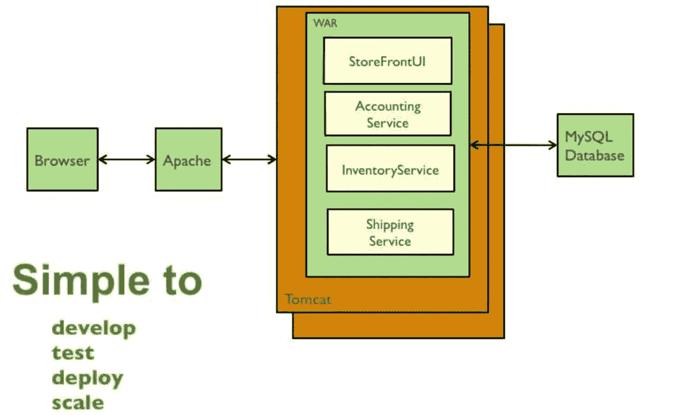
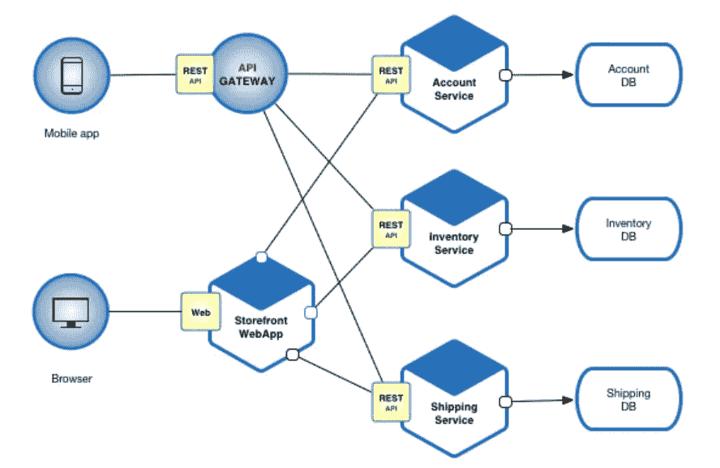

# 微服务的原因和位置？

> 原文：<https://medium.com/javarevisited/why-and-where-of-microservices-f4a1660a4837?source=collection_archive---------2----------------------->

优点和缺点。

微服务是开发应用程序时可以遵循的一种架构风格。它的一些特点是:

*   高度可维护和可测试
*   松散耦合
*   可独立部署
*   围绕业务能力组织
*   由一个小团队拥有

话虽如此，微服务架构并不是你可以盲从的。架构取决于您的业务用例。微服务有它自己的缺陷。

微服务架构的对立面是一个整体应用程序。整体式建筑是一种传统的建筑风格，对于许多应用来说仍然是一个很好的选择。在 monolith 架构中，我们有一个负责核心业务逻辑的应用程序。

微服务. io

我们有一个包含所有模块和业务用例的单一应用程序和一个数据库。

在微服务中，我们为每个业务用例提供单独的服务，即业务用例被划分为多个不同的服务，这些服务可以相互交互。

微服务. io

## 微服务的优势

1.  服务是可自我部署的。
    对于您必须在架构中进行的任何更改，只有需要更改的服务才会在更改后进行部署。如果是 monolith，我们将不得不一起部署模块，这确实会花费更多的时间，因为应用程序的大小，以及在任何部署之前需要通过的所有测试案例和冒烟套件。
2.  **组件/服务是分布式的。** 有了这个，我们就可以避免系统的紧耦合。遵循这个原则是系统设计的基本部分。小团队更容易管理，服务归团队所有。
3.  **需要扩展的服务可以按需扩展。** 在使用微服务时，只有那些服务可以有更多的实例，从而有更多的负载。在 monolith 架构中，整个应用程序需要按比例增加，这更加昂贵。我们举一个 BookMyShow 的例子。在 Bookmyshow 中，与实际预订座位的用户数量相比，每天查看时间和座位可用性的用户数量会更多。考虑到我们为时间安排/可用性和预订提供了单独的服务，我们可以根据其使用情况来管理服务。与预订服务相比，为定时/可用性服务运行的实例数量可以更多。对吗？在 monolith 中，考虑到我们只有一个应用程序来管理这两种功能，这是不可能的。
4.  **心理与心态** *你没看错吧！*团队必须拥有产品的整个生命周期。*您构建，您运营。这让开发人员每天都接触到他们的软件在产品中的表现，并增加了与用户的联系，因为他们至少要承担一些支持的负担。产品理念与业务能力的联系紧密相关。不要把软件看作是一组要完成的功能，而是有一个持续的关系，问题是软件如何帮助它的用户增强业务能力。马丁·福勒已经提出了这一点。
    总结这一点，我认为当我们有独立的团队拥有一项服务时，我们会有更大的创造空间。欢迎在评论区发表你对此的看法。*
5.  **不同语言的选择** 我相信这是微服务架构的一个优点。我们可以用 NodeJS 编写支付服务与 mongo 交互，用 Java 编写预订服务与 SQL 交互。不同的团队可以自主解决他们遇到的问题，而不是坚持由一个人编写的一套定义好的规则和标准。网飞在开源图书馆方面做得非常好。他们在内部开发了一些库来解决他们的问题，然后公开提供给每个人使用。[https://netflix.github.io/](https://netflix.github.io/)
6.  **为失败而设计** 微服务是为失败而设计的。很容易识别问题，并将问题发送给负责该问题的团队进行修复。产品发布的日子又累又无聊。不同于在 monolith 中查找整个应用程序的错误，各个团队成员可以跟踪他们自己的服务来查找微服务中的任何错误和错误。
7.  **易于理解** 像微服务中相对较小的代码库更容易理解。在 monolith 中，只有一个代码库(考虑到我们没有单独的模块)，所以理解它需要更多的努力和时间。

## **微服务架构的问题？**

1.  **事务管理** 正如我们所知，每个服务都有自己独立的数据库，因此扩展到多个服务的业务逻辑可能更难管理。虽然我们有不同的微服务模式，如非常适合这种情况的 Saga。
2.  **CAP 定理** 在分布式系统中，只能实现三者中的两个:一致性、可用性和分区。
    假设我们总共有 2 个节点。两人都是高手。应用程序正在两个节点上执行读取&写入操作。假设有其他应用程序只是出于读取目的而使用这些节点。让我们将节点命名为 A 和 B，如果应用程序在 A 中进行写操作，则 A 有责任将写操作通知 B；反之亦然。如果 A 和 B 的连接出现问题怎么办？A 和 B 节点工作正常，只是它们之间无法通信。这就是容错。节点 A 和 B 将无法相互通知写操作。
    在这种情况下，我们可以选择可用性，也可以选择一致性。
    我对此有一个单独的文章: [CAP](/nerd-for-tech/cap-theorem-with-focus-on-partition-tolerance-1af4403cb35a)
3.  **谁决定服务边界？如何决定将单个大型应用拆分为多个不同的服务，是一个需要详细回答的问题。很难确定组件的边界应该在哪里。问题是，如果组件不能干净地组合，那么我们所做的就是将复杂性从内部(像 Monolith 一样)转移到服务/组件之间的连接上。**
4.  **增加了管理通信黑白服务器的难度** 对。服务越多，服务器的数量就越多，因此通信 b/w 服务器的管理就越细致和费力。由于微服务架构，开发人员必须了解负载平衡，并努力发现网络延迟。当你知道有不同的团队在研究服务之间的通信时，不要感到惊讶。
5.  **团队技能** 如果团队没有足够的技能来决定微服务架构的内容和方式，那么管理这样的基础架构可能会成为团队的负担和额外成本。设计糟糕的微服务产品可能会一团糟。对此的一个答案是构建一个整体，保持其模块化，并在需要时将其拆分为微服务。
6.  **测试很难** 服务数量越多，开发人员在编写测试用例时就需要越谨慎。在编写测试用例时，这也是一个决策问题。虽然我认为单元测试用例很好，因为微服务架构中的复杂性相对较少。集成测试的边界是什么？我们写端到端集成测试吗？或者我们也集成具有高商业价值的测试模块？

**微服务是未来吗？** 是不是已经？在某处读到过，我想引用完全相同的陈述:
***通常，您的架构决策的真实结果在您做出这些决策几年后才
显现出来。***

**结尾注释**

如有任何疑问或自由职业工作，请联系我。所有的掌声和关注都受到高度赞赏。

请随时通过 LinkedIn 联系我或者给我发电子邮件到 vivek.sinless@gmail.com