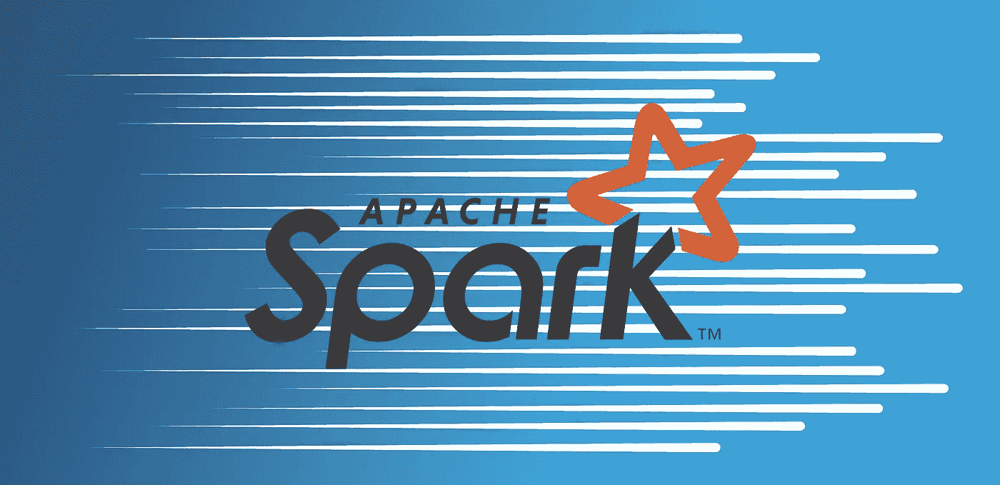
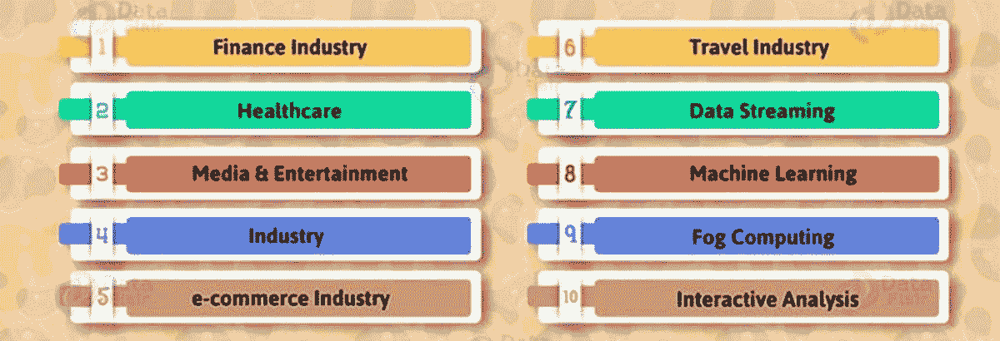

# 为什么行业落后于 Spark——“Spark 为什么重要的 50 个理由”

> 原文：<https://medium.com/javarevisited/why-industries-running-behind-spark-50-reasons-why-spark-is-important-83473477b41d?source=collection_archive---------0----------------------->

> “Apache Spark 已经取代 Hadoop，成为最受欢迎的大数据引擎”

在这里，我要给你 50 个理由，当你有数百种选择时，为什么你应该选择 Spark

**1)简单性** : API 都有良好的文档记录和结构

使数据科学家和应用程序开发人员能够直接

迅速让 spark 发挥作用。

**2)速度:**火花专为速度而设计，通过操作内存和开

磁盘。Spark 可以比 [**Hadoop 的 Map reduce**](https://data-flair.training/blogs/hadoop-architecture/) 快 100 倍。

**3)多语言支持:** Spark 支持多种编程

语言包括 Java，Python，R & Scala。

**4)通用分布式处理引擎:**不同的处理

像批处理、流、交互、图形等方法&机器学习可以

由 spark 完成，而不是在中执行不同的处理方法

不同的工具。

**5)活跃且不断扩大的社区:**始于 2009 年，超过

全球 250 名开发人员为开发做出了贡献

火花。Apache Spark 也有一个活跃的邮件列表和 JIRA

追踪。

**6) Spark 既可以独立工作，也可以与**集成

**Hadoop:** Spark 能够以独立的方式运行，并且

能够与 [**Hadoop**](https://techvidvan.com/tutorials/apache-hadoop-tutorials/) 一起工作。它将从 Hadoop&amp；Hadoop

像 HDFS HBASE 这样的数据源。如果你想了解更多关于 Hadoop 的知识，可以查看这些 [**大数据和 Hadoop 课程**](https://dev.to/javinpaul/top-5-courses-to-learn-big-data-and-hadoop-for-beginners-6g8) :

</javarevisited/top-10-courses-to-learn-big-data-and-hadoop-best-of-lot-23ef8691633f>  

7) Apache Spark 具有自动内存调优功能: Apache spark 提供了一个

可调旋钮的数量，以便程序员和管理员可以

使用它们来管理其应用程序的性能(在-

内存计算)。

**8)容错:** Apache spark RDD 是一个不可变的数据集，每个 spark

RDD 记得确定性运算的谱系

容错输入数据集来创建它。

**9)支持多种格式:** Spark 支持多种数据源，如

如拼花地板、JSON、Hive 和 Cassandra 等。

**10)惰性评估:** Apache spark 将其评估延迟到

绝对有必要。Spark 将它们添加到计算的 DAG 中

只有当驱动程序请求一些数据时，这个 DAG 才真正得到

已执行。

**11)复用性:**我们可以复用 spark 代码进行批量处理，

根据历史数据联接流或对流状态运行即席查询。

**本质上是动态的:**我们可以很容易地开发一个并行应用程序，

因为 spark 提供 80 个高级操作员。

**13)实时流处理:** Spark 提供实时

流处理。火花流解决了 MapReduce 的问题

它只处理已经存在的数据。如果你想了解更多关于 MapReduce 和 Spark 的知识，请查看这些[免费 Spark 课程](/swlh/5-free-online-courses-to-learn-big-data-hadoop-and-spark-in-2019-a553e6ccfe30):

<https://www.java67.com/2018/05/top-5-free-big-data-courses-to-learn-Hadoop-Apache-Spark.html>  

**14)经济高效:** Apache Spark 是经济高效的大数据解决方案

Hadoop 中的问题大量存储和大型数据中心

数据复制所必需的。

**15)支持复杂的分析:** Spark 附带专用的

用于数据流、交互式/声明性查询的工具，机器

了解要映射和减少哪个附加模块。

**16)强大的缓存:**简单的编程层提供强大的

缓存和磁盘持久性功能。

**17)部署:**可以通过 Yarn 在 Mesos、Hadoop 中部署

或者 Spark 自己的集群管理器。

**18)不变性:**Spark rdd 本质上是不可变的。曾经的 RDD

我们无法操纵它。我们通过以下方式实现一致性

不变性。

**19)分区:**对记录进行逻辑分区和分布

群集中各个节点的数据。逻辑划分只适用于

从而提供并行性。

**20)位置粘性:**火花 RDD 能够定义位置

首选计算分区。放置首选项是指

RDD 的位置。

**21)多源支持:** Spark 包括对 tight 的支持

在 Hadoop 中集成了许多领先的存储解决方案

像 HDFS，HBASE，卡珊德拉，蒙哥数据库等生态系统。如果您想了解更多关于 HDFS 和 HBASE 的信息，请查看这些[大数据课程](https://hackernoon.com/top-5-hadoop-courses-for-big-data-professionals-best-of-lot-7998f593d138):

<https://javarevisited.blogspot.com/2019/04/top-10-hadoop-tutorials-for-big-data-developers.html>  

**22)多重商业支持:**不断增长的商业集

Databricks、Cloudera、Azure 和 Hortonworks 等提供商。

**23)粗粒度操作:**它适用于数据集中的所有元素

通过地图/过滤器/分组操作。

**24)持久性:**用户可以更新他们将重用的 rdd

为它们选择一种存储策略(例如:内存中或磁盘上)。

**25)开源:**免费下载加上大型 apache 社区

支持。

**26)可扩展性:**可以处理 Pb 级的数据。支持 Hadoop

生态系统。

简单易用: Spark 非常方便用户编写程序

提供函数式编程。

**28)机器学习:** Spark MLlib 就是机器学习

组件，在处理大数据时非常方便。

**29)没有限制:**火花的使用次数没有限制

RDD。我们可以使用任何数量的 rdd。基本上限制取决于大小

磁盘和内存。

**30)分型:**火花 RDD 有几种类型。比如 RDD[int]，

RDD[龙]，RDD[弦]。

**31)并行:**并行处理发生在 spark 中。RDD 处理

数据在集群上并行传输。

图形处理: Spark GraphX 是图形计算引擎

基于 apache spark 构建，支持大规模处理图形数据。

**33)支持处理多种数据:**结构化、半结构化

和非结构化的各种数据都将被处理。

灵活性:我们可以同时处理图形和计算

火花图 x。它包括探索性分析、ETL(提取、转换

和负载)以及迭代图。

高效:跨使用范围的统一编程模型

案例。

**36)交互 Shell:** 为 scala 和 phython 提供交互 Shell。

执行引擎: Spark 有一个先进的 DAG 执行引擎

它支持循环数据流和内存计算。

**38)数据处理:** Spark 将 Map 降低到下一个级别

数据处理的成本越低。

**39)统一数据访问:**访问多种数据源的数据

框架和 SQL 支持一种通用的方式。像 Hive，Avro，

拼花地板，兽人，JSON 以及 JDBC。

**40)高兼容性:**我们被允许运行未修改的配置单元

spark sql 中现有仓库的查询。利用现有的蜂箱数据，

查询和 UDF 的 spark sql 提供了完全的兼容性。

**41)性能优化:**通过使用共享变量，如

用于提高性能优化的广播和累加器。

**42)标准连接:**我们可以通过 JDBC 或 ODBC 触发 sql。

**43)增加的迭代周期:**需要在相同的

尤其是机器学习场景。火花

非常适合该应用。

使用内置库的多重操作: Spark 提供了

用于执行各种类型任务内置库选项。

**45)分布式:**数据驻留在多个节点。

**46)散兵游勇缓解:**散兵游勇意味着花更多的时间去

比同龄人完整。火花 RDD 减轻掉队使用备份

任务。

**47)低延迟:** spark 提供低延迟是因为并行处理

和处理速度。

**48)广泛使用:**不同的 Spark 框架广泛使用

处理大数据以做出商业决策的公司

制作(例如:facebook，雅虎，twitter，youtube 等。)

**49)支持不同的集群:** Spark 支持不同的集群，如

作为纱线，Mesos 和独立。

**50)用户自定义函数:** Spark sql 有语言集成用户

定义的函数。

# Spark 实时用例-

正如我们所知，Apache Spark 是最快的大数据引擎，它以多种方式在多个组织中广泛使用。有大量的 Apache Spark 用例

# 开始学习 Apache Spark -

随着 Spark 继续用于交互式横向扩展数据处理需求和面向批量的需求，预计它将在下一代横向扩展 BI 应用中发挥重要作用。专业人士需要在 Spark 中进行全面的实践培训，以提高工作效率，特别是如果他们是 Scala 编程的新手。它要求专业人员熟悉像 Scala 这样的新编程范式。但是，也可以使用 Shark，即 Shark 上的 SQL 来开始学习 Apache Spark 的<https://data-flair.training/blogs/spark-tutorials-home/>*。*

*其他**免费在线编程与开发课程**你可能喜欢探索:
[2020 devo PS 路线图](https://javarevisited.blogspot.com/2018/09/the-2018-devops-roadmap-your-guide-to-become-DevOps-Engineer.html)
[5 门免费课程学习 Servlet、JSP、JDBC](http://www.java67.com/2018/02/5-free-servlet-jsp-and-jdbc-online-courses-for-java-developers.html)
[5 门免费 JavaScript 课程学习 Web 开发者](http://www.java67.com/2018/04/top-5-free-javascript-courses-to-learn.html)
[5 门免费课程学习 Core Spring、Spring Boot、 和 Spring MVC](http://www.java67.com/2017/11/top-5-free-core-spring-mvc-courses-learn-online.html)
[5 门免费 Docker 课程面向 Java 和 DevOps 工程师](http://www.java67.com/2018/02/5-free-docker-courses-for-java-and-DevOps-engineers.html)
[5 门课程面向 Java 开发者学习 Maven 和 Jenkins](http://www.java67.com/2018/02/6-free-maven-and-jenkins-online-courses-for-java-developers.html)
[5 门课程面向 Oracle 和微软 SQL Server 数据库](http://www.java67.com/2018/02/5-free-oracle-and-microsoft-sql-server-online-courses.html)
[3 本书和课程面向 Java 学习 RESTful Web 服务](http://www.java67.com/2018/02/3-books-and-courses-to-learn-restful-web-services-with-spring.html)
[2020 React JS 开发者路线图](https://javarevisited.blogspot.com/2018/10/the-2018-react-developer-roadmap.html)
[5 门课程面向](http://www.java67.com/2018/02/5-free-blockchain-technology-courses.html)*

*非常感谢您阅读这篇文章。如果您喜欢这些免费的大数据课程，请与您的朋友和同事分享。如果您有任何问题或反馈，请留言。*