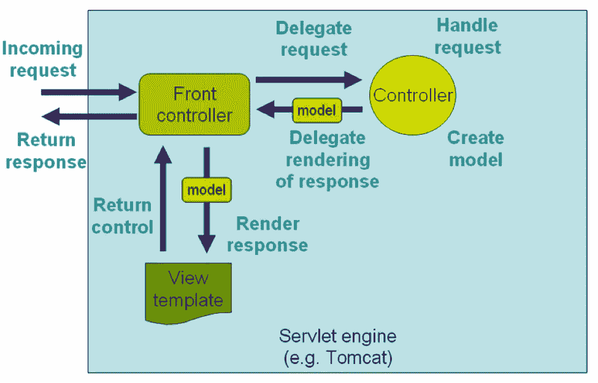

# 为什么 Java 开发人员应该使用 Spring 来开发 RESTful Web 服务？

> 原文：<https://medium.com/javarevisited/why-java-developer-should-use-spring-to-develop-restful-web-services-efe36d7a6727?source=collection_archive---------0----------------------->

照片由[丹尼斯·莱昂](https://unsplash.com/@denisseleon?utm_source=medium&utm_medium=referral)在 [Unsplash](https://unsplash.com?utm_source=medium&utm_medium=referral) 上拍摄

REST 现在已经成为开发 web 服务的标准方式，而对于 Java 来说，有许多可用的框架和库，例如 JAX-RS、 [Restlet](http://javarevisited.blogspot.sg/2016/10/restlet-helloworld-example-in-java-and-Eclipse.html) 、 [Jersey](http://javarevisited.blogspot.sg/2017/06/jersey-web-service-hello-world-example.html) 、 [RESTEasy](http://javarevisited.blogspot.sg/2017/02/difference-between-jax-rs-restlet-jersey-apache-cfx-RESTEasy.html) 、Apache CFX 等。，但是我鼓励 Java 开发者使用 Spring MVC 来开发 RESTful web 服务。

有些人可能会问，*为什么要用 Spring MVC 框架用 Java 开发 RESTful web 服务？*它有什么优势，为什么比其他可用的框架和库更好？

嗯，我认为，使用 Spring 开发 RESTful web 服务的最重要的原因是，您可以使用您的 [Spring MVC](http://javarevisited.blogspot.sg/2017/06/how-spring-mvc-framework-works-web-flow.html) 经验来开发 RESTful web 服务，并且您不需要学习新的框架或库，这意味着您可以快速推出 REST API。

这是最大的优势之一，即利用你多年来在 Spring MVC 上的经验来将你的应用程序公开为 REST APIs。

另一个原因是 Spring 对开发 RESTful web 服务有很好的支持。

在最近的几个版本中，从 Spring 3.0 版本开始，它对 Spring MVC 进行了很多增强，以提供一流的 REST 支持。它提供了专门的注释，例如[**@ rest controller**](http://javarevisited.blogspot.sg/2017/08/difference-between-restcontroller-and-controller-annotations-spring-mvc-rest.html)**和[**@ ResponseStatus**](http://javarevisited.blogspot.sg/2011/09/spring-interview-questions-answers-j2ee.html#axzz55mVSPFfH)让 Spring 4.0 中 RESTful 资源的开发变得更加容易。**

**它不仅帮助你创建 RESTful web 服务，还提供了使用 REST 资源的类，比如你可以使用[**REST template**](http://javarevisited.blogspot.sg/2017/02/how-to-consume-json-from-restful-web-services-Spring-RESTTemplate-Example.html)**类来使用 RESTful 资源。****

****还有许多实用程序类和注释使得在 Spring 中开发 RESTful web 服务变得更加容易和无缝，我将在本文中分享其中的一些来证明我的观点，即使用 Spring 开发 RESTful Web 服务是正确的决定。****

# ****使用 Spring 在 Java 中创建 RESTful Web 服务的 7 个理由****

****正如我在第一段中告诉你的，我们可以使用 Spring MVC 来创建和消费 RESTful web 服务。现在，让我们更详细地看看这些支持，这样您就可以充分利用它们，快速开发您一直想要的 RESTful 服务。****

******1。在 Spring MVC 中，控制器可以处理所有 HTTP 方法的请求，这是 RESTful web 服务的主干。例如，您可以处理 GET 方法来执行读取操作， [POST](http://javarevisited.blogspot.sg/2016/10/difference-between-put-and-post-in-restful-web-service.html) 方法来创建资源， [PUT](http://www.java67.com/2016/09/when-to-use-put-or-post-in-restful-web-services.html) 方法来更新资源，以及 DELETE 方法来从服务器中移除资源。******

****从 Spring 3.2 开始，您还可以处理补丁请求。顺便说一句，如果你不熟悉 Spring MVC 框架，那么你应该先看看那个； [Spring MVC 对于初学者来说](https://click.linksynergy.com/fs-bin/click?id=JVFxdTr9V80&subid=0&offerid=562016.1&type=10&tmpid=14538&RD_PARM1=https%3A%2F%2Fwww.udemy.com%2Fspring-mvc-tutorial-for-beginners-step-by-step%2F)是一个很好的起点。****

********

******2。**在 REST 的情况下，数据的表示非常重要，这就是为什么 Spring MVC 允许你通过使用`[@ResponseBody](https://www.java67.com/2022/02/what-is-responsebody-and-requestbody-annotations-in-spring.html)`注释和各种`HttpMessgeConverter`实现来完全绕过基于视图的呈现。****

****通过使用它，您可以直接向客户端发送响应，例如，客户端想要的资源以及他们想要的格式。查看[此处](http://courses.baeldung.com/p/rest-with-spring-the-certification-class?affcode=22136_bkwjs9xa)了解更多关于`HttpMessageConvert`和`@ResponseBody`注释的信息。****

********

******3。**Spring 4.0 版本增加了一个专用注释`@RestController`，使得 RESTful web 服务的开发更加容易。****

****如果您使用`[@RestController](/javarevisited/difference-between-controller-and-restcontroller-in-spring-boot-and-spring-mvc-216578ad445f)`而不是 [@Controller](http://javarevisited.blogspot.sg/2017/08/difference-between-restcontroller-and-controller-annotations-spring-mvc-rest.html) 来注释控制器类，那么 Spring 会将消息会话应用于控制器中的所有处理程序方法。****

****这意味着你不需要用`@ResponseBody`注释来注释每个方法。这也使你的代码更加整洁。****

******4。**REST web 服务与普通 web 应用的一个主要区别在于，REST pass 资源在 URI 本身中标识数据，例如`/messages/101`，而 web 应用通常使用查询参数，例如`/messages?Id=101`。****

****如果您还记得，我们使用 [@RequestParam](http://javarevisited.blogspot.sg/2017/10/differences-between-requestparam-and-pathvariable-annotations-spring-mvc.html) 来获取这些查询参数的值，但是不用担心，Spring MVC 也提供了一个 [@PathVariable](http://javarevisited.blogspot.sg/2017/10/differences-between-requestparam-and-pathvariable-annotations-spring-mvc.html) 注释，它可以从 URL 中提取数据。它允许控制器处理参数化 URL 的请求。****

******5。RESTful web 服务的另一个关键方面是表示，这意味着相同的资源可以用不同的格式表示，例如 JSON、XML、HTML 等。幸运的是，Spring 提供了几个视图实现和视图解析器来将数据呈现为 [JSON](http://www.java67.com/2016/10/3-ways-to-convert-string-to-json-object-in-java.html#.WkOmLRqktTU.linkedin) 、 [XML](http://javarevisited.blogspot.sg/2015/07/how-to-read-xml-file-as-string-in-java-example.html#axzz55mVSPFfH) 和 [HTML](http://javarevisited.blogspot.sg/2014/09/how-to-parse-html-file-in-java-jsoup-example.html) 。******

****例如，`ContentNegotiatingViewResolver`可以查看请求或接受头的文件扩展名，为客户机找出资源的正确表示。****

******6。**类似于`[@ResponseBody](https://www.java67.com/2022/02/what-is-responsebody-and-requestbody-annotations-in-spring.html)`注释，它用于将响应转换成客户机想要的格式(通过使用`HttpMessageConverts`)，Spring MVC 也提供了`@RequestBody`注释，它使用`HttpMethodConverter`实现将入站 HTTP 数据转换成传递给控制器的 handler 方法的 Java 对象。****

****如果你对 handler 方法和 Spring MVC 总体不熟悉，那么你也可以查看一下 [3 种学习 Spring MVC 的方法](http://javarevisited.blogspot.sg/2018/01/how-to-learn-spring-core-spring-mvc-boot-security-framework.html)。****

********

****7。**Spring 框架还提供了一个模板类`RestTemplate`，类似于`[JdbcTemplate](https://javarevisited.blogspot.com/2020/05/10-jdbctemplate-examples-in-spring.html)`和`JmsTemplate`，可以消耗 REST 资源。您可以使用这个类来测试 RESTful web 服务或者开发 REST 客户端。******

******这些是 Spring MVC 框架的一些**重要特性，有助于开发 RESTful web 服务。正如我前面所说，我选择 [Spring](/javarevisited/10-best-spring-framework-books-for-java-developers-360284c37036) 开发 RESTful 资源的最重要原因是，我可以使用我现有的框架知识，这意味着没有陡峭的学习曲线。********

****如果从高层次来看，开发 [RESTful 服务](/javarevisited/top-5-books-and-courses-to-learn-restful-web-services-in-java-using-spring-mvc-and-spring-boot-79ec4b351d12)与开发一个 web 应用程序没有太大区别。****

****最根本的区别是，对于前者，我们主要处理人类用户，而对于 REST，您必须处理非人类用户，主要是富 JavaScript 客户端和移动应用程序。****

****这种关键的差异会导致其他的差异，比如用 JSON 或 XML 而不是 HTML 来表示数据，后者适合人类用户，但不适合非人类系统。如果您想在开始使用 Spring 开发生产级 RESTful web 服务之前了解更多，那么 [**REST with Spring**](http://courses.baeldung.com/p/rest-with-spring-the-certification-class?affcode=22136_bkwjs9xa) 课程是一个不错的起点。****

****您可能喜欢的其他**弹簧**和**休息资源******

****[如何用春云搭建微服务？](https://click.linksynergy.com/fs-bin/click?id=JVFxdTr9V80&subid=0&offerid=323058.1&type=10&tmpid=14538&RD_PARM1=https%3A%2F%2Fwww.udemy.com%2Fmicroservices-with-spring-cloud%2F)
[微服务有 Spring Boot 和春云](https://click.linksynergy.com/fs-bin/click?id=JVFxdTr9V80&subid=0&offerid=323058.1&type=10&tmpid=14538&RD_PARM1=https%3A%2F%2Fwww.udemy.com%2Fexploring-spring-boot-and-spring-cloud-microservices%2F)
[Java 中 Restlet、Jersey、RESTEasy 的区别？](http://javarevisited.blogspot.sg/2017/02/difference-between-jax-rs-restlet-jersey-apache-cfx-RESTEasy.html)
[DispatcherServlet 在 Spring MVC 中有什么用？](http://www.java67.com/2017/06/what-is-use-of-dispatcherservlet-in-spring-mvc.html)
[如何在 Java web 应用中启用 Spring 安全？](http://javarevisited.blogspot.sg/2017/05/how-to-enable-spring-security-in-java-web-application.html)
[弹簧在行动由克雷格壁](http://aax-us-east.amazon-adsystem.com/x/c/QiZVriYHFuciDCpQUIuQj8sAAAFhQeGL5QEAAAFKAVVDQvE/https://assoc-redirect.amazon.com/g/r/https://www.amazon.com/Spring-Action-Covers-4/dp/161729120X/ref=as_at?creativeASIN=161729120X&linkCode=w61&imprToken=7fwWaemDeV0uveAVwqurZw&slotNum=0&tag=javamysqlanta-20)
[弹簧框架 5:初学者到宗师](https://click.linksynergy.com/fs-bin/click?id=JVFxdTr9V80&subid=0&offerid=323058.1&type=10&tmpid=14538&RD_PARM1=https%3A%2F%2Fwww.udemy.com%2Fspring-framework-5-beginner-to-guru%2F)****

****感谢您阅读本文，如果您喜欢这些使用 Spring 开发 RESTful web 服务的理由，那么请与您的朋友和同事分享。如果您有任何问题或反馈，请留言。****

******p . s .**——如果你想深入学习 Spring MVC 并需要课程，那么我也建议你加入 Udemy 上的 [Spring Framework:初学者到大师](https://click.linksynergy.com/fs-bin/click?id=JVFxdTr9V80&subid=0&offerid=323058.1&type=10&tmpid=14538&RD_PARM1=https%3A%2F%2Fwww.udemy.com%2Fspring-framework-5-beginner-to-guru%2F)课程。这是一门很好的课程。****

**** [## 2023 年面向初学者的五大春季 MVC 在线课程——最佳选择

### 大家好，你们中的许多人一直在问我学习反应弹簧、Spring Boot 和…的最佳在线课程

javarevisited.blogspot.com](https://javarevisited.blogspot.com/2020/08/top-5-courses-to-learn-spring-mvc-for.html)****